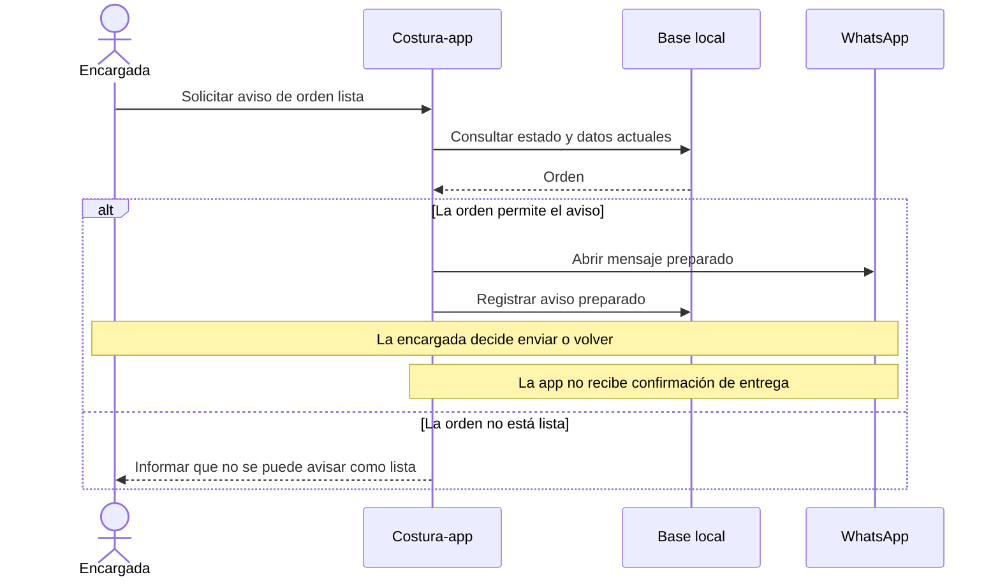

# Costura-app: revisión del equipo de analistas

**Fecha:** 7 de octubre de 2026. **Versión del informe:** 0.1.  
**Estado:** revisión documental inicial; propuestas pendientes donde se indica. No es aceptación del producto ni certificación jurídica.

La aplicación tiene una base implementada y una verificación automática exitosa. El siguiente trabajo debe concentrarse en conciliar requisitos, comportamiento, obligaciones pertinentes y evidencia de uso. La existencia de código y pruebas no demuestra por sí sola que el proyecto esté listo para entregar.

## 1. Caso, versión y trabajo realizado

- Repositorio: [Aryannext/Costura-app](https://github.com/Aryannext/Costura-app).
- Versión publicada revisada: [c84e7c9a2acd581d18f00343dfcdf4d627f65d2e](https://github.com/Aryannext/Costura-app/commit/c84e7c9a2acd581d18f00343dfcdf4d627f65d2e).
- HEAD local: e9c8a6a2bbed7a731c219b0a50996c1e9ec135af. Estado inicial de Git limpio.
- Ambos commits tienen exactamente el mismo árbol: c03c428bce00fe056225127aa54ad06875e8ba0c. El análisis local corresponde al contenido publicado, aunque los commits sean distintos.
- El usuario confirmó en este chat la entrega del **25 de octubre de 2026** y el uso en **el taller de su mamá**. Florencia, Caquetá, Colombia consta en los antecedentes y en D-01.
- Fuentes locales inspeccionadas: README, índice documental, decisiones y plan; secciones pertinentes de Costura.md, fase 2, trazabilidad, ficha técnica y diagramas; código de estados, saldos, reportes, clientes, recibos y privacidad; configuración CI y muestras de pruebas.
- No se inspeccionó íntegramente cada archivo ni las imágenes incrustadas en la especificación histórica. No se recuperó la fuente primaria de la rúbrica académica.
- No se ejecutó la aplicación, el APK ni una nueva suite local. Se consultó la ejecución existente de GitHub Actions y sus pasos.

### Métodos realmente utilizados

Se leyeron el coordinador 00 y sus reglas comunes completas, y los métodos completos 01–07 del paquete portable 1.1. Se aplicaron como perspectivas de la IA principal:

| Método | Resultado en este informe |
| --- | --- |
| 00 Coordinación | Versión común, alcance, integración y condiciones de avance |
| 01 Problema y contexto | Problema sustentado, alternativas y registro normativo inicial |
| 02 Procesos y reglas | Flujo reconstruido, decisiones y excepciones |
| 03 Obtención | Confirmación de dos datos con el usuario y guion pendiente para la usuaria |
| 04 Especificación | Propuesta concreta RF-39 revisión 2 y criterios |
| 05 Modelado | Secuencia M-ANA-01 del aviso, basada en código |
| 06 Validación | Hallazgos y muestra de trazabilidad |
| 07 Cambios | Registro de cambios propuestos, dependencias y orden de cierre |

Se iniciaron tres subagentes reales, pero finalizaron por límite de uso sin entregar informes completos. Uno comunicó dos indicios parciales, comprobados después por la IA principal contra código y fuentes oficiales. No se afirma consenso entre agentes ni revisión independiente humana.

## 2. Problema y proceso del taller

**Declarado en D-01 y en la introducción de Costura.md:** hay confusión al identificar prendas, olvidos de arreglos y fechas, dificultades de cobro y ropa sin recoger. La confirmación del taller por el usuario no confirma automáticamente frecuencia, causas o pérdidas económicas.

**Problema provisional:** la encargada necesita relacionar cada prenda física con su cliente, arreglo, fecha comprometida, avance y saldo para atender y entregar los trabajos con información recuperable.

**Hipótesis pendiente:** registrar información en la app y usar una identificación física consistente reducirá las confusiones. Se refuta si, durante el uso, la encargada no consigue asociar la prenda con su orden o necesita reconstruir la información de memoria. No se ha medido una reducción de errores.

**Proceso reconstruido desde documentos y código, pendiente de observación en el taller:**

| Momento | Responsable / información | Regla o excepción que revisar |
| --- | --- | --- |
| Recibir | Encargada y cliente: prenda, arreglo, contacto, fechas y precio conocido | Qué ocurre si todavía no se conoce precio o fecha; condición inicial de la prenda |
| Identificar | Encargada: relación entre bolsa/prenda y número de orden | D-02 propone etiqueta; falta comprobar qué ocurre al separar prendas de una bolsa |
| Trabajar | Encargada: avance por prenda | RN-04, RN-06 y RN-17 gobiernan el estado de la orden |
| Avisar | App prepara mensaje; encargada lo envía | D-03 y D-04: WhatsApp manual, sin constancia automática de recepción |
| Entregar / cobrar | Encargada: prendas entregadas y abonos | D-11 / RN-30 permiten entregar con deuda; confirmar práctica con la dueña |
| Recuperar información | Encargada: respaldo y contraseña | Probar restauración con datos ficticios y fotos, sin poner en riesgo la instalación de trabajo |

La dueña puede confirmar prácticas y decisiones del taller. El aprendiz aporta y mantiene el proyecto. El instructor confirma los entregables académicos. Una decisión del taller no resuelve por sí sola una interpretación jurídica.

## 3. Alternativas investigadas

Comparación exploratoria; no se contrataron ni probaron productos. Consulta: 7 de octubre de 2026.

| Alternativa | Evidencia o propuesta | Qué falta para compararla justamente |
| --- | --- | --- |
| Cuaderno con fichas numeradas | Propuesta de mejora de proceso coherente con D-02; permite evaluar la identificación física sin nuevo software | Probar recuperación de datos, saldos y legibilidad con la encargada |
| WhatsApp Business | La ayuda oficial documenta catálogos para mostrar productos y servicios: [About catalog](https://faq.whatsapp.com/405903568419894/?helpref=uf_share) | Esa función no demuestra cobertura de estados por prenda, deuda ni trabajo offline; requiere prueba específica |
| TailorPad | El fabricante publica gestión de clientes, medidas, pedidos y órdenes de producción, con suscripciones: [TailorPad](https://tailorpad.com/) | Idioma, funcionamiento offline, encaje en Colombia, precio total y facilidad para esta usuaria no comprobados |
| Costura-app | Código inspeccionado de estados y saldos; decisiones D-03 y D-06 sobre móvil local y comunicación | Validar uso real, recuperación, privacidad y documentación |

**Conclusión provisional:** la gestión de sastrería ya tiene alternativas; no está sustentado afirmar que Costura-app es la primera o que sus competidores fallan. Su valor candidato es el ajuste al taller y a sus condiciones. El proyecto formativo puede continuar, mientras esa utilidad se comprueba.

## 4. Normas relacionadas con hechos del caso

Investigación acotada, consultada el 7 de octubre de 2026. Se leyeron los artículos indicados en fuentes oficiales y sus anotaciones visibles. No se realizó un dictamen exhaustivo de vigencia, jurisprudencia, impuestos o regulación territorial.

| Referencia | Relación y efecto en el análisis | Límites |
| --- | --- | --- |
| [Ley 1581 de 2012, arts. 2, 9 y 12 — Cancillería](https://www.cancilleria.gov.co/normograma/compilacion/docs/ley_1581_2012.htm) | El registro comercial de nombres y teléfonos requiere estudiar autorización, información previa, finalidades, responsable y evidencia consultable. Una casilla y una fecha no demuestran por sí solas qué información se presentó. | Examinar excepciones, conservación, solicitudes de titulares y servicios externos según el uso real; no afirmar cumplimiento general |
| [Ley 1480 de 2011, art. 18 — Cancillería](https://www.cancilleria.gov.co/normograma/compilacion/docs/ley_1480_2011.htm) | Recibir prendas para arreglarlas vincula el caso con el recibo y la custodia. El recibo generado omite dirección y teléfono de quien entrega, y término de garantía. El abandono no habilita al prestador para lucrarse o apropiarse del bien. | Determinar condiciones de servicio y garantía; no inventar un plazo. No confundir recibo con factura |
| [Decreto 1413 de 2018 — Función Pública](https://www1.funcionpublica.gov.co/eva/gestornormativo/norma.php?i=87866) | Incorpora al Decreto 1074 el procedimiento de requerimiento y disposición de bienes. No equivale a un contador de 30 días ni a abrir WhatsApp. | Se recuperó texto en los resultados oficiales; la apertura directa devolvió error. Para diseñar ese procedimiento, recuperar y revisar el texto consolidado completo. Venta fuera de alcance actual |

## 5. Hallazgos y condición de cierre

Los IDs ANA-H01–H06 son nuevos hallazgos de esta revisión; no renumeran RF, RNF, RN ni defectos históricos. Todos permanecen **abiertos**. Prioridad propuesta: primero lo que afecta información a personas y decisiones de uso; después coherencia documental y evidencia de entrega.

### ANA-H01 — Privacidad: afirmaciones mayores que la evidencia

**Verificado por inspección:** src/services/avisoPrivacidad.js:17 dice que no se comparten datos y que se guardan en el celular. src/composables/useOrdenTelegram.js:147 y siguientes permite enviar recibos con nombre por Telegram; también existen WhatsApp y compartir nativo. La ficha técnica, sección 6, limita las salidas al respaldo, de forma incompleta.

createCliente y registrarAutorizacionDatos conservan una fecha; la revisión no encontró en esas operaciones versión del texto, medio de autorización ni referencia a evidencia. anonimizarCliente modifica la fila de cliente y conserva órdenes: eso no comprueba eliminación de información identificable que pudiera quedar en fotos, notas o copias. Esto último es un riesgo por revisar, no prueba de que existan datos personales en esos campos.

**Contraevidencia considerada:** hay controles y pruebas para impedir el registro sin casilla, guardar fecha y borrar campos. Son avances funcionales, no una validación integral de privacidad.

**Cierre:** inventario de salidas y datos; aviso y documentación coherentes con esos flujos; identificación y contacto del responsable; mecanismo propuesto de evidencia recuperable; política y prueba de supresión/conservación con ejemplos ficticios. Resolver interpretación pertinente con orientación competente antes de declarar cumplimiento. Afecta D-08, P-03 y la fila “Ley 1581” de TRAZABILIDAD.

### ANA-H02 — Recibo incompleto respecto de la referencia que afirma cumplir

**Verificado:** D-09 afirma cobertura del art. 18; construirRecibo en src/composables/useOrdenTelegram.js:27–60 no incorpora dirección, teléfono ni término de garantía. La fuente oficial sí los contempla. El recibo incluye otras partes útiles, como prendas, abonos y fechas.

**Cierre:** especificar datos y condiciones del recibo, incluyendo recepción con precio/plazo aún desconocidos; definir el término aplicable sin inventarlo; revisar todos los destinos del recibo y demostrar casos completos e incompletos. Afecta D-09 y la revisión de RF-42.

### ANA-H03 — Requisitos históricos de avisos no expresan la decisión actual

**Verificado:** Costura.md:129–132 pide avisos automáticos y resumen al cliente por Telegram. D-03/D-04 documentan WhatsApp manual y Telegram para la encargada. avisarWhatsApp registra “preparado”, correctamente sin afirmar envío.

Esto es una evolución documentada, no evidencia de que falte construir una API automática. La matriz conserva RF-42 en verde con una correspondencia que no demuestra el destinatario original.

**Cierre:** nueva especificación vigente con revisiones de RF-39 a RF-42, origen D-03/D-04 y criterios por canal/destinatario. Conservar el original histórico. Confirmar con la dueña que pulsar Enviar satisface su necesidad.

### ANA-H04 — Rendimiento marcado como verificado sin medición equivalente

**Verificado:** TRAZABILIDAD.md:75 usa índices y consultas agrupadas para marcar RNF-01 a RNF-03 como cumplidos. Costura.md:146–148 exige tiempos concretos, incluyendo menos de dos segundos con hasta 500 órdenes.

Los índices y las pruebas funcionales son evidencia de implementación, no de esos tiempos en el teléfono objetivo.

**Cierre:** protocolo con dispositivo, versión, datos, condiciones, repeticiones y mediciones desde la acción hasta el resultado visible. Registrar resultados, incluyendo incumplimientos. Conservar los umbrales originales como declarados hasta validar su pertinencia; no inventar otros.

### ANA-H05 — Alerta operativa confundida con abandono legal futuro

**Verificado:** el reporte calcula “sin reclamar” con N días desde la fecha más tardía entre lista y entrega prometida (queries/reportes.js:48–62). El diagrama lo asocia al art. 18. La fase 2 propone incautar y vender después de 30 días (épica 7 y RF-61–RF-63), mientras D-07 excluye esa tienda.

**Cierre:** documentar RN-37/RF-47 como alerta operativa, separada del procedimiento legal; marcar RF-61–RF-63 como requieren revalidación antes de cualquier implementación. Mantener la venta fuera de esta entrega según D-07. No basta cambiar el número de días.

### ANA-H06 — Documentos sin una versión de evidencia común

**Verificado:** README anuncia 91 pruebas; trazabilidad y ficha técnica, 332; plan, 347. La matriz/ficha señalan esquema 5, pero migrations.js contiene hasta la versión 7. La ficha conserva P1-8 como pendiente mientras la matriz lo registra cerrado. El plan mezcla pendientes ya registrados como resueltos.

**Cierre:** actualizar documentos vigentes contra un commit concreto, enlazar evidencia de pruebas, distinguir resultado histórico de actual y conciliar pendientes. La especificación histórica se conserva; el SRS.md previsto en el plan todavía no aparece en el inventario revisado.

Los manuales en inglés y otros entregables constan como pendientes en el plan. El documento académico primario no se leyó: conservar esas exigencias como declaradas y recuperar su confirmación específica, sin inventar obligaciones IEEE/UML.

## 6. Ejemplo de requisito y modelo aplicado

**RF-39, revisión 2 propuesta; no reemplaza aún el histórico.**  
Origen: necesidad de avisar al cliente, D-03/D-04 y comportamiento actual. Cuando la orden esté Lista para Entregar y la encargada seleccione avisar, la aplicación preparará el mensaje con datos actuales y abrirá WhatsApp. Registrará la preparación; no afirmará entrega o lectura del mensaje.

**Criterios propuestos:**

1. Orden lista con teléfono válido: el enlace contiene el destinatario y los datos de la orden leídos al solicitar el aviso; el registro local indica preparación.
2. Orden en otro estado: no se ofrece ni procesa el aviso de lista, aun si se intenta llamar a la función.
3. La persona vuelve de WhatsApp sin enviar: el historial no afirma que el cliente recibió el aviso.
4. Un fallo al construir o abrir el aviso produce un error comprensible; no se presenta como envío exitoso. La capacidad de detectar fallos externos debe especificarse según plataforma.

No se ejecutaron estos criterios durante esta revisión. El cuarto requiere completar cómo se detectan fallos en Android y web.

**M-ANA-01, versión 0.1:** secuencia del comportamiento inspeccionado, vinculada a RF-39 / RN-31 / ANA-H03. Es un modelo de análisis en Mermaid; no se renderizó ni se certificó conformidad UML.

## 7. Muestra de trazabilidad y comprobación

| Necesidad / regla | Requisito | Evidencia revisada | Qué acredita y qué falta |
| --- | --- | --- | --- |
| Saber si todo está terminado; RN-06/RN-17 | RF-24 | services/estadoOrden.js y matriz existente | Lógica estática consistente con estados derivados; aceptación en taller pendiente |
| Cobro correcto; RN-27/RN-29 | RF-36 | queries/saldo.js y reglasNegocio.spec.js:478–538 | Cálculo excluye pagos anulados; pruebas inspeccionadas rechazan sobrepago y doble toque. No demuestra totalidad de escenarios |
| Avisar sin perder control; RN-31 | RF-39 / RF-40 | useOrdenTelegram.js:89–115 | Preparación manual; actualizar redacción y criterios, ANA-H03 |
| Consulta ágil | RNF-01–03 | Especificación y matriz | Umbrales declarados; medición objetivo pendiente, ANA-H04 |
| Informar tratamiento | D-08 / requisito específico por crear | avisoPrivacidad.js, queries/clientes.js y pruebas:918–960 | Casilla/fecha/campos comprobados estáticamente; evidencia y flujos incompletos, ANA-H01 |
| Identificar recepción y condiciones | D-09 / RF-42 por revisar | construirRecibo y art. 18 | Recibo parcial; ANA-H02 |

**Ejecución externa consultada:** [GitHub Actions 37676549891](https://github.com/Aryannext/Costura-app/actions/runs/37676549891), para el commit publicado: éxito en pruebas/cobertura, compilación y Docker. Se consultaron el resultado y los pasos, no el log con el recuento exacto.

El workflow inspeccionado no ejecuta Playwright E2E. Sus controles Docker comprueban respuestas HTTP, rutas y encabezados; no sustituyen interacción de usuario. El éxito de CI no acredita pruebas de cámara, huella, alarma, restauración en teléfono, tiempos RNF ni cumplimiento jurídico.

## 8. Obtención pendiente y prueba guiada

**Actividad realizada:** el solicitante confirmó usuaria y fecha de entrega. No hubo entrevista con la dueña ni con el instructor durante esta revisión.

**Guion propuesto para la dueña, usando ejemplos sin datos personales:**

1. “Muéstrame cómo reconoces de quién es una prenda cuando ya salió de su bolsa”.
2. “Cuéntame la última vez que cambió el precio o la fecha después de recibir el trabajo”.
3. “Cuando entregas algo que falta por pagar, ¿cómo recuerdas qué quedó debiendo?”
4. “¿Cómo compruebas hoy que el cliente recibió el aviso?”
5. “Si mañana pierdes el teléfono, ¿qué información necesitarías recuperar primero?”

**Prueba propuesta:** con datos ficticios, registrar una orden de dos prendas, identificarlas físicamente, terminar solo una, terminar la segunda, abrir aviso y volver sin enviarlo, registrar un abono, entregar con deuda y consultar saldo. Después, en un entorno de prueba, exportar y restaurar una copia con foto.

Registrar por paso: resultado esperado, observado, ayuda necesaria, fecha, versión y evidencia anonimizada. Son escenarios para aprender y detectar vacíos; aún no son resultados. P-06 mantiene pendiente la verificación en Android real.

## 9. Gestión de cambios y siguiente avance

| Cambio propuesto | Afecta | Estado / responsable para resolver |
| --- | --- | --- |
| ANA-C01: redactar especificación vigente manteniendo IDs y revisiones | RF-39–42, RNF-13/14, D-03/D-06 y relaciones de modelos/pruebas | Propuesto; analista redacta, dueña confirma necesidad, instructor aclara formato |
| ANA-C02: ajustar privacidad y recibos con requisitos trazables | D-08/D-09, P-03, datos, avisos, recibos y comprobaciones | Propuesto; definir condiciones del negocio y revisión normativa pertinente antes del cierre |
| ANA-C03: distinguir alerta operativa y disposición legal | RN-37, RF-47, RF-61–63 y diagrama de estados | Propuesto; revalidación de fase 2, sin ampliar entrega actual |
| ANA-C04: conciliar documentación y evidencia | Matriz, ficha, README, plan, manuales | Propuesto; revisión documental contra el commit y resultados identificados |

**Puede avanzar ahora:** redactar el SRS vigente, actualizar relaciones y preparar los escenarios de aceptación con los datos disponibles. No se necesita que el aprendiz certifique calidad técnica.

**No se puede cerrar todavía:** aceptación real del taller, rendimiento en teléfono, integridad de privacidad/recibos ni cobertura académica completa. Cada pendiente tiene arriba su evidencia de cierre; ninguno impide todo el trabajo.

**Orden recomendado hacia el 25 de octubre:** requisitos vigentes y ANA-H01/H02; después correcciones correspondientes y pruebas focalizadas; aceptación con la dueña en Android; finalmente coherencia de manuales, evidencias académicas y ensayo de sustentación. Se conserva el plan existente como antecedente, sin declarar nuevas fechas intermedias confirmadas.

Este encargo produce el diagnóstico y los materiales de análisis anteriores. No implementa los cambios propuestos ni declara los hallazgos cerrados.
