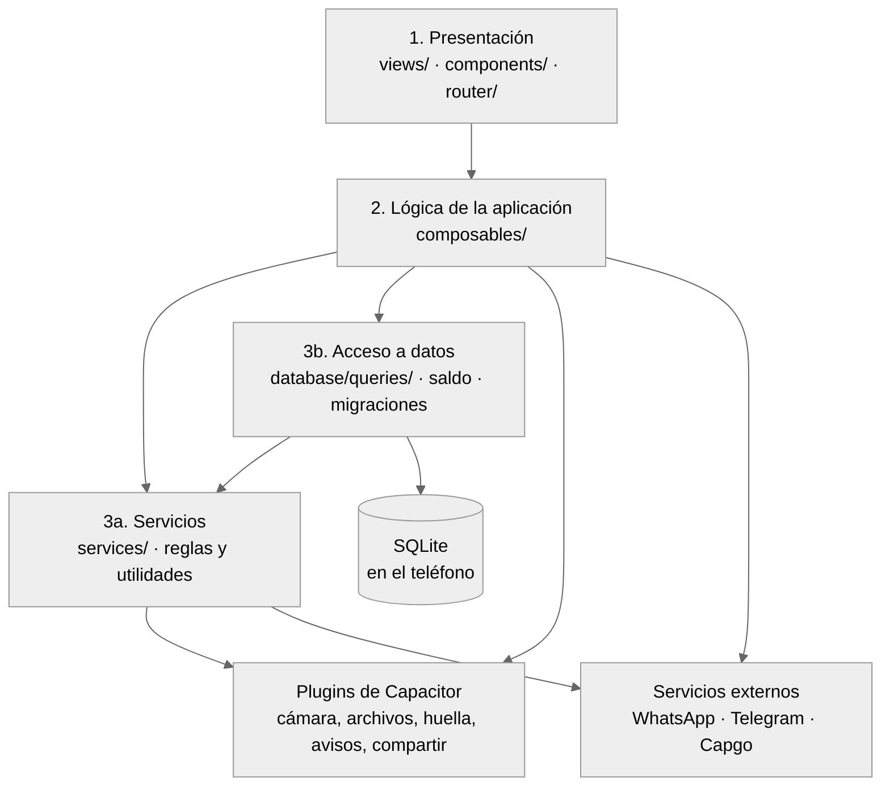
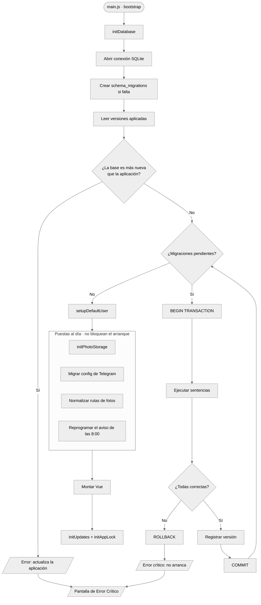
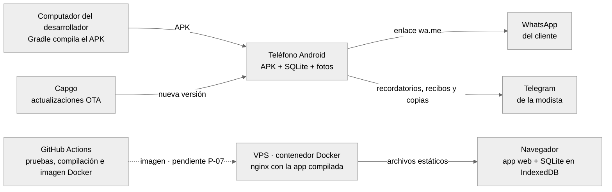

# Arquitectura · Atelier Manager

Cómo está construida la aplicación, sacado del código de `src/`. Si algo no está en el código, no está aquí.

> **Revisado contra el código:** 7 de octubre de 2026 · esquema de base de datos versión 8
> La prueba `src/__tests__/documentacion.spec.js` falla si este documento deja de coincidir con el código (módulos, rutas, esquema y excepciones).

**Otros documentos de diseño:**
- [MODELO_DE_DATOS.md](MODELO_DE_DATOS.md): tablas, columnas y migraciones.
- [CASOS_DE_USO.md](CASOS_DE_USO.md): actores, casos de uso y flujo del negocio.
- [COMPORTAMIENTO.md](COMPORTAMIENTO.md): navegación, estados y diagramas de secuencia.
- [CLASES.md](CLASES.md): diagrama de clases del dominio.

---

## 1. Resumen en cinco frases

1. Es una **aplicación móvil híbrida**: la interfaz está hecha con Vue 3 y Capacitor la empaqueta como APK de Android.
2. Es **offline-first**: todos los datos viven en una base SQLite dentro del teléfono. No hay servidor de datos ni cuentas en la nube.
3. Está organizada en **cuatro capas** con dependencias en una sola dirección: presentación → lógica → servicios y acceso a datos → SQLite.
4. Las **reglas de negocio** (estado de la orden, saldo, validaciones) viven en servicios y consultas, no en los botones. Las escrituras de varias tablas van en una sola transacción.
5. Lo único que sale del teléfono lo decide la modista: los avisos por WhatsApp, lo que se manda a su propio Telegram y la copia de seguridad cifrada.

## 2. Tecnologías

| Pieza | Tecnología | Para qué |
| --- | --- | --- |
| Interfaz | Vue 3 (Composition API, `<script setup>`), Vue Router 4, CSS propio | Pantallas y navegación |
| Empaquetado | Vite 8 | Compilar la app web |
| App nativa | Capacitor 8 (Android) | Convertir la app web en APK y dar acceso al teléfono |
| Base de datos | SQLite: `@capacitor-community/sqlite` en el teléfono, `jeep-sqlite` + IndexedDB en el navegador | Guardar todo localmente |
| Plugins nativos | Camera, Filesystem, Preferences, LocalNotifications, Share, Haptics, App, StatusBar, SplashScreen, BiometricAuth | Fotos, archivos, sesión, avisos, compartir, vibración, ciclo de vida, huella |
| Seguridad | bcryptjs (contraseña), Web Crypto (AES-256-GCM y PBKDF2 para el respaldo) | Proteger acceso y copias |
| Gráficas | Chart.js + vue-chartjs | Reporte financiero |
| Tutorial | driver.js | Guía paso a paso dentro de la app |
| Actualizaciones | Capgo (OTA) | Publicar versiones nuevas sin reinstalar el APK |
| Pruebas | Vitest + Vue Test Utils + sql.js; Playwright | Pruebas unitarias contra SQLite real y de punta a punta |
| Versión web | Docker: nginx sin privilegios | Servir la misma app en un navegador (demostración) |

## 3. Vista de capas

| Capa | Contenido |
| --- | --- |
| Presentación | 11 rutas, una vista por ruta, y los componentes de cada módulo |
| Lógica de la aplicación | 19 composables (sección 4.1) |
| Servicios | 12 módulos (sección 4.2) |
| Acceso a datos | 11 consultas, una por entidad, más conexión y migraciones (sección 4.3) |

**Regla de dependencias:** las flechas van solo hacia abajo. Una consulta SQL no sabe nada de Vue, y un servicio no conoce las pantallas. Los servicios son transversales: los usan tanto la lógica como las consultas (por ejemplo, `estadoOrden`). Qué hay en cada capa está en la sección 4.

### Excepciones conocidas

Cinco archivos de presentación leen la base directamente, sin pasar por un composable. Todas son lecturas o escrituras simples de una sola tabla; ninguna se salta una regla de negocio.

| Archivo | Qué usa | Por qué |
| --- | --- | --- |
| `src/views/AjustesView.vue` | `getConfig`, `updateConfig` | Lee y guarda los valores de Ajustes |
| `src/views/ClienteDetailView.vue` | `getConfig` | Lee el nombre del taller para el aviso de privacidad |
| `src/views/ReportesView.vue` | `getReporteFinanciero` | Pide el reporte del periodo elegido |
| `src/components/clientes/AutorizacionDatos.vue` | `getConfig` | Lee el nombre del taller para el aviso |
| `src/components/ordenes/OrdenForm.vue` | `getAllClientes`, `createCliente` | Lista y registra clientas desde la orden; la regla de autorización está en `createCliente` |

La prueba de documentación falla si aparece una sexta excepción sin anotarla aquí.

## 4. Módulos

Cada archivo con su responsabilidad. La prueba de documentación comprueba que no falte ninguno.

### 4.1 Lógica de la aplicación (`src/composables/`)

| Módulo | Responsabilidad |
| --- | --- |
| `useClientes` | Listar, buscar, registrar y editar clientas; registrar autorización y borrar datos personales (Ley 1581) |
| `useOrdenes` | Listar y crear órdenes, validar fechas, entregar, cancelar y reabrir |
| `usePrendas` | Agregar, editar, eliminar y cambiar el estado de prendas; fotos y notas |
| `usePagos` | Registrar abonos y anular pagos |
| `useReportes` | Datos del panel de inicio |
| `useSearch` | Búsqueda global de clientas y órdenes |
| `useConfiguracionNegocio` | Días de anticipación para "próximas a vencer" |
| `useOrdenTelegram` | Avisos por WhatsApp, recibo (`construirRecibo`) y envíos al Telegram de la modista desde una orden |
| `useNotificaciones` | Historial de avisos y recordatorios del día por Telegram |
| `useNotificacionesLocales` | Aviso de las 8:00 en el teléfono y sus permisos |
| `useTelegramBot` | Configuración del bot y envío de mensajes y archivos |
| `useTelegramReports` | Reporte diario de órdenes por Telegram |
| `useBackupRestore` | Copia de seguridad cifrada (archivo o Telegram) y restauración |
| `useAppLock` | Bloqueo al pasar a segundo plano |
| `useUpdates` | Actualizaciones OTA con Capgo |
| `useOrdenModals` | Confirmaciones y menús del detalle de la orden |
| `useAsyncAction` | Estado de carga, error y aviso para cualquier acción |
| `useHaptics` | Vibración al tocar |
| `useTutorial` | Recorridos guiados de la pantalla de ayuda |

### 4.2 Servicios (`src/services/`)

| Módulo | Responsabilidad |
| --- | --- |
| `estadoOrden` | Regla central: deriva el estado de la orden desde sus prendas; estado de pago y órdenes activas |
| `validators` | Todas las validaciones de datos y de cambios de estado |
| `vencimientos` | Próximas a vencer, atrasadas y días sin reclamar |
| `auth` | Inicio de sesión, huella, bloqueo, cambio de clave e inactividad |
| `cryptoService` | Cifrado AES-256-GCM con clave derivada por PBKDF2-SHA256 (600 000 iteraciones) |
| `backupPayload` | Formato del archivo de respaldo (versiones 1 y 2) |
| `avisoPrivacidad` | Texto del aviso de privacidad y su versión |
| `whatsapp` | Número con +57, enlaces `wa.me` y plantillas de mensajes |
| `telegramService` | Enlaces `t.me` |
| `photoStorage` | Guardar, leer y borrar fotos en el almacenamiento de la app |
| `fechas` | Fechas locales sin errores de zona horaria |
| `formato` | Pesos colombianos |

### 4.3 Acceso a datos (`src/database/`)

| Módulo | Responsabilidad |
| --- | --- |
| `connection` | Abrir SQLite en teléfono o navegador, exportar e importar con instantánea de seguridad |
| `migrationRunner` | Aplicar migraciones pendientes, cada una en su transacción |
| `migrations` | Las 8 versiones del esquema |
| `queries/auth` | Usuario y contraseña |
| `queries/clientes` | Clientas, autorización de datos y anonimización |
| `queries/ordenes` | Órdenes, cambios de estado manuales e historial |
| `queries/prendas` | Prendas, fotos y notas |
| `queries/pagos` | Abonos y anulaciones |
| `queries/estadoOrden` | Traduce la regla de estados a sentencias SQL dentro de la transacción |
| `queries/saldo` | Recalcula total y saldo desde prendas y pagos vigentes |
| `queries/notificaciones` | Historial de avisos y órdenes para recordar |
| `queries/reportes` | Panel de inicio y reporte financiero |
| `queries/search` | Búsqueda de clientas y órdenes |
| `queries/configuracion` | Valores de Ajustes |

## 5. Decisiones de arquitectura

Están argumentadas en [DECISIONES.md](../05-gestion/DECISIONES.md). Las que más preguntan:

| Pregunta | Respuesta corta | Decisión |
| --- | --- | --- |
| ¿Por qué no hay servidor? | Un taller con un teléfono no necesita uno; sin servidor no hay costo mensual y la app funciona sin internet | D-06 |
| ¿Por qué WhatsApp sin API? | La API de WhatsApp Business cobra por mensaje; el enlace `wa.me` es gratis y la modista revisa el mensaje antes de enviarlo | D-03 |
| ¿Para qué Telegram? | Es gratis para la modista: recibe ahí recordatorios, recibos y copias. No se usa para hablarle al cliente | D-03 |
| ¿Por qué el estado de la orden no se elige a mano? | Se deriva de las prendas en la misma transacción, así nunca se contradicen | D-10 |
| ¿Por qué SQLite y no otra base? | Viene con el teléfono, funciona sin red y es transaccional | D-06 |

## 6. Arranque y migraciones

**Sin base de datos no hay taller**, así que un fallo ahí detiene el arranque. Un fallo normalizando la ruta de una foto, en cambio, no puede impedir que la modista abra su aplicación.

## 7. Despliegue

La app es la **misma** en el teléfono y en el navegador; lo que cambia es dónde guarda los datos.

- **No hay servidor de datos.** El contenedor solo entrega archivos.
- **GitHub Actions prueba y construye la imagen, pero todavía no la publica en el VPS** (pendiente P-07). Por eso esa flecha es punteada.
- **Los datos no se comparten:** lo que se registra en el navegador queda en ese navegador y no llega al teléfono (D-06 y D-13).
- **Archivos:** `Dockerfile`, `docker/nginx.conf`, `docker/seguridad.inc`, `docker-compose.yml`, `.github/workflows/ci.yml`.

## 8. Seguridad

| Tema | Cómo está hecho |
| --- | --- |
| Contraseña | bcrypt con 10 rondas. La clave de fábrica obliga a cambiarla antes de entrar a cualquier pantalla |
| Sesión | Se guarda en Preferences. Al arrancar en frío se entra bloqueado |
| Segundo plano | Se bloquea al salir; si vuelve antes de 2 minutos se desbloquea solo, si no pide huella o contraseña |
| Inactividad | Cierra sesión a los 15 minutos |
| Copia de seguridad | Cifrada con AES-256-GCM; la clave se deriva de la contraseña maestra con PBKDF2-SHA256 y 600 000 iteraciones |
| Datos en el teléfono | La base no está cifrada como archivo; la protege el aislamiento de Android |
| Datos personales | Aviso de privacidad, autorización con fecha y versión, y borrado (Ley 1581). Ver D-08 |

Más detalle en el [manual técnico](../03-manuales/MANUAL_TECNICO.md).

## 9. Fuera del alcance de esta versión

Estas funciones **no se construyeron a propósito**, así que no están dibujadas:
- bodega y venta de prendas abandonadas (RF-61 a RF-63);
- exportación a Excel o PDF (RF-64, RF-65);
- impresión térmica (RF-66, RF-67);
- modo oscuro (RF-71);
- API de WhatsApp Business (solo se usan enlaces `wa.me`);
- sincronización entre dispositivos.

Quedaron escritas como requisitos de una fase posterior. La tabla con la razón de cada una está en el [SRS, sección 1.2](../01-requisitos/SRS.md).
