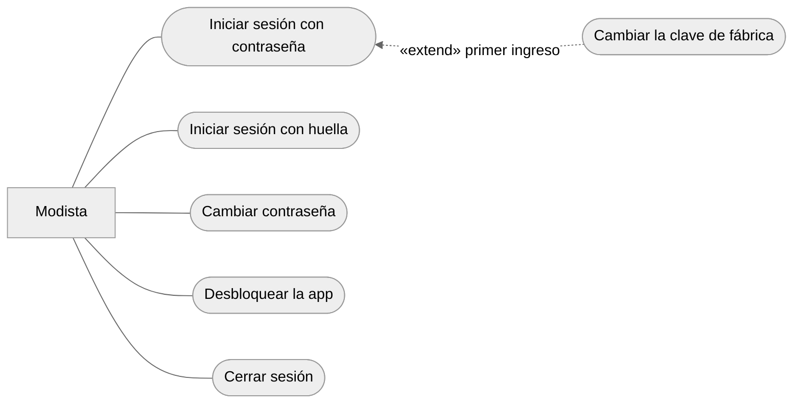
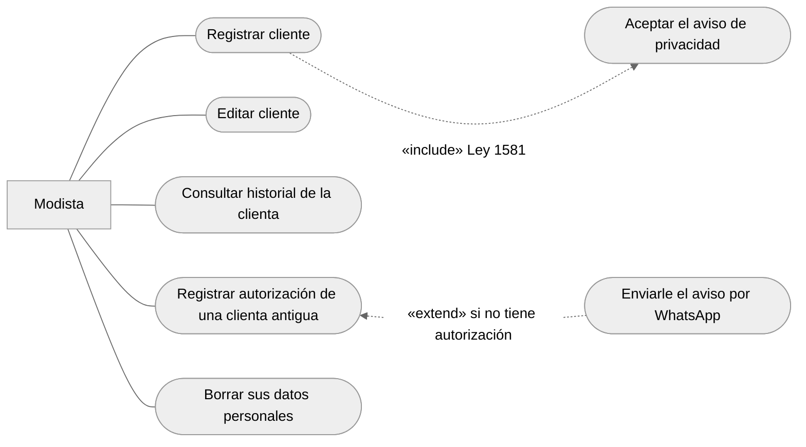
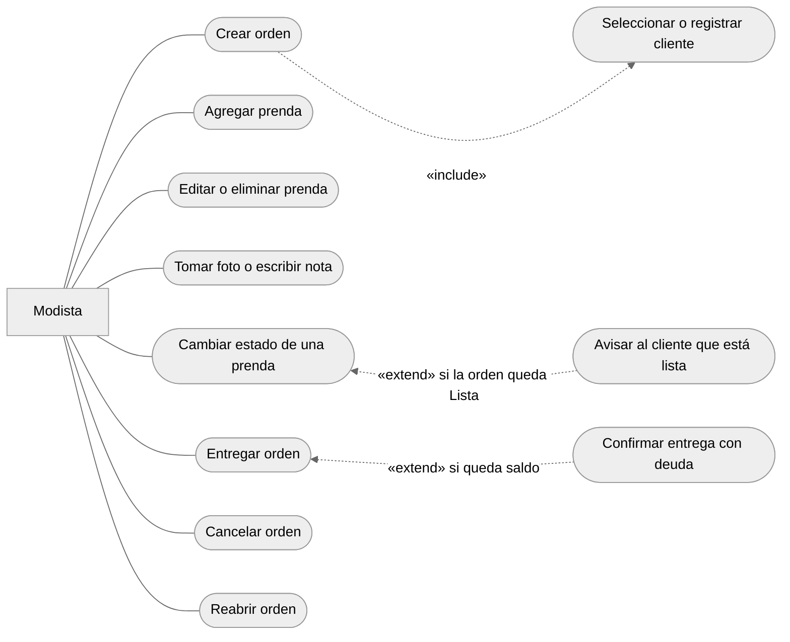
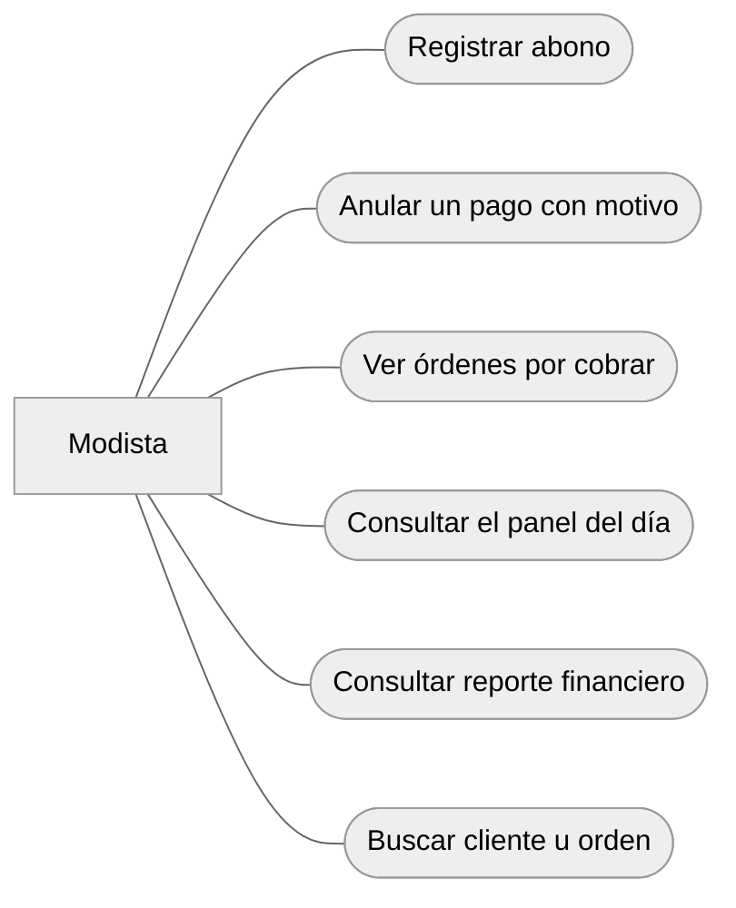
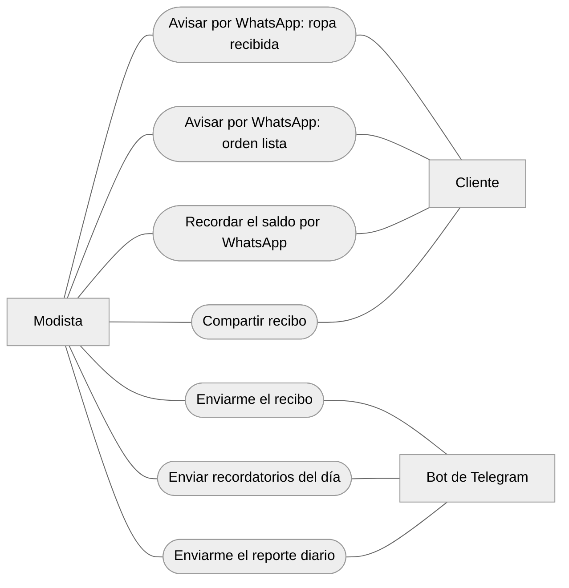
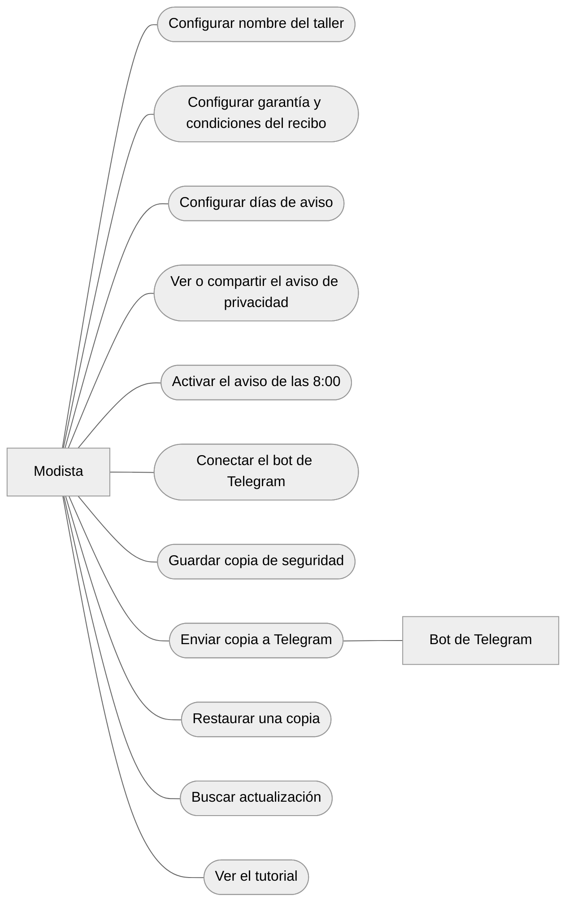
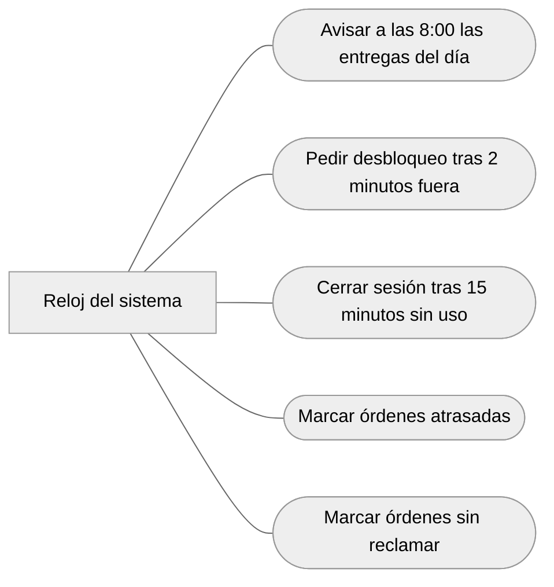
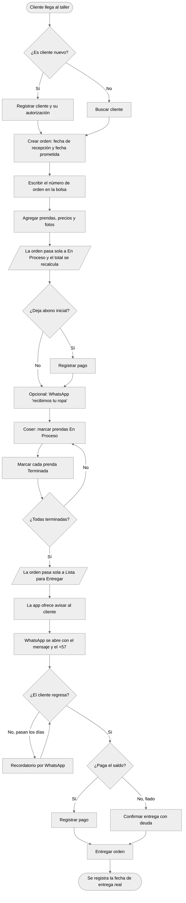

# Casos de uso · Atelier Manager

Qué puede hacer cada actor con la aplicación, tal como está construida hoy. Cada caso de uso corresponde a un botón o a un proceso que existe en el código.

> **Revisado contra el código:** 7 de octubre de 2026

---

## 1. Actores

| Actor | Tipo | Quién es |
| --- | --- | --- |
| **Modista** | Principal | Dueña del taller y única usuaria de la app |
| **Cliente** | Secundario | Deja la ropa y recibe avisos y recibos por WhatsApp. **No usa la app** |
| **Bot de Telegram** | Sistema externo | Le lleva a la modista recordatorios, recibos, reportes y copias de seguridad |
| **Reloj del sistema** | Actor temporal | Dispara lo que ocurre solo con el paso del tiempo |

**Cómo leer los diagramas.** Los casos de uso son los óvalos; las flechas punteadas son relaciones:
- **«include»**: el caso siempre ejecuta al otro.
- **«extend»**: el otro caso se ofrece solo en cierta condición.

Como la modista hace muchas cosas, sus casos se dividen en seis diagramas por tema.

## 2. Diagramas por actor

### 2.1 Modista · Acceso y seguridad

- **Cambiar la clave de fábrica** extiende *Iniciar sesión*: solo aparece mientras la contraseña sea la de fábrica, y no deja ir a ninguna otra pantalla hasta cambiarla.
- **Desbloquear la app** se hace con huella o contraseña.

### 2.2 Modista · Clientes y datos personales

- **Registrar cliente** siempre incluye que la clienta acepte el aviso de privacidad. La app guarda la fecha y la versión del aviso como prueba.
- **Registrar autorización de una clienta antigua** es para las registradas antes del aviso. Si todavía no ha autorizado, la app ofrece mandarle el aviso por WhatsApp.
- **Borrar sus datos personales** deja la orden y los pagos sin nombre ni teléfono. Solo se puede si no tiene órdenes abiertas ni saldo.

### 2.3 Modista · Órdenes y prendas

- **Crear orden** siempre incluye elegir a la clienta o registrarla ahí mismo. Pide la fecha de recepción (hoy o un día anterior) y la fecha prometida.
- **Cambiar estado de una prenda** mueve sola la orden ([COMPORTAMIENTO.md](COMPORTAMIENTO.md), sección 2.2). Si era la última prenda por terminar, la app ofrece avisar al cliente.
- **Entregar orden** pide confirmación si el cliente todavía debe (RN-30).
- **Cancelar** y **reabrir** son las únicas acciones que cambian el estado de la orden a mano.

### 2.4 Modista · Cobros y consultas

- **Registrar abono** pide el medio de pago (Efectivo, Transferencia, Nequi, Daviplata o Bre-B) y la fecha, que puede ser anterior a hoy. La app no mueve dinero: solo registra lo que ya se recibió (D-05).
- **Panel del día:** atrasadas, próximas entregas, listas esperando al cliente y total por cobrar.
- **Reporte financiero:** ingresos, órdenes nuevas, prendas procesadas y ticket promedio del periodo.

### 2.5 Modista · Comunicación

- **Ningún aviso al cliente sale solo.** La app abre WhatsApp con el mensaje escrito y el +57; la modista lo revisa y pulsa Enviar (D-03). En el historial queda como "aviso preparado".
- **Avisar que está lista** solo se ofrece con la orden en *Lista para Entregar*. **Recordar el saldo**, solo si el cliente debe algo.
- **Enviar recordatorios del día** le manda **a la modista**, por Telegram, un enlace de WhatsApp por cada orden lista que nadie ha recogido. Solo queda registrado si Telegram confirma el envío.

### 2.6 Modista · Configuración y copia de seguridad

- **Guardar copia de seguridad** no necesita Telegram: cifra la copia y abre el menú Compartir de Android para guardarla en Drive o mandarla por WhatsApp.
- **Enviar copia a Telegram** es la alternativa, y requiere el bot conectado (K6). No es un «include», porque no se conecta el bot cada vez.
- Las dos copias usan la misma contraseña maestra y el mismo cifrado.

### 2.7 Reloj del sistema

**Sin reclamar:** la orden está Lista y pasaron más de 30 días desde la fecha prometida, o desde que quedó Lista si fue después (RN-37). Es una alerta para la modista, **no** el procedimiento legal de bienes abandonados.

### 2.8 Resumen

| Actor | Casos de uso | Diagrama |
| --- | --- | --- |
| Modista | Iniciar sesión (clave o huella), cambiar contraseña y clave de fábrica, desbloquear, cerrar sesión | 2.1 |
| Modista | Registrar, editar y consultar clientas; autorización; borrar datos personales | 2.2 |
| Modista | Crear orden; agregar, editar, eliminar y cambiar estado de prendas; fotos y notas; entregar, cancelar, reabrir | 2.3 |
| Modista | Abonos, anulaciones, por cobrar, panel, reporte financiero, búsqueda | 2.4 |
| Modista | Avisos por WhatsApp, recibos, recordatorios y reporte diario | 2.5 |
| Modista | Taller, garantía y condiciones, días de aviso, aviso de privacidad, aviso de las 8:00, Telegram, copias, actualización, tutorial | 2.6 |
| Cliente | Recibe avisos y recibos por WhatsApp (no usa la app) | 2.5 |
| Bot de Telegram | Recibe recibos, recordatorios, reportes y copias para la modista | 2.5, 2.6 |
| Reloj del sistema | Aviso de las 8:00, bloqueo, cierre por inactividad, atrasadas, sin reclamar | 2.7 |

## 3. Especificación de los casos de uso principales

### CU-01 · Registrar cliente

| Campo | Contenido |
| --- | --- |
| Actor | Modista |
| Requisitos | RF-01, RN-01, RN-02, Ley 1581 |
| Precondición | Sesión iniciada |
| Flujo principal | 1. Toca *+ Nuevo* en Clientes (o *+ Nuevo Cliente* al crear una orden). 2. Escribe nombre, celular y, si quiere, dirección. 3. Le lee o le envía el aviso de privacidad a la clienta. 4. Marca la casilla de autorización. 5. Guarda |
| Flujo alterno | 4a. Sin la casilla, la app no guarda y explica por qué |
| Postcondición | La clienta queda registrada con la fecha y la versión del aviso que aceptó |

### CU-02 · Crear orden

| Campo | Contenido |
| --- | --- |
| Actor | Modista |
| Requisitos | RF-05, RF-06, RN-03, RN-05 |
| Precondición | Sesión iniciada |
| Flujo principal | 1. Toca *+ Nueva* en Órdenes. 2. Elige la clienta o la registra (CU-01). 3. Indica la fecha de recepción y la fecha prometida. 4. Guarda |
| Flujos alternos | 3a. Fecha de recepción futura: se rechaza. 3b. Fecha prometida anterior a la recepción: se rechaza |
| Postcondición | La orden existe en estado *Pendiente*, sin prendas y con total cero |

### CU-03 · Agregar prenda

| Campo | Contenido |
| --- | --- |
| Actor | Modista |
| Requisitos | RF-17, RF-18, RF-19, RN-17, RN-19, RN-20 |
| Precondición | La orden no está *Entregada* ni *Cancelada* |
| Flujo principal | 1. En la pestaña Prendas toca *+ Prenda*. 2. Elige el tipo, describe el arreglo (la app sugiere los frecuentes) y pone el precio. 3. Guarda. 4. Si quiere, toma una foto o escribe una nota |
| Flujo alterno | 2a. Descripción vacía o precio en cero: se rechaza |
| Postcondición | En una sola transacción: la prenda queda *Pendiente*, la orden pasa a *En Proceso* y el total y el saldo se recalculan |

### CU-04 · Cambiar estado de una prenda

| Campo | Contenido |
| --- | --- |
| Actor | Modista |
| Requisitos | RF-21, RF-24, RN-06, RN-07, RN-17 |
| Precondición | La orden está abierta |
| Flujo principal | 1. En la tarjeta de la prenda toca el estado nuevo (*En Proceso*, *Terminada* o *Entregada*). 2. La app guarda el cambio y recalcula el estado de la orden |
| Flujos alternos | 2a. Si era la última prenda por terminar, la orden pasa a *Lista para Entregar* y la app pregunta si quiere avisar al cliente por WhatsApp. 2b. Una prenda solo pasa a *Entregada* desde *Terminada* |
| Postcondición | Prenda, orden e historial actualizados en la misma transacción |

### CU-05 · Registrar abono

| Campo | Contenido |
| --- | --- |
| Actor | Modista |
| Requisitos | RF-33, RF-34, RF-36, RN-25 a RN-30 |
| Precondición | La orden no está *Cancelada* y tiene saldo |
| Flujo principal | 1. En la pestaña Pagos toca *+ Registrar Pago*. 2. Escribe el valor, elige el medio y, si fue antes, la fecha. 3. Guarda |
| Flujo alterno | 2a. Valor en cero, negativo o mayor que el saldo: se rechaza. Un doble toque no registra dos pagos |
| Postcondición | El pago queda registrado y el saldo se recalcula; si llega a cero, la orden aparece como *Pagada* |

### CU-06 · Entregar orden

| Campo | Contenido |
| --- | --- |
| Actor | Modista |
| Requisitos | RF-48, RN-30, RN-36 |
| Precondición | La orden está *Lista para Entregar* |
| Flujo principal | 1. En el detalle toca *Entregar orden*. 2. La orden pasa a *Entregada* con la fecha y hora de entrega |
| Flujo alterno | 1a. Si el cliente debe, la app muestra cuánto y pide confirmación. Se puede entregar fiado y seguir cobrando después |
| Postcondición | Orden *Entregada*, todas sus prendas *Entregada*, fecha de entrega real registrada |

### CU-07 · Avisar al cliente por WhatsApp

| Campo | Contenido |
| --- | --- |
| Actores | Modista, Cliente |
| Requisitos | RF-39, RN-31, RN-34, D-03 |
| Precondición | La clienta tiene celular registrado |
| Flujo principal | 1. En el detalle de la orden toca el aviso (*recibida*, *lista* o *saldo*). 2. La app arma el mensaje con los datos actuales y abre WhatsApp con el número en formato +57. 3. La modista revisa y pulsa Enviar |
| Flujo alterno | 1a. El aviso de *lista* solo aparece si la orden está *Lista para Entregar* |
| Postcondición | El historial dice "Aviso por WhatsApp preparado". La app no afirma que el cliente lo recibió |

### CU-08 · Guardar copia de seguridad

| Campo | Contenido |
| --- | --- |
| Actor | Modista |
| Requisitos | RNF-17, RNF-25 |
| Precondición | Ninguna; no necesita Telegram |
| Flujo principal | 1. En Ajustes toca *Guardar copia de seguridad*. 2. Escribe la contraseña maestra. 3. La app cifra la base y las fotos. 4. Se abre el menú Compartir y la modista elige dónde guardarla |
| Flujo alterno | 3a. Si las fotos pasan de 20 MB, la copia sale sin fotos y la app lo dice |
| Postcondición | Un archivo cifrado que solo se abre con la contraseña maestra |

### CU-09 · Borrar los datos personales de una clienta

| Campo | Contenido |
| --- | --- |
| Actor | Modista (a pedido de la clienta) |
| Requisitos | Ley 1581, derecho de supresión; D-08 |
| Precondición | La clienta no tiene órdenes abiertas ni saldo pendiente |
| Flujo principal | 1. En el detalle de la clienta toca *Borrar sus datos personales*. 2. Lee la advertencia y confirma |
| Flujo alterno | 1a. Con órdenes abiertas o saldo, la app no lo permite y explica qué falta |
| Postcondición | Nombre "Clienta retirada", sin teléfono ni dirección, y su nombre fuera del historial de avisos. Órdenes y pagos se conservan para las cuentas del taller |

## 4. Flujo del negocio

Desde que el cliente entra por la puerta hasta que se lleva la ropa.

> **El aviso al cliente no es automático.** La aplicación arma el mensaje y abre WhatsApp; enviarlo es una acción de la modista. No hay integración con la API de WhatsApp Business.
