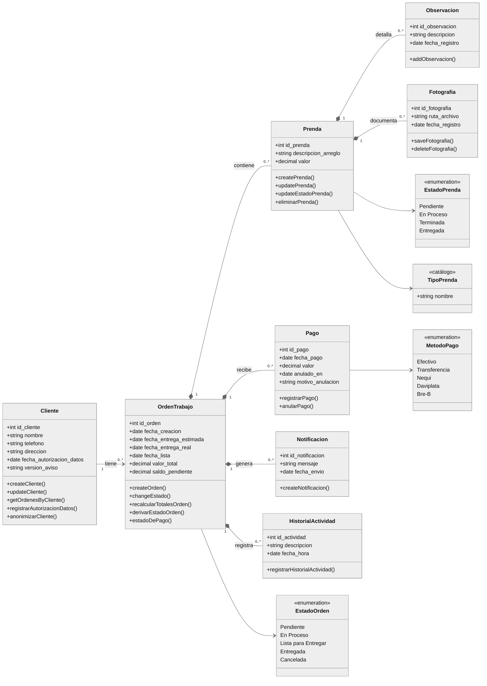

# Diagrama de clases · Atelier Manager

**Una aclaración antes del diagrama:** la app está escrita en JavaScript con Vue 3 y no usa `class`. Cada entidad es una tabla de SQLite y sus operaciones son funciones de `src/database/queries/` y `src/services/`. Por eso esto es un **modelo de clases del dominio**: dibuja las entidades con sus atributos y, como métodos, las funciones reales que trabajan sobre cada una.

> **Revisado contra el código:** 7 de octubre de 2026
> La prueba `src/__tests__/documentacion.spec.js` comprueba que cada método del diagrama exista como función exportada en `src/`.

---

## 1. Modelo del dominio

**Composición o asociación.** Una orden **compone** a sus prendas, pagos, avisos e historial: no existen sin ella. La clienta solo se **asocia** a sus órdenes; si borra sus datos, las órdenes se quedan.

## 2. Dónde vive cada método

| Clase | Módulo | Qué hace el método más importante |
| --- | --- | --- |
| Cliente | `database/queries/clientes.js` | `createCliente` rechaza el registro sin autorización y guarda fecha y versión del aviso |
| OrdenTrabajo | `database/queries/ordenes.js`, `queries/saldo.js`, `services/estadoOrden.js` | `derivarEstadoOrden` decide el estado desde las prendas; `recalcularTotalesOrden` rehace total y saldo |
| Prenda | `database/queries/prendas.js` | `createPrenda` y `updateEstadoPrenda` cambian la prenda y la orden en la misma transacción |
| Observacion, Fotografia | `database/queries/prendas.js` | Cada nota o foto también deja una línea en el historial |
| Pago | `database/queries/pagos.js` | `registrarPago` comprueba el saldo dentro de la propia sentencia; `anularPago` nunca borra |
| Notificacion | `database/queries/notificaciones.js` | Registra lo que se preparó, no lo que el cliente leyó |
| HistorialActividad | `database/queries/ordenes.js` | Rastro de todo lo que le pasó a la orden |

Los estados y catálogos son tablas con valores fijos; están en [MODELO_DE_DATOS.md](MODELO_DE_DATOS.md), sección 2.2.
