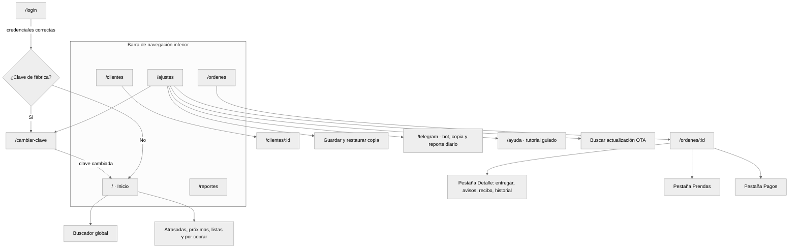
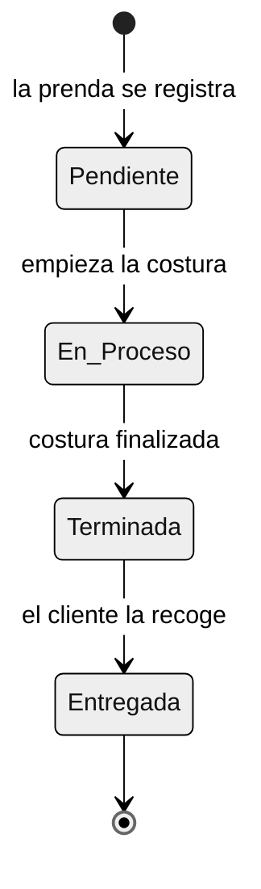
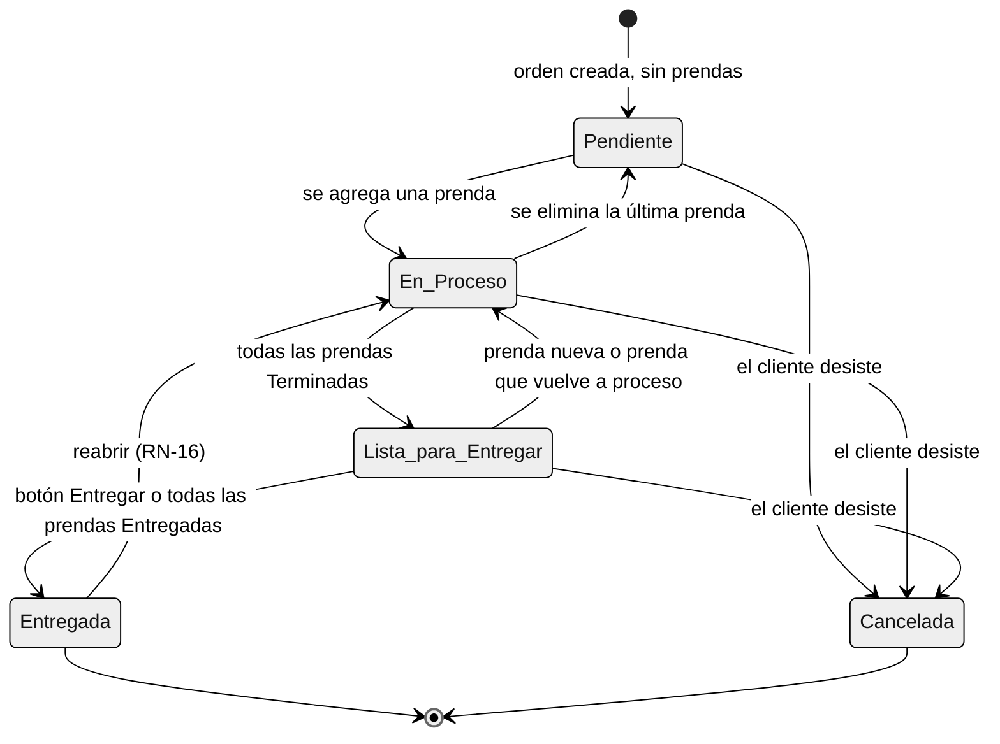
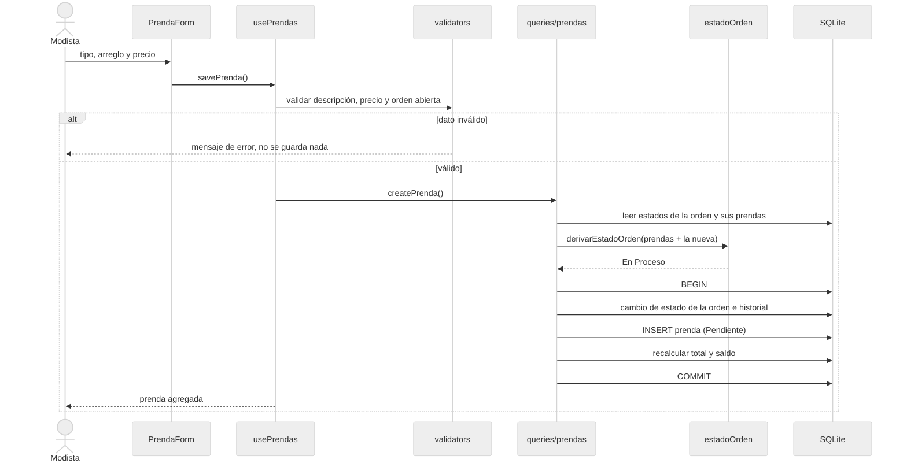
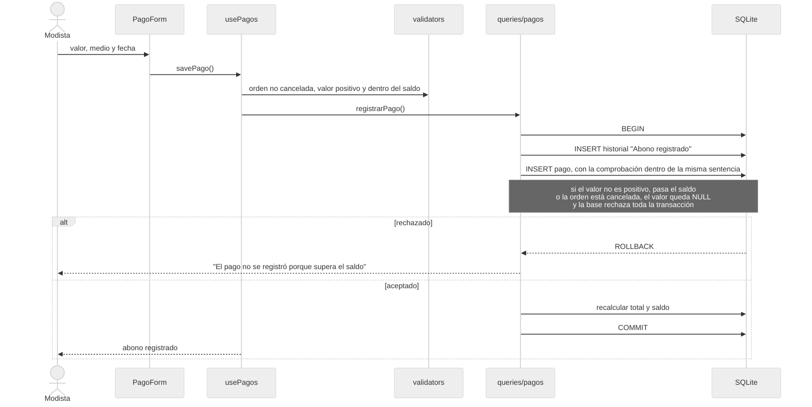
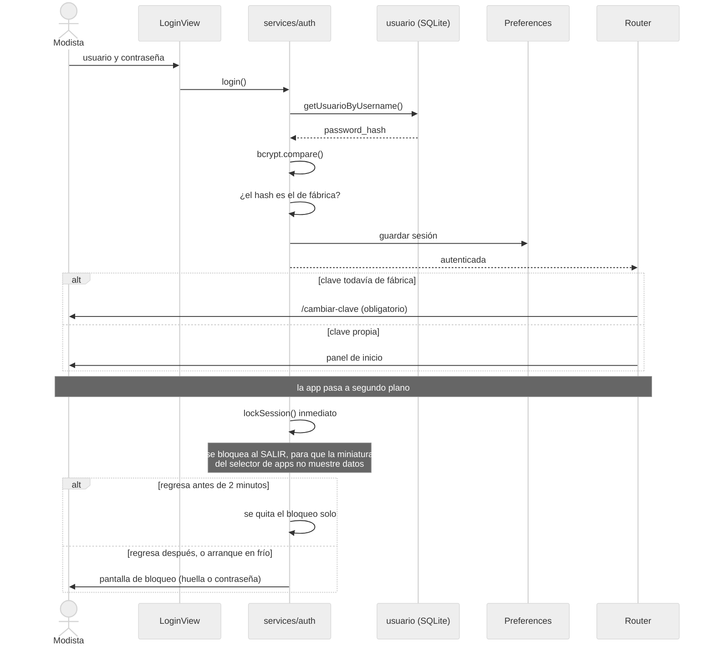
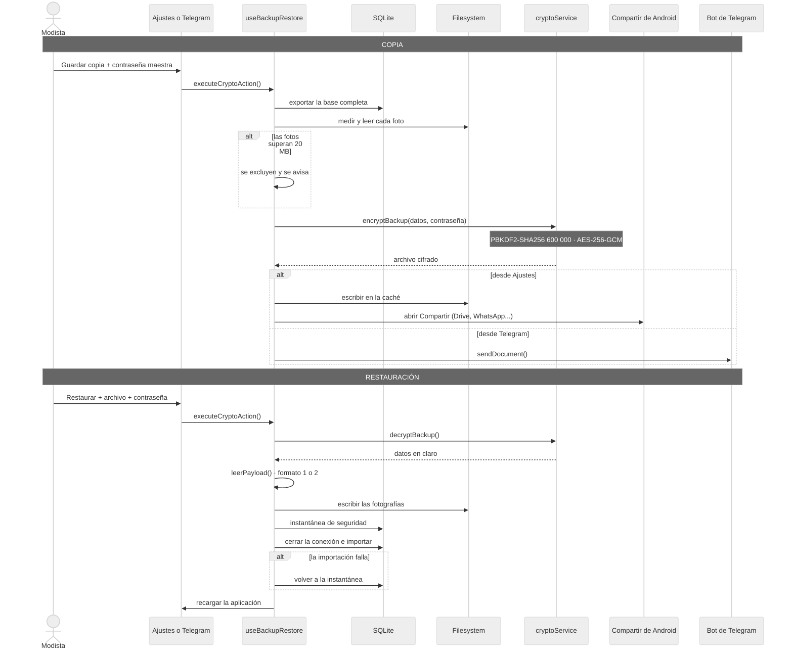

# Comportamiento · Atelier Manager

Cómo se mueve la aplicación: sus pantallas, los estados de órdenes y prendas, y lo que pasa por dentro en las operaciones importantes. Todo está sacado de `src/`.

> **Revisado contra el código:** 7 de octubre de 2026

---

## 1. Navegación

Las 11 rutas de `src/router/index.js`. Cualquier otra dirección vuelve al inicio.

- **Guardia de sesión:** sin sesión, cualquier ruta lleva a `/login`. Con la clave de fábrica, cualquier ruta lleva a `/cambiar-clave`.
- **La copia de seguridad está en dos lugares:** en Ajustes se guarda como archivo (sin Telegram); en `/telegram` se envía al bot. Restaurar funciona desde los dos.

## 2. Estados

Son **dos** máquinas de estados distintas: la de cada prenda y la de la orden.

### 2.1 Estado de una prenda (`estado_prenda`)

Cuatro estados. Una prenda **no** se cancela: se cancela la orden completa. Solo pasa a *Entregada* desde *Terminada*.

### 2.2 Estado de una orden (`estado_orden`)

**Transiciones automáticas.** *Pendiente*, *En Proceso* y *Lista para Entregar* no se eligen a mano: las decide `derivarEstadoOrden` (`services/estadoOrden.js`) cada vez que se crea, cambia de estado o elimina una prenda, en la misma transacción.

| Prendas de la orden | Estado de la orden | Regla |
| --- | --- | --- |
| Ninguna | Pendiente | RN-04 |
| Alguna *Pendiente* o *En Proceso* | En Proceso | RN-17 |
| Todas *Terminada* o *Entregada*, alguna sin entregar | Lista para Entregar · se registra "falta avisarle al cliente" | RN-06, RN-10 |
| Todas *Entregada* | Entregada · se sella la fecha de entrega real | RN-09 |

Una orden *Entregada* o *Cancelada* no cambia por sus prendas.

**Acciones manuales** (`validators.validateCambioManualEstado`):
- *Entregar*: solo desde *Lista para Entregar*. Pone todas las prendas en *Entregada*.
- *Cancelar*: cualquier orden que no esté *Entregada*. Los pagos se conservan.
- *Reabrir*: solo una *Entregada*; vuelve a *En Proceso*.
- Una orden *Cancelada* no admite prendas ni pagos.

**Otros estados que se calculan, no se guardan:**

| Concepto | Regla | Dónde |
| --- | --- | --- |
| Orden activa | Solo *En Proceso* y *Lista para Entregar* (RN-04). Una *Pendiente* no cuenta en atrasadas, próximas ni recordatorios | `ESTADOS_ORDEN_ACTIVA` |
| Estado de pago | *Pagada* si el saldo es cero, *Pendiente* si queda saldo (RN-28) | `estadoDePago` |
| Próxima a vencer | Entrega entre hoy y hoy + N días, con N de 0 a 30 en Ajustes (RN-38) | `clasificarVencimiento` |
| Sin reclamar | Lista y más de N días (30) desde la fecha más tardía entre `fecha_lista` y la fecha prometida (RN-37). Es una alerta, no el procedimiento legal de la Ley 1480 | `queries/reportes.js` |
| Saldo | `valor_total = suma de prendas`; `saldo = total − pagos no anulados`. Se recalcula en cada escritura; nunca se suman diferencias | `queries/saldo.js` |

## 3. Secuencias

### 3.1 Agregar una prenda

Muestra por qué el estado y el saldo nunca se descuadran: todo va en una sola transacción.

Si cualquier sentencia falla, la transacción se deshace completa: no queda una prenda sin su total ni una orden con el estado equivocado.

### 3.2 Registrar un abono

La comprobación se hace **dos veces**: antes, en `validators`, para dar un mensaje claro; y dentro de la sentencia que escribe, porque un doble toque lanza dos guardados que leerían el mismo saldo.

### 3.3 Sesión: acceso y bloqueo

Además, la sesión se cierra tras 15 minutos sin tocar la pantalla.

### 3.4 Copia de seguridad y restauración

**Qué lleva la copia (formato 2):** la base de datos completa (incluida la configuración del bot y la contraseña como hash) y las fotografías mientras no pasen de 20 MB. Las copias del formato 1, sin fotos, se siguen pudiendo restaurar.
