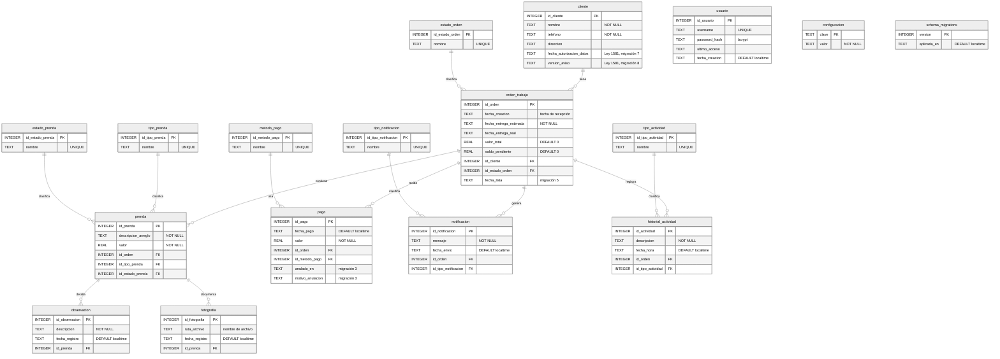

# Modelo de datos · Atelier Manager

El esquema **real**, tal como lo crea `src/database/migrations.js`. El diseño inicial en MySQL ([historico/script_mysql_original.sql](historico/script_mysql_original.sql)) ya no corresponde a la base y la app no lo usa.

> **Versión del esquema documentada:** 8 (`schema_migrations`)
> La prueba `src/__tests__/documentacion.spec.js` crea la base con las migraciones reales y falla si una tabla o columna del diagrama no coincide.

---

## 1. Diagrama entidad-relación

Diecisiete tablas: ocho de negocio, seis catálogos y tres de soporte.

**Cardinalidad:** una orden tiene **cero o más** prendas. Recién creada no tiene ninguna y está *Pendiente* (RN-04).

## 2. Diccionario de datos

### 2.1 Tablas de negocio

| Tabla | Qué guarda | Notas |
| --- | --- | --- |
| `cliente` | Las clientas del taller | Sin autorización (`fecha_autorizacion_datos`) no se puede registrar (Ley 1581). Al borrar sus datos queda como "Clienta retirada" con el teléfono vacío |
| `orden_trabajo` | Un encargo: lo que una clienta deja en una visita | `fecha_creacion` es la fecha de **recepción**, que puede ser anterior a hoy. `valor_total` y `saldo_pendiente` se recalculan en cada escritura (`queries/saldo.js`); nunca se suman diferencias. `fecha_lista` se sella al entrar en *Lista para Entregar* y se borra al salir |
| `prenda` | Cada pieza de ropa de la orden, con su arreglo y precio | Su estado decide el de la orden (`services/estadoOrden.js`) |
| `observacion` | Notas sobre una prenda | Texto libre de la modista |
| `fotografia` | Fotos de una prenda | Guarda el **nombre** del archivo, no la ruta completa, para sobrevivir a una reinstalación |
| `pago` | Abonos | Un pago nunca se borra: se anula con `anulado_en` y `motivo_anulacion`, y deja de contar en el saldo |
| `notificacion` | Historial de avisos de cada orden | Registra lo que la app **preparó**, no lo que el cliente leyó |
| `historial_actividad` | Todo lo que le pasó a una orden | Se escribe en la misma transacción que el cambio |

### 2.2 Catálogos

Los valores se crean en la migración 1, salvo donde se indica.

| Tabla | Valores |
| --- | --- |
| `estado_orden` | 1 Pendiente · 2 En Proceso · 3 Lista para Entregar · 4 Entregada · 5 Cancelada |
| `estado_prenda` | 1 Pendiente · 2 En Proceso · 3 Terminada · 4 Entregada |
| `tipo_prenda` | 1 Pantalón · 2 Camisa · 3 Vestido · 4 Falda · 5 Chaqueta · 6 Blusa · 7 Uniforme · 8 Otro |
| `metodo_pago` | 1 Efectivo · 2 Transferencia · 3 Nequi · 4 Daviplata · 5 Bre-B (migración 6) |
| `tipo_notificacion` | 1 Resumen · 2 Orden Lista · 3 Recordatorio · 4 Orden Recibida · 5 En Proceso · 6 Cobro (4 a 6 en la migración 6) |
| `tipo_actividad` | 1 Creación · 2 Modificación · 3 Cambio Estado · 4 Pago · 5 Entrega · 6 Cancelación · 7 Reapertura · 8 Anulación de pago · 9 Eliminación de prenda (8 y 9 en la migración 3) |

### 2.3 Tablas de soporte

| Tabla | Qué guarda |
| --- | --- |
| `usuario` | La cuenta de la modista. La contraseña se guarda como hash bcrypt |
| `configuracion` | Los valores de Ajustes, como pares clave-valor (abajo). Entran solos en la copia de seguridad |
| `schema_migrations` | Qué versiones del esquema ya se aplicaron y cuándo |

**Claves de `configuracion`:**

| Clave | Para qué | Valor inicial |
| --- | --- | --- |
| `telegram_bot_token` | Token del bot de la modista | vacío |
| `telegram_chat_id` | Chat donde recibe recordatorios, recibos y copias | vacío |
| `dias_anticipacion_vencer` | Días antes de la entrega en que la orden aparece como próxima (0 a 30) | 3 |
| `dias_sin_reclamar` | Días para marcar una orden lista como sin reclamar | 30 |
| `nombre_taller` | Sale en los mensajes y en el recibo | vacío |
| `garantia_recibo` | Garantía impresa en el recibo | la que dio la dueña: seis meses |
| `condiciones_recibo` | Condiciones para recoger y pagar | las que dio la dueña |

## 3. Índices

`idx_cliente_nombre`, `idx_orden_cliente`, `idx_orden_estado`, `idx_orden_fecha_entrega`, `idx_prenda_orden`, `idx_pago_orden`, `idx_notificacion_orden`, `idx_historial_orden`. Están sobre las claves foráneas y los campos por los que se busca.

## 4. Migraciones

Cada migración corre en su propia transacción. Si falla, se deshace completa y la app no arranca con una base a medias. Si el teléfono tiene una base **más nueva** que la app (por ejemplo, tras restaurar una copia hecha con una versión posterior), la app se niega a abrirla.

| Versión | Qué cambia | Por qué |
| --- | --- | --- |
| 1 | Crea las 16 tablas del negocio, catálogos e índices | Esquema inicial |
| 2 | Recalcula total y saldo de todas las órdenes | El saldo se acumulaba por diferencias y se descuadraba (P1-4) |
| 3 | `pago.anulado_en` y `pago.motivo_anulacion` | Un pago no se borra, se anula (P1-9) |
| 4 | Ajusta el estado de las órdenes abiertas según sus prendas | Desde aquí el estado se deriva de las prendas (RN-06, RN-17) |
| 5 | `orden_trabajo.fecha_lista` | "Sin reclamar" se cuenta desde que la orden quedó lista (RN-37) |
| 6 | Bre-B, `nombre_taller` y tipos de aviso por WhatsApp | Avisos por WhatsApp y pagos sin costo |
| 7 | `cliente.fecha_autorizacion_datos` | Prueba de la autorización (Ley 1581) |
| 8 | `cliente.version_aviso`, `garantia_recibo` y `condiciones_recibo` | Qué aviso aceptó la clienta; garantía y condiciones en el recibo (Ley 1480 art. 18) |

`schema_migrations` la crea `migrationRunner.js` antes de aplicar la primera; por eso son 17 tablas y no 16.
