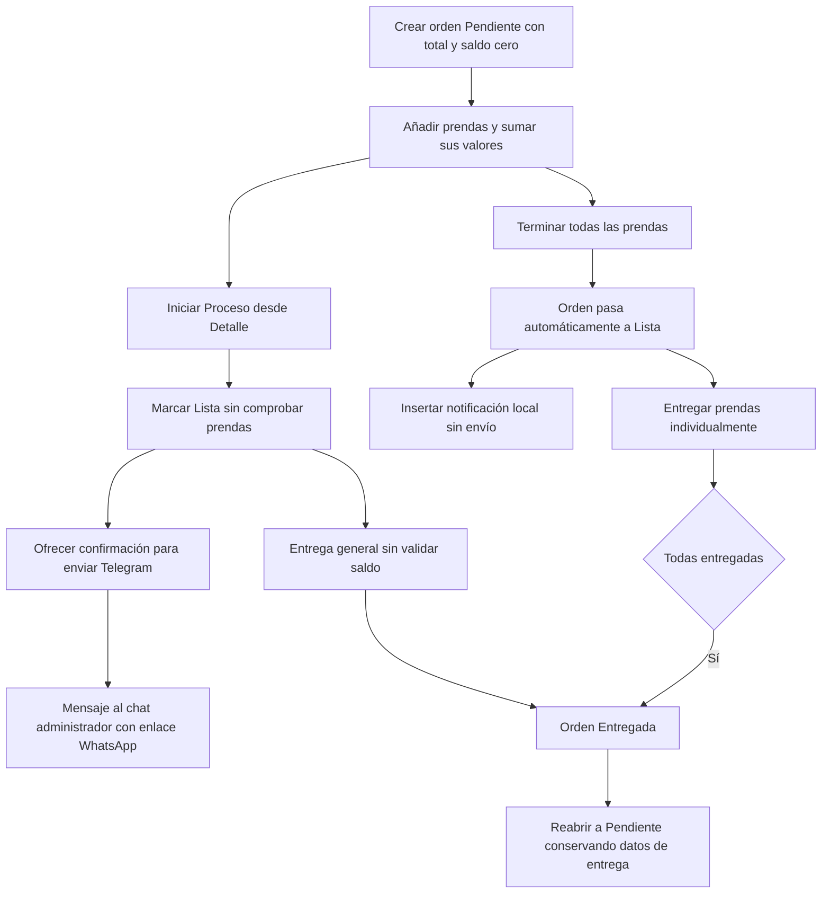

# Auditoría de la app y su documentación

Fecha de revisión: 6 de octubre de 2026, zona America/Bogota.

La documentación y los diagramas **no coinciden completamente con la implementación**. Hay errores funcionales, promesas documentales que el código no cumple y decisiones de negocio contradictorias entre documentos. Este informe conserva las especificaciones originales y permite comprobar los hallazgos antes de decidir las correcciones.

## Alcance y evidencia

Se revisaron `src/`, las migraciones SQLite, configuración Android/Capacitor, dependencias, pruebas y CI; `README.md`, `FICHA_TECNICA.md`, `MANUAL_USUARIO.md`, los cuatro Markdown de `docs/`, el texto de `Costura.docx` y `script_costura.sql`. El Word también contiene RN-16, RN-30, RF-39, RF-40, RF-42 y RNF-14: los conflictos no se limitan al Markdown.

Se reprodujeron **14 comportamientos** mediante los cuerpos originales de los módulos JavaScript, con SQLite real en memoria y dobles de Vue, Capacitor y transporte. Las sustituciones se limitan a sus dependencias importadas. Esto verifica lógica y consultas; no equivale a ejecutar la interfaz ni validar plugins en un teléfono.

Para repetir la comprobación con Node 24:

```powershell
node docs/auditoria/verificar.mjs
```

La evidencia está en `docs/auditoria/resultados.json`. El script no abre la base del taller ni envía mensajes. No se modificaron los archivos de implementación ni los documentos originales. El APK de MediaFire, `dist.zip` y `dist(actializado)` no se han certificado como equivalentes al código fuente revisado.

Prioridades: **P1** afecta integridad, seguridad o comunica una operación inexistente; **P2** afecta comportamiento y coherencia; **D** identifica una diferencia documental. No todos los comportamientos reproducidos implican que deba cambiarse el código: A14 requiere resolver una contradicción de negocio.

## Hallazgos reproducidos

### A01 — P1 — Eliminar pagos y prendas solo muestra un mensaje

**Evidencia:** `src/composables/useOrdenModals.js:73`; conexiones en `src/views/OrdenDetailView.vue:59` y las pestañas de prendas/pagos.

`handleSheetAction()` muestra «Prenda eliminada» o «Pago eliminado y saldo recalculado» sin llamar a ninguna operación de borrado, recalcular importes ni recargar listas. La prueba confirma que el pago continúa en SQLite después del mensaje de éxito.

**Cómo verlo:** abrir una orden con un pago o prenda, deslizar el elemento y confirmar Eliminar; volver a abrir la orden. El elemento seguirá presente.

**Corrección:** implementar la operación completa y atómica, con política explícita para fotos, observaciones, importes e historial, y anunciar éxito únicamente después de guardarla. RNF-05 exige confirmar operaciones exitosas.

### A02 — P1 — Los recordatorios masivos no se envían

**Evidencia:** `src/database/queries/notificaciones.js:41` y `src/views/DashboardView.vue:182`.

`executeRecordatoriosMasivos()` inserta filas en `notificacion` y devuelve su cantidad, pero no invoca ningún transporte. El panel anuncia «Se enviaron ... recordatorios automáticos». La prueba obtiene un recordatorio registrado y cero solicitudes de envío. La transición automática a Lista también inserta una notificación sin enviarla (`prendas.js:136`).

**Cómo verlo:** tener una orden Lista y ejecutar los recordatorios del panel. Se registra una notificación aunque Telegram no esté configurado.

**Corrección:** distinguir mensaje pendiente, envío intentado y envío confirmado; registrar como enviado solo tras confirmar el transporte. RF-39/RF-40 no se cumplen mediante una inserción local.

### A03 — P2 — Reabrir devuelve a Pendiente y conserva los datos de entrega

**Evidencia:** `src/components/ordenes/TabDetalle.vue:20`, `src/database/queries/ordenes.js:86`; RN-16 y HU-09 CA-02 en `docs/Costura.md` y Word.

La interfaz solicita estado 1, Pendiente. La actualización conserva `fecha_entrega_real` y las prendas en estado Entregada. La especificación pide **En Proceso**. Sí se registra la actividad de reapertura, por lo que RF-14 está parcialmente bien cubierto.

**Cómo verlo:** entregar una orden y pulsar Reabrir Orden. La cabecera dice Pendiente, las prendas siguen Entregadas y aparece la antigua fecha real.

**Corrección:** establecer En Proceso y definir qué prendas se reabren y cómo se conserva el historial de entregas anteriores.

### A04 — P1 — Marcar Lista admite prendas sin terminar

**Evidencia:** `src/components/ordenes/TabDetalle.vue:15`, `src/composables/useOrdenes.js:40`, `src/database/queries/ordenes.js:70`; RN-06 y RF-24.

El botón actualiza directamente la orden. No comprueba que tenga prendas ni que todas estén Terminadas. La prueba deja una orden Lista con una prenda En Proceso. La finalización automática por prendas existe, pero la ruta manual permite saltar la regla.

**Cómo verlo:** en una orden En Proceso con prendas pendientes, pulsar Marcar Lista en Detalle.

**Corrección:** validar las condiciones en la operación de negocio y base de datos; si se necesita una excepción manual, documentar quién puede usarla y sus condiciones.

### A05 — P2 — Una prenda puede volver a En Proceso dejando la orden Lista

**Evidencia:** `src/database/queries/prendas.js:114`; RN-17.

La lógica sincroniza estados hacia Lista/Entregada, pero no devuelve la orden a En Proceso cuando una prenda retrocede. También se puede añadir una nueva prenda pendiente a una orden Lista sin recalcular su estado.

**Cómo verlo:** terminar todas las prendas; cambiar una de Terminada a En Proceso. La cabecera conserva Lista.

**Corrección:** centralizar el cálculo del estado después de añadir, editar o cambiar prendas. Recargar la cabecera en `handleEstadoPrenda()`; actualmente tampoco se llama a `fetchOrden()` al completar una entrega individual.

### A06 — P1 — Reducir un precio ya pagado produce saldo negativo

**Evidencia:** `src/database/queries/prendas.js:188`; RN-27/RN-29.

Con una prenda de $100.000 y pagos de $100.000, reducir su valor a $80.000 deja `saldo_pendiente = -20000`. La operación ajusta el saldo por diferencia sin comprobar el total abonado.

**Cómo verlo:** pagar completamente una orden que aún permita editar prendas y reducir el valor de una prenda.

**Corrección:** bloquear el cambio o registrar explícitamente devolución/saldo a favor. No ocultar el problema truncando simplemente el saldo a cero, porque eso perdería la diferencia contable.

### A07 — P2 — Crear cliente desde una orden permite teléfono vacío

**Evidencia:** `src/components/ordenes/OrdenForm.vue:30` y `:115`, `src/database/queries/clientes.js:21`; RF-01/RN-01.

La ruta «+ Nuevo Cliente» dentro de una orden llama directamente a `createCliente()`, omitiendo `validators.validateCliente()`. El teléfono tampoco tiene `required`. La base acepta una cadena vacía.

**Cómo verlo:** Órdenes → + Nueva → + Nuevo Cliente; escribir solo el nombre y crear la orden.

**Corrección:** reutilizar el alta validada de clientes y mostrar sus errores en el formulario.

### A08 — P2 — El reporte Telegram omite las órdenes atrasadas

**Evidencia:** `src/composables/useTelegramReports.js:13`, `src/database/queries/ordenes.js:3`.

Consulta `o.fecha_entrega`, pero el campo real es `fecha_entrega_estimada`. `new Date(undefined)` impide detectar las atrasadas. La prueba con una orden vencida no incluye Atrasadas en el mensaje.

**Cómo verlo:** tener una orden activa cuya entrega estimada ya pasó y pulsar Reporte Diario.

**Corrección:** usar el campo real y comparar fechas locales sin hora. Unificar también la definición de Activas: el dashboard cuenta estados 1/2, mientras este reporte cuenta 1/2/3.

### A09 — P2 — Elegir hoy puede rechazarse por la zona horaria

**Evidencia:** `src/services/validators.js:20`, `src/components/ordenes/OrdenForm.vue:91`.

La fecha `YYYY-MM-DD` se interpreta como UTC y luego se normaliza con horas locales. En Bogotá, `2026-10-06` corresponde inicialmente a la tarde del día 5. La prueba fija el reloj al 6 de octubre, 15:00 de Bogotá: seleccionar el día 6 se rechaza como anterior a la creación.

**Cómo verlo:** seleccionar la fecha local de hoy para una nueva orden en Bogotá.

**Corrección:** tratar los campos de fecha como fechas de calendario locales. Los usos de `toISOString().split('T')[0]` también adelantan el día entre las 19:00 y 23:59 de Bogotá y aparecen en panel, formulario y alarmas.

### A10 — P1 — Se acepta una sesión persistida sin comprobar su antigüedad

**Evidencia:** `src/services/auth.js:29` y `:61`; `README.md:57`; RNF-09.

El login escribe `auth_user` en Preferences y `isAuthenticated()` lo recupera sin validar su antigüedad ni consultar el usuario. La prueba acepta un registro con `loginTime: 0`. El temporizador de 15 minutos existe mientras corre la app; al recuperar la sesión se inicia de nuevo. No protege por sí solo el intervalo en que el proceso estuvo cerrado.

**Cómo verlo:** iniciar sesión, cerrar/recargar la app y comprobar si entra sin credenciales. La antigüedad aceptada se verificó con un doble de Preferences; el almacenamiento y ciclo de vida nativo requieren prueba en dispositivo.

**Corrección:** definir persistencia y expiración, registrar la última actividad y validarla al abrir/reanudar. Corregir la promesa del README de sesión exclusivamente en RAM. Las pruebas E2E actuales esperan login después de recargar y contradicen este código.

### A11 — P2 — Los recibos omiten fecha de recepción y detalle del trabajo

**Evidencia:** `src/composables/useOrdenTelegram.js:46` y `:68`; RF-42 y HU de resumen Telegram.

Ambos recibos consultan `fecha_recepcion`, campo inexistente; la base usa `fecha_creacion`. Además, solo incluyen totales agregados, sin prendas ni historial de pagos, aunque RF-42 exige ese detalle.

**Cómo verlo:** generar el recibo de una orden con prendas y abonos. La recepción aparece vacía y no se enumeran los trabajos ni pagos.

**Corrección:** generar ambos formatos desde un modelo común con los nombres reales y consultar las prendas y pagos actuales.

### A12 — P2 — El listado inicial oculta clientes después de los primeros 50

**Evidencia:** `src/database/queries/clientes.js:3`, `src/composables/useClientes.js:16`, `src/views/ClientesView.vue:22`.

La consulta tiene `LIMIT 50`, pero la vista no permite cargar la siguiente página. La prueba con 51 clientes devuelve 50. Buscar sí puede recuperar el cliente omitido: no hay pérdida de datos, hay un listado incompleto.

**Cómo verlo:** registrar más de 50 clientes; abrir la agenda sin filtro.

**Corrección:** añadir paginación o carga progresiva. El selector de clientes de órdenes también tiene un límite separado de 1.000.

### A13 — P2 — La alarma diaria conserva un conteo antiguo

**Evidencia:** `src/composables/useNotificacionesLocales.js:17`, `src/views/DashboardView.vue:178`.

Se consulta cuántas entregas hay hoy al abrir el panel y se programa una repetición con ese número como texto fijo. Si hoy hay cero, no se programa alarma aunque mañana existan entregas. Las modificaciones posteriores de órdenes no actualizan automáticamente esta programación.

**Cómo verlo:** abrir el panel con dos entregas, cambiar la agenda y dejar la app cerrada para la siguiente alarma. El efecto de disparo requiere dispositivo; la prueba confirma el cuerpo fijo y `repeats: true`.

**Corrección:** programar avisos por fecha y mantenerlos al modificar órdenes, o usar un mecanismo nativo que consulte datos actualizados. Documentar que la hora actual está fijada a las 08:00.

### A14 — D/P2 — Entregar con deuda está permitido pero los documentos se contradicen

**Evidencia:** `MANUAL_USUARIO.md:47` frente a RN-30 en `docs/Costura.md:1119` y Word; `src/database/queries/ordenes.js:74`.

El manual afirma que no se permite entregar con saldo pendiente. RN-30 permite seguir cobrando una orden entregada con deuda. La implementación permite entregar con deuda y la pestaña Pagos permite esos cobros. La prueba conserva $100.000 de deuda tras entregar.

**Decisión necesaria:** elegir y documentar una política única. Si se permite deuda, corregir el manual; si debe bloquearse, cambiar la regla y RN-30. No corresponde imponer una de las dos durante una auditoría.

**Problema adicional:** la entrega general fuerza todas las prendas a Entregada sin comprobar si estaban Terminadas. A04 permite alcanzar Lista antes de terminar; juntas, ambas rutas permiten cerrar trabajo incompleto.

## Hallazgos adicionales por inspección del código

Estos cuatro puntos tienen evidencia directa en las rutas de código, pero no fueron ejecutados en navegador o hardware.

| ID | Prioridad | Hallazgo, consecuencia y comprobación sugerida |
| --- | --- | --- |
| A15 | P2 | **Fotos y observaciones no se refrescan en galerías ya abiertas.** `OrdenDetailView.vue:265` y `:282` comprueban el mapa local `prendaRefs`, que no se llena desde su template; las referencias reales están en `TabPrendas`. Abrir una galería con contenido y añadir otra foto/nota: el refresco queda bloqueado. Usar directamente las referencias expuestas por la pestaña. |
| A16 | P2 | **Editar una prenda emite un cambio de estado sin argumentos.** `PrendaCard.vue:134` emite `estado-changed` sin ID ni estado; `TabPrendas.vue:33` lo reenvía y `OrdenDetailView.vue:239` intenta actualizar el estado con argumentos indefinidos. Separar el evento de edición del de estado y recargar importes e historial. |
| A17 | P1 | **El respaldo no incluye archivos de fotografías ni la configuración Telegram usada.** `connection.js:73` exporta tablas; `useBackupRestore.js:74` cifra ese JSON. Las fotos son archivos externos en Directory.Data y la tabla contiene sus rutas. Token y Chat ID efectivos están en localStorage, no en esas tablas. Al cambiar de teléfono, importar filas no reconstruye esos archivos ni esa configuración. Verificar una restauración en dispositivo limpio; empaquetar fotos y ajustar el alcance descrito. El cifrado AES-GCM del JSON sí está implementado. |
| A18 | P2 | **“Sin reclamar” usa la fecha estimada y no el tiempo en estado Lista.** `reportes.js:43` mide 30 días desde `fecha_entrega_estimada`; RN-37 pide 30 días permaneciendo Lista. Una orden con entrega estimada antigua y terminada hoy puede aparecer sin reclamar de inmediato. Registrar la entrada al estado Lista y calcular desde esa fecha. |

## Diferencias de documentación

| Tema | Documentación | Implementación y ajuste necesario |
| --- | --- | --- |
| Arquitectura y varios dispositivos | Costura.md/Word, alcance y RNF-13/RNF-14: navegador dentro de red local, computador servidor, acceso simultáneo. | Cada instalación/navegador usa su propia SQLite; no hay servicio ni sincronización compartida. Las mejoras de fase 1 dicen que se sustituyó por offline-first. Registrar ese cambio formalmente y marcar esos requisitos como reemplazados; servir el frontend por red no comparte su base. |
| Modelo de datos | Ficha técnica enumera `clientes`, `ordenes`, `prendas`, `fotografias_prenda`, `pagos`, `notificaciones`. | Las tablas reales son `cliente`, `orden_trabajo`, `prenda`, `fotografia`, `pago`, `notificacion`, más observaciones, historial, usuarios, configuración y catálogos. Usar `migrations.js` como fuente del esquema vigente. |
| Script SQL | `script_costura.sql` contiene `CREATE DATABASE`, `USE`, `AUTO_INCREMENT` y tipos MySQL. | El arranque usa SQLite y `migrations.js`, no este script. Marcarlo como diseño histórico MySQL o convertirlo; no presentarlo como inicialización de la app actual. |
| Seguridad de Telegram | Ficha técnica: token y Chat ID cifrados en localStorage. | `TelegramView.vue:103` los guarda directamente como texto. El cifrado de respaldos no cifra la configuración. Corregir la afirmación o implementar almacenamiento protegido. |
| Privacidad | Ficha: datos personales y transacciones no abandonan el dispositivo. | Los mensajes y recibos contienen nombre, importes y enlace con teléfono; el respaldo cifrado se transmite a Telegram. Describir qué sale, bajo qué acción y en qué formato. |
| Operación del reporte diario | Manual y README sugieren envío matutino/diario automático. | `TelegramView.vue` tiene un botón manual; no se encontró una programación de reportes Telegram. Diferenciar reporte manual y alarma local. |
| Formulario de orden | Manual: escribir precio total, abono inicial y fecha de recepción al crear. | OrdenForm solo solicita cliente y entrega estimada. Se crea una cabecera con importes cero; se añaden prendas y después pagos. Actualizar el procedimiento. |
| Agenda e historial del cliente | Manual menciona notas, total pagado, cantidad de prendas y frecuencia. | ClienteForm usa nombre, teléfono y dirección; ClienteDetail muestra órdenes/notificaciones sin esas métricas. Ajustar el manual o implementar los datos prometidos. |
| Versión y plataforma | Ficha: 1.0.0, mínimo SDK 22, recomendado 34, Android/iOS. | package.json: 1.1.2; Android: versionName 1.0/versionCode 1, min 24, compile/target 36. El proyecto nativo disponible es Android; no hay carpeta iOS. La compatibilidad potencial de Capacitor no acredita una compilación iOS validada. |
| Node e instalación | README: Node 18 o superior. CI: Node 20.x. | El lock requiere Vite `^20.19.0 \|\| >=22.12.0`, CLI Capacitor `>=22` y dependencias jsdom `^22.13.0 \|\| >=24`. Recomendar Node 24 o fijar una combinación compatible. CI necesita actualizar su versión antes de confiar en la compilación. |
| Identificadores de requisitos | Mejoras fase 1 y fase 2 reutilizan RF-50 y RNF-24 a RNF-27 para cosas distintas. | RF-50 significa sugerencias de descripciones en un documento y bodega en otro. Asignar identificadores únicos y una matriz de trazabilidad. |
| Estado de fase 2 | Se presenta como próxima etapa. | Búsqueda global y notificaciones locales ya tienen implementación; bodega, venta, exportación xlsx/PDF, impresión Bluetooth, selector de modo oscuro y hora configurable no se encontraron en las rutas/vistas/dependencias revisadas. Marcar cada requisito como implementado, parcial o pendiente; lo pendiente no es por sí solo un defecto de fase 1. |

## Revisión de los seis diagramas oficiales

| Diagrama en DIAGRAMAS.md | Coincidencia | Diferencias concretas |
| --- | --- | --- |
| 1. Arquitectura | Parcial | `useTelegram` no existe con ese nombre; existen varios composables Telegram. WhatsApp se abre con enlaces `wa.me`, no una API de WhatsApp integrada. Faltan queries, autenticación y la diferencia entre SQLite nativa y almacenamiento web mediante jeep-sqlite/IndexedDB. Vite es una herramienta de construcción, no un destino al que Vue llame durante el uso. |
| 2. Entidad-relación | Parcial | `usuario` declara `nombre_usuario`/`contrasena`; los campos reales son `username`, `password_hash`, `ultimo_acceso`, `fecha_creacion`. Falta `configuracion`. La relación orden-prenda exige una o más prendas, pero se pueden crear órdenes vacías (RN-04 y `createOrden()`). SQLite usa TEXT/REAL, aunque el dibujo muestra datetime/date/decimal; si es conceptual debe indicarse, no llamarlo esquema exacto. |
| 3. Casos de uso | Parcial | Las seis acciones dibujadas existen en términos generales, pero no cubren login/biometría, restauración, cancelación, reapertura, entregas parciales, reportes, observaciones y consulta de historiales. Etiquetarlo como resumen o ampliar el alcance. |
| 4. Flujo de negocio | No exacto | No se añaden prendas antes de guardar la cabecera como sugiere el dibujo. Marcar Lista no envía automáticamente Telegram: propone una confirmación; el cambio automático por prendas registra una fila local. El pago antes de entregar tampoco es una condición obligatoria del código. |
| 5. Módulos | Parcial | Los módulos principales coinciden; respaldo/restauración están dentro de Telegram, accesible desde Ajustes. Faltan Login, Ayuda, búsqueda global y las funciones de entrega parcial/reapertura. |
| 6. Estados de prenda/orden | Incorrecto como modelo común | Mezcla entidades: la prenda usa Terminada y no tiene Cancelada; la orden usa Lista para Entregar y sí tiene Cancelada. Omite reapertura, cancelación desde En Proceso/Lista, entregas parciales y cambios por prenda. Necesita dos diagramas y reglas que los conecten. |

La siguiente vista resume el comportamiento **actual**, incluidas rutas defectuosas; no es una propuesta de negocio:



### Modelo gráfico incluido en Costura.md

También se extrajo y examinó visualmente la imagen «Diagrama Conceptual de Datos» incrustada en `docs/Costura.md:1242`. A diferencia del Mermaid, representa una versión anterior sin tablas catálogo:

- `cliente.fecha_registro` no existe; el esquema actual incluye `direccion`.
- `orden_trabajo.fecha_registro` se llama `fecha_creacion`; `estado` es la FK `id_estado_orden`.
- `prenda.tipo_prenda` y `estado` son FKs a catálogos; las observaciones son una tabla separada, no un campo `observaciones`.
- `fotografia.ruta_imagen` se llama `ruta_archivo`; `pago.valor_pago` se llama `valor` y su método es `id_metodo_pago`.
- `notificacion.estado_envio` no existe en la migración; faltan su `mensaje` y la FK del tipo. Esto refuerza A02: el esquema actual tampoco distingue estados de envío.
- `historial_actividades` se llama `historial_actividad` y añade `id_tipo_actividad`.

Puede conservarse como antecedente conceptual si se identifica su versión, pero no como esquema físico de la app actual. No se revisó la maquetación completa del Word; se revisó su contenido textual.

## Orden recomendado de corrección

1. Resolver A01, A02, A06 y A17: operaciones ficticias, contabilidad y restauración incompleta.
2. Definir política de entrega con deuda y persistencia de sesión; implementar la expiración A10.
3. Unificar las reglas de estados A03/A04/A05 y los eventos de edición/refresco A15/A16.
4. Corregir fechas, recibos, reporte, alarmas, teléfonos, lista de clientes y antigüedad sin reclamar.
5. Actualizar manual, ficha y los diagramas con el comportamiento acordado; separar requisitos vigentes, históricos y de fase 2, asignando IDs únicos.

## Verificación del proyecto

| Comprobación | Resultado |
| --- | --- |
| `npm ci --no-audit --no-fund` con Node 24.19.0 | Correcto: 282 paquetes instalados. El primer intento falló por permisos sobre la caché npm; la ejecución autorizada fuera del entorno restringido completó la instalación. |
| `node docs/auditoria/verificar.mjs` | Correcto: 14 de 14 comportamientos reproducidos. Son comprobaciones de hallazgos, no pruebas de que la aplicación cumple sus requisitos. |
| `npm run build` | Correcto con Vite 8.0.16. Generó `dist/`. Emitió una advertencia de externalización de `crypto` en jeep-sqlite; no impidió la compilación y no se ha demostrado aquí un fallo de ejecución causado por ella. |
| `npm run test:unit` | **Falló**: 9 archivos pasaron, 1 falló; 40 pruebas pasaron y 5 quedaron sin ejecutar. |
| E2E y plugins nativos | No ejecutados en esta revisión. Las pruebas E2E existentes esperan volver al login tras recargar, comportamiento que contradice la restauración de sesión implementada. |

El fallo unitario proviene del doble de DOM en `src/database/__tests__/connection.spec.js:37`: sustituye `document` por un objeto sin `querySelector`, pero `initDatabase()` utiliza ese método en `connection.js:13`. El `beforeAll` falla y deja sin ejecutar las cinco pruebas de restauración. Esto es un error de preparación de la prueba; no demuestra por sí solo que el DOM real del navegador falle. Debe corregirse el doble o conservar el DOM de jsdom, y volver a ejecutar esa suite.

La compilación exitosa y las 40 pruebas que pasaron no descartan los errores de negocio descritos: varias pruebas actuales comprueban llamadas SQL simuladas y no las invariantes financieras, transiciones o envíos reales.

Las comprobaciones nativas (disparo de alarmas, biometría, cierre/reanudación y restauración de fotos en teléfono nuevo) requieren una prueba en dispositivo. La carpeta revisada no tiene `.git`, por lo que no se puede asociar este informe a un commit ni atribuir diferencias a una versión desplegada.
