# Diagramas vigentes: copia para revisión

No sustituye a las fuentes. Extraídos sin cambiar su contenido.

## DG-01 · docs/02-diseno/ARQUITECTURA.md · 1

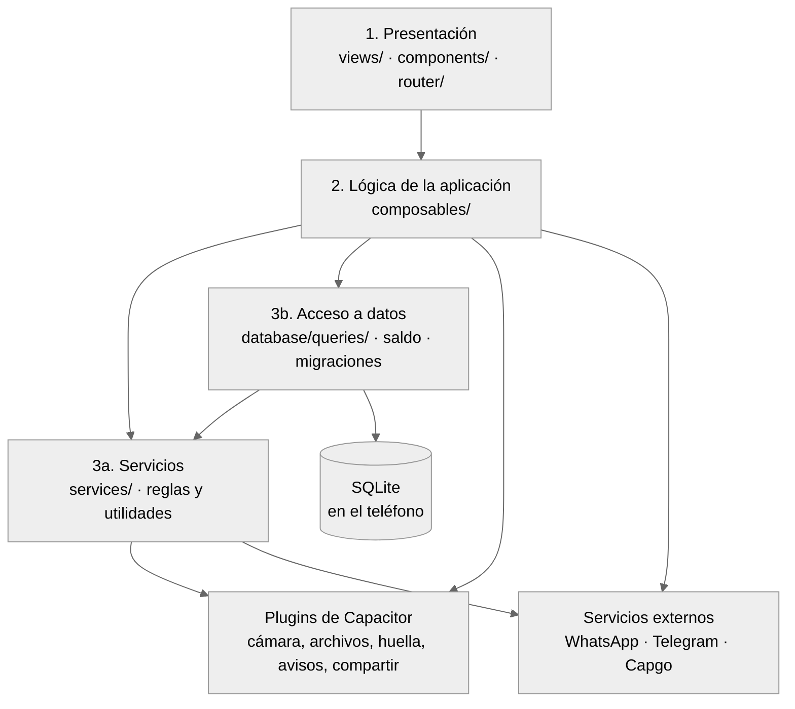
```mermaid
%%{init: {'theme': 'neutral'}}%%
flowchart TB
    P["1. Presentación<br/>views/ · components/ · router/"]
    L["2. Lógica de la aplicación<br/>composables/"]
    S["3a. Servicios<br/>services/ · reglas y utilidades"]
    D["3b. Acceso a datos<br/>database/queries/ · saldo · migraciones"]
    BD[("SQLite<br/>en el teléfono")]
    N["Plugins de Capacitor<br/>cámara, archivos, huella, avisos, compartir"]
    E["Servicios externos<br/>WhatsApp · Telegram · Capgo"]

    P --> L
    L --> S
    L --> D
    D --> S
    D --> BD
    L --> N
    S --> N
    L --> E
    S --> E
```

## DG-02 · docs/02-diseno/ARQUITECTURA.md · 2

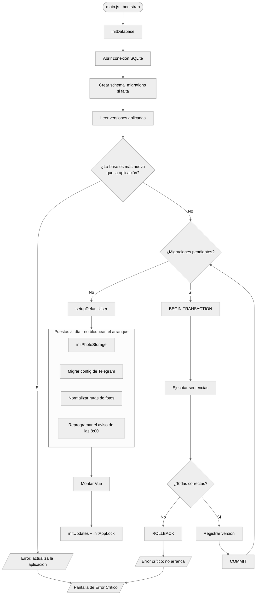
```mermaid
%%{init: {'theme': 'neutral'}}%%
flowchart TD
    Start([main.js · bootstrap]) --> Init[initDatabase]
    Init --> Conn[Abrir conexión SQLite]
    Conn --> Tabla[Crear schema_migrations si falta]
    Tabla --> Leer[Leer versiones aplicadas]

    Leer --> Guardia{¿La base es más nueva<br/>que la aplicación?}
    Guardia -- Sí --> Bloqueo[/Error: actualiza la aplicación/]
    Guardia -- No --> Pend{¿Migraciones pendientes?}

    Pend -- No --> Usuario
    Pend -- Sí --> Trans[BEGIN TRANSACTION]
    Trans --> Ejec[Ejecutar sentencias]
    Ejec --> Ok{¿Todas correctas?}
    Ok -- No --> Roll[ROLLBACK] --> Falla[/Error crítico: no arranca/]
    Ok -- Sí --> Reg[Registrar versión] --> Commit[COMMIT] --> Pend

    Usuario[setupDefaultUser] --> Mant

    subgraph Mant ["Puestas al día · no bloquean el arranque"]
        M1[initPhotoStorage]
        M2[Migrar config de Telegram]
        M3[Normalizar rutas de fotos]
        M4[Reprogramar el aviso de las 8:00]
    end

    Mant --> Mount[Montar Vue] --> OTA[initUpdates + initAppLock]

    Bloqueo --> Pantalla[/Pantalla de Error Crítico/]
    Falla --> Pantalla
```

## DG-03 · docs/02-diseno/ARQUITECTURA.md · 3

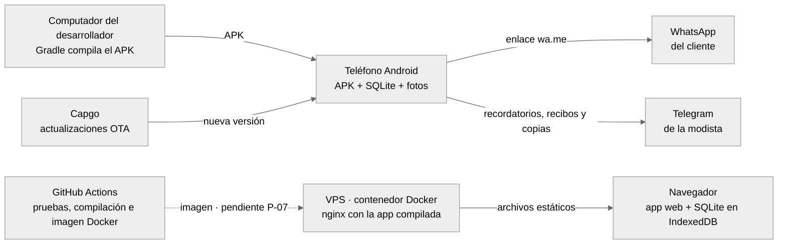
```mermaid
%%{init: {'theme': 'neutral'}}%%
flowchart LR
    DEV["Computador del desarrollador<br/>Gradle compila el APK"]
    GH["GitHub Actions<br/>pruebas, compilación e imagen Docker"]
    VPS["VPS · contenedor Docker<br/>nginx con la app compilada"]
    NAV["Navegador<br/>app web + SQLite en IndexedDB"]
    CAPGO["Capgo<br/>actualizaciones OTA"]
    TEL["Teléfono Android<br/>APK + SQLite + fotos"]
    WA["WhatsApp<br/>del cliente"]
    TG["Telegram<br/>de la modista"]

    DEV -->|APK| TEL
    GH -.->|"imagen · pendiente P-07"| VPS
    VPS -->|archivos estáticos| NAV
    CAPGO -->|nueva versión| TEL
    TEL -->|enlace wa.me| WA
    TEL -->|recordatorios, recibos y copias| TG
```

## DG-04 · docs/02-diseno/CASOS_DE_USO.md · 1

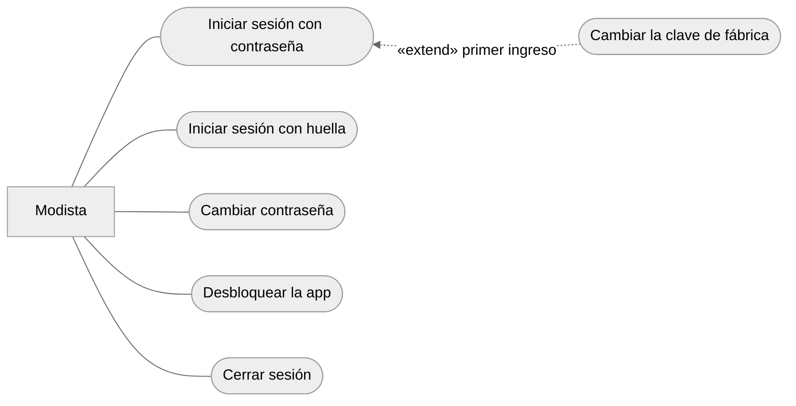
```mermaid
%%{init: {'theme': 'neutral'}}%%
flowchart LR
    M["Modista"]
    A1(["Iniciar sesión con contraseña"])
    A2(["Iniciar sesión con huella"])
    A3(["Cambiar contraseña"])
    A4(["Desbloquear la app"])
    A5(["Cerrar sesión"])
    X1(["Cambiar la clave de fábrica"])

    M --- A1
    M --- A2
    M --- A3
    M --- A4
    M --- A5
    A1 ~~~ X1
    X1 -.->|«extend» primer ingreso| A1
```

## DG-05 · docs/02-diseno/CASOS_DE_USO.md · 2

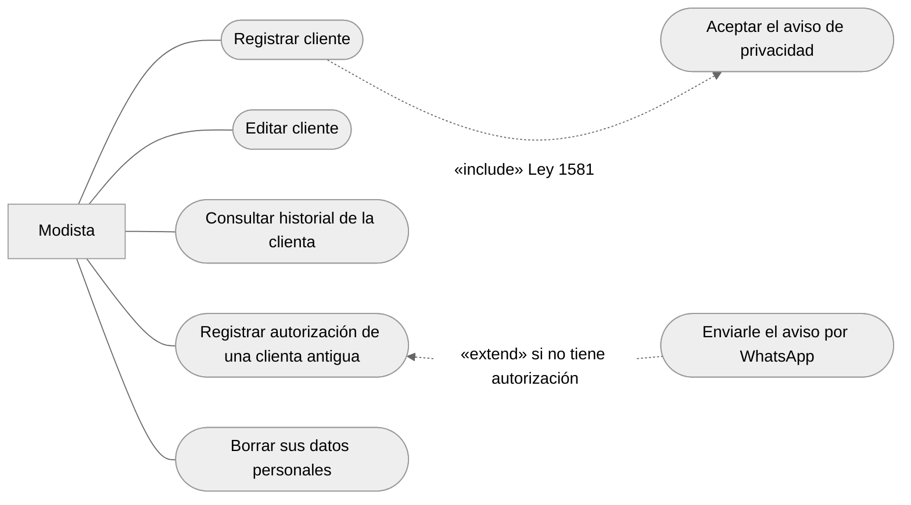
```mermaid
%%{init: {'theme': 'neutral'}}%%
flowchart LR
    M["Modista"]
    C1(["Registrar cliente"])
    C2(["Editar cliente"])
    C3(["Consultar historial de la clienta"])
    C4(["Registrar autorización de una clienta antigua"])
    C5(["Borrar sus datos personales"])
    I1(["Aceptar el aviso de privacidad"])
    X1(["Enviarle el aviso por WhatsApp"])

    M --- C1
    M --- C2
    M --- C3
    M --- C4
    M --- C5
    C1 ~~~ I1
    C1 -.->|«include» Ley 1581| I1
    C4 ~~~ X1
    X1 -.->|«extend» si no tiene autorización| C4
```

## DG-06 · docs/02-diseno/CASOS_DE_USO.md · 3

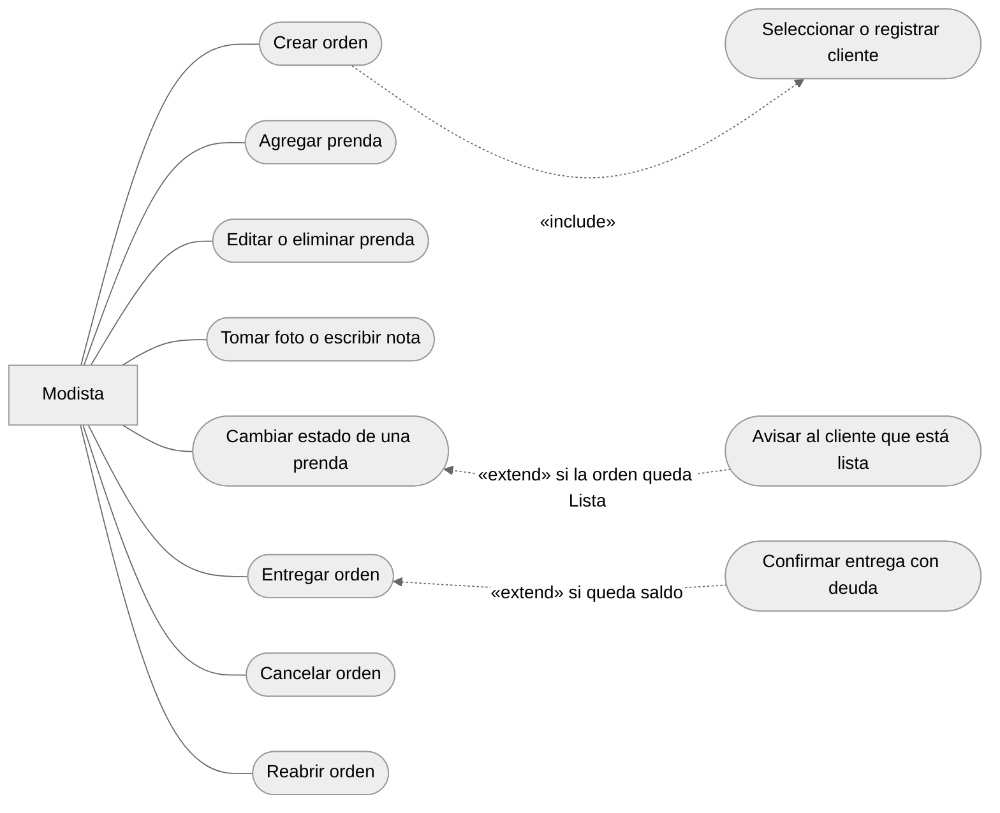
```mermaid
%%{init: {'theme': 'neutral'}}%%
flowchart LR
    M["Modista"]
    O1(["Crear orden"])
    O2(["Agregar prenda"])
    O3(["Editar o eliminar prenda"])
    O4(["Tomar foto o escribir nota"])
    O5(["Cambiar estado de una prenda"])
    O6(["Entregar orden"])
    O7(["Cancelar orden"])
    O8(["Reabrir orden"])
    I1(["Seleccionar o registrar cliente"])
    X1(["Avisar al cliente que está lista"])
    X2(["Confirmar entrega con deuda"])

    M --- O1
    M --- O2
    M --- O3
    M --- O4
    M --- O5
    M --- O6
    M --- O7
    M --- O8
    O1 ~~~ I1
    O1 -.->|«include»| I1
    O5 ~~~ X1
    X1 -.->|«extend» si la orden queda Lista| O5
    O6 ~~~ X2
    X2 -.->|«extend» si queda saldo| O6
```

## DG-07 · docs/02-diseno/CASOS_DE_USO.md · 4

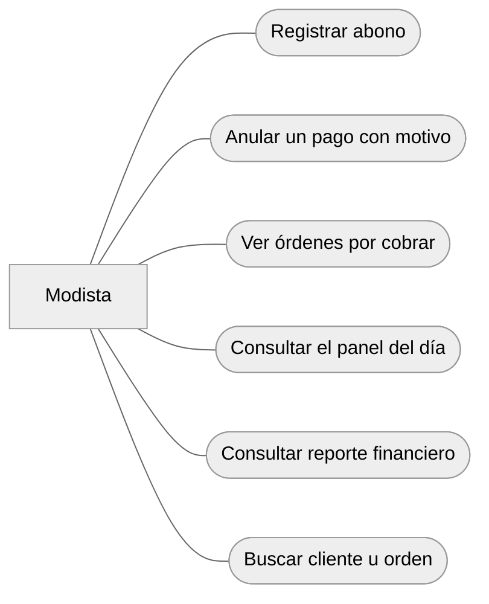
```mermaid
%%{init: {'theme': 'neutral'}}%%
flowchart LR
    M["Modista"]
    P1(["Registrar abono"])
    P2(["Anular un pago con motivo"])
    P3(["Ver órdenes por cobrar"])
    P4(["Consultar el panel del día"])
    P5(["Consultar reporte financiero"])
    P6(["Buscar cliente u orden"])

    M --- P1
    M --- P2
    M --- P3
    M --- P4
    M --- P5
    M --- P6
```

## DG-08 · docs/02-diseno/CASOS_DE_USO.md · 5

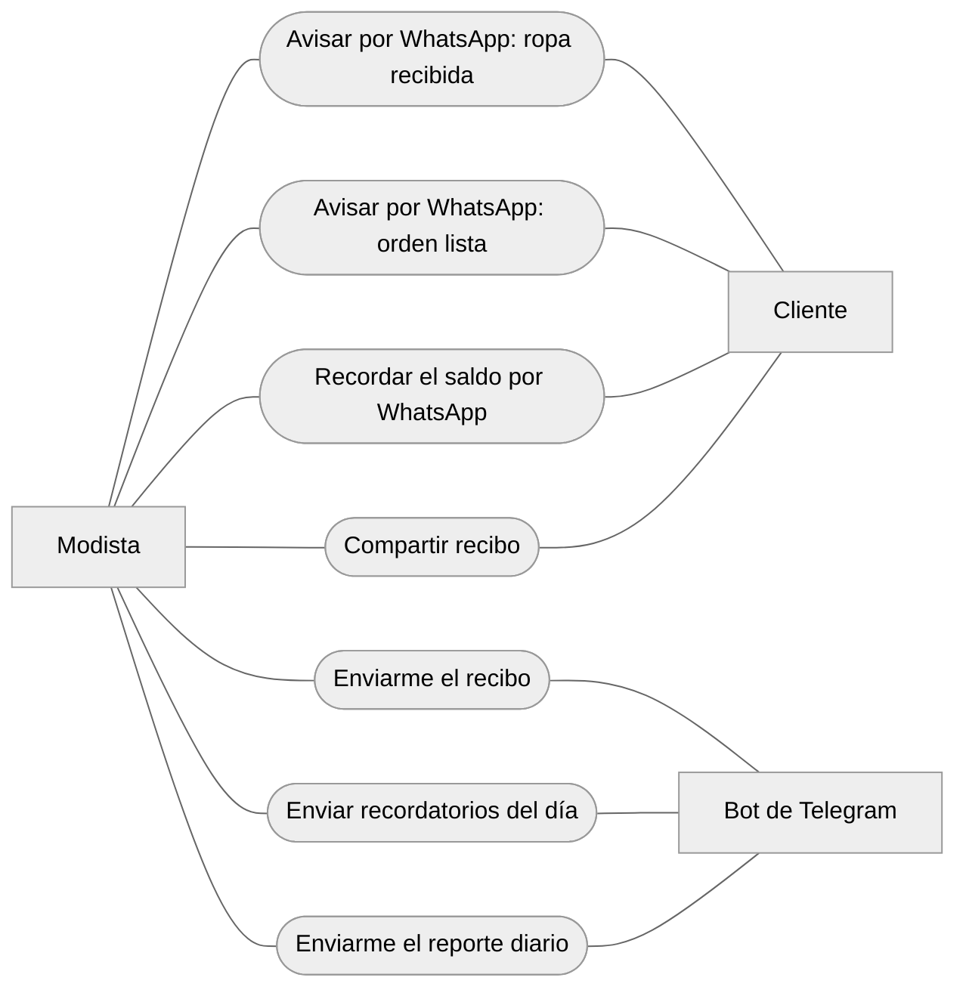
```mermaid
%%{init: {'theme': 'neutral'}}%%
flowchart LR
    M["Modista"]
    W1(["Avisar por WhatsApp: ropa recibida"])
    W2(["Avisar por WhatsApp: orden lista"])
    W3(["Recordar el saldo por WhatsApp"])
    W4(["Compartir recibo"])
    W5(["Enviarme el recibo"])
    W6(["Enviar recordatorios del día"])
    W7(["Enviarme el reporte diario"])
    CL["Cliente"]
    TG["Bot de Telegram"]

    M --- W1
    M --- W2
    M --- W3
    M --- W4
    M --- W5
    M --- W6
    M --- W7
    W1 --- CL
    W2 --- CL
    W3 --- CL
    W4 --- CL
    W5 --- TG
    W6 --- TG
    W7 --- TG
```

## DG-09 · docs/02-diseno/CASOS_DE_USO.md · 6

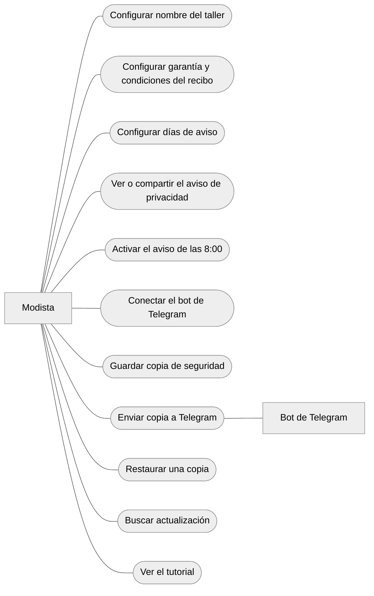
```mermaid
%%{init: {'theme': 'neutral'}}%%
flowchart LR
    M["Modista"]
    K1(["Configurar nombre del taller"])
    K2(["Configurar garantía y condiciones del recibo"])
    K3(["Configurar días de aviso"])
    K4(["Ver o compartir el aviso de privacidad"])
    K5(["Activar el aviso de las 8:00"])
    K6(["Conectar el bot de Telegram"])
    K7(["Guardar copia de seguridad"])
    K8(["Enviar copia a Telegram"])
    K9(["Restaurar una copia"])
    K10(["Buscar actualización"])
    K11(["Ver el tutorial"])
    TG["Bot de Telegram"]

    M --- K1
    M --- K2
    M --- K3
    M --- K4
    M --- K5
    M --- K6
    M --- K7
    M --- K8
    M --- K9
    M --- K10
    M --- K11
    K8 --- TG
```

## DG-10 · docs/02-diseno/CASOS_DE_USO.md · 7

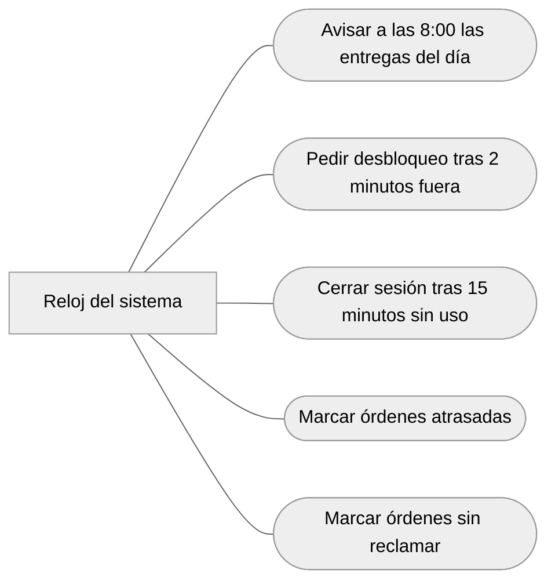
```mermaid
%%{init: {'theme': 'neutral'}}%%
flowchart LR
    R["Reloj del sistema"]
    S1(["Avisar a las 8:00 las entregas del día"])
    S2(["Pedir desbloqueo tras 2 minutos fuera"])
    S3(["Cerrar sesión tras 15 minutos sin uso"])
    S4(["Marcar órdenes atrasadas"])
    S5(["Marcar órdenes sin reclamar"])

    R --- S1
    R --- S2
    R --- S3
    R --- S4
    R --- S5
```

## DG-11 · docs/02-diseno/CASOS_DE_USO.md · 8

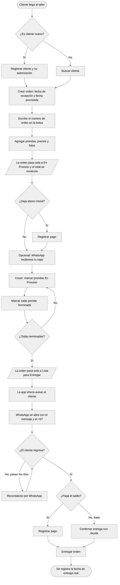
```mermaid
%%{init: {'theme': 'neutral'}}%%
flowchart TD
    Inicio([Cliente llega al taller]) --> P1{¿Es cliente nuevo?}
    P1 -- Sí --> P2[Registrar cliente y su autorización]
    P1 -- No --> P3[Buscar cliente]

    P2 --> P4[Crear orden: fecha de recepción y fecha prometida]
    P3 --> P4

    P4 --> PB[Escribir el número de orden en la bolsa]
    PB --> P5[Agregar prendas, precios y fotos]
    P5 --> P6[/La orden pasa sola a En Proceso y el total se recalcula/]
    P6 --> P7{¿Deja abono inicial?}
    P7 -- Sí --> P8[Registrar pago]
    P7 -- No --> P9[Opcional: WhatsApp 'recibimos tu ropa']
    P8 --> P9

    P9 --> P10[Coser: marcar prendas En Proceso]
    P10 --> P11[Marcar cada prenda Terminada]
    P11 --> P12{¿Todas terminadas?}
    P12 -- Sí --> P13[/La orden pasa sola a Lista para Entregar/]
    P12 -- No --> P10

    P13 --> P14[La app ofrece avisar al cliente]
    P14 --> P15[WhatsApp se abre con el mensaje y el +57]

    P15 --> P16{¿El cliente regresa?}
    P16 -- No, pasan los días --> P19[Recordatorio por WhatsApp]
    P19 --> P16
    P16 -- Sí --> P17{¿Paga el saldo?}
    P17 -- Sí --> P20[Registrar pago]
    P17 -- No, fiado --> P21[Confirmar entrega con deuda]
    P20 --> P18[Entregar orden]
    P21 --> P18
    P18 --> Fin([Se registra la fecha de entrega real])
```

## DG-12 · docs/02-diseno/CLASES.md · 1

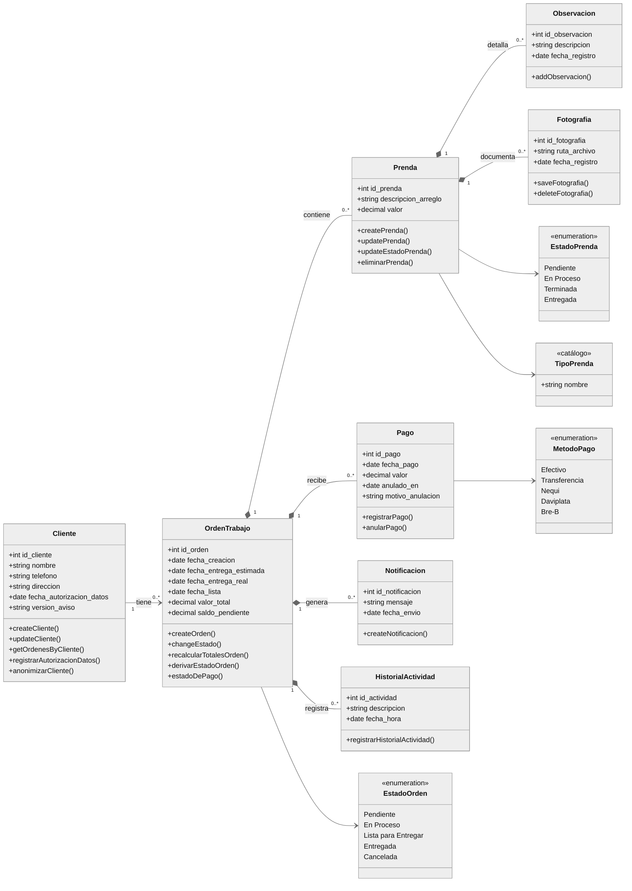
```mermaid
%%{init: {'theme': 'neutral'}}%%
classDiagram
    direction LR

    class Cliente {
        +int id_cliente
        +string nombre
        +string telefono
        +string direccion
        +date fecha_autorizacion_datos
        +string version_aviso
        +createCliente()
        +updateCliente()
        +getOrdenesByCliente()
        +registrarAutorizacionDatos()
        +anonimizarCliente()
    }

    class OrdenTrabajo {
        +int id_orden
        +date fecha_creacion
        +date fecha_entrega_estimada
        +date fecha_entrega_real
        +date fecha_lista
        +decimal valor_total
        +decimal saldo_pendiente
        +createOrden()
        +changeEstado()
        +recalcularTotalesOrden()
        +derivarEstadoOrden()
        +estadoDePago()
    }

    class Prenda {
        +int id_prenda
        +string descripcion_arreglo
        +decimal valor
        +createPrenda()
        +updatePrenda()
        +updateEstadoPrenda()
        +eliminarPrenda()
    }

    class Observacion {
        +int id_observacion
        +string descripcion
        +date fecha_registro
        +addObservacion()
    }

    class Fotografia {
        +int id_fotografia
        +string ruta_archivo
        +date fecha_registro
        +saveFotografia()
        +deleteFotografia()
    }

    class Pago {
        +int id_pago
        +date fecha_pago
        +decimal valor
        +date anulado_en
        +string motivo_anulacion
        +registrarPago()
        +anularPago()
    }

    class Notificacion {
        +int id_notificacion
        +string mensaje
        +date fecha_envio
        +createNotificacion()
    }

    class HistorialActividad {
        +int id_actividad
        +string descripcion
        +date fecha_hora
        +registrarHistorialActividad()
    }

    class EstadoOrden {
        <<enumeration>>
        Pendiente
        En Proceso
        Lista para Entregar
        Entregada
        Cancelada
    }

    class EstadoPrenda {
        <<enumeration>>
        Pendiente
        En Proceso
        Terminada
        Entregada
    }

    class MetodoPago {
        <<enumeration>>
        Efectivo
        Transferencia
        Nequi
        Daviplata
        Bre-B
    }

    class TipoPrenda {
        <<catálogo>>
        +string nombre
    }

    Cliente "1" --> "0..*" OrdenTrabajo : tiene
    OrdenTrabajo "1" *-- "0..*" Prenda : contiene
    Prenda "1" *-- "0..*" Observacion : detalla
    Prenda "1" *-- "0..*" Fotografia : documenta
    OrdenTrabajo "1" *-- "0..*" Pago : recibe
    OrdenTrabajo "1" *-- "0..*" Notificacion : genera
    OrdenTrabajo "1" *-- "0..*" HistorialActividad : registra
    OrdenTrabajo --> EstadoOrden
    Prenda --> EstadoPrenda
    Prenda --> TipoPrenda
    Pago --> MetodoPago
```

## DG-13 · docs/02-diseno/COMPORTAMIENTO.md · 1

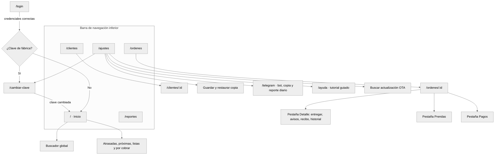
```mermaid
%%{init: {'theme': 'neutral'}}%%
flowchart TB
    Login["/login"]
    Clave["/cambiar-clave"]

    Login -->|"credenciales correctas"| Guardia{¿Clave de fábrica?}
    Guardia -- Sí --> Clave
    Guardia -- No --> Dash

    Clave -->|"clave cambiada"| Dash

    subgraph Nav ["Barra de navegación inferior"]
        Dash["/ · Inicio"]
        Ord["/ordenes"]
        Cli["/clientes"]
        Rep["/reportes"]
        Aju["/ajustes"]
    end

    Dash --> Buscador[Buscador global]
    Dash --> Panel[Atrasadas, próximas, listas y por cobrar]

    Ord --> OrdDet["/ordenes/:id"]
    OrdDet --> TabD[Pestaña Detalle: entregar, avisos, recibo, historial]
    OrdDet --> TabP[Pestaña Prendas]
    OrdDet --> TabPa[Pestaña Pagos]

    Cli --> CliDet["/clientes/:id"]

    Aju --> Copia[Guardar y restaurar copia]
    Aju --> Tele["/telegram · bot, copia y reporte diario"]
    Aju --> Clave
    Aju --> Ayuda["/ayuda · tutorial guiado"]
    Aju --> Actualiza[Buscar actualización OTA]
```

## DG-14 · docs/02-diseno/COMPORTAMIENTO.md · 2

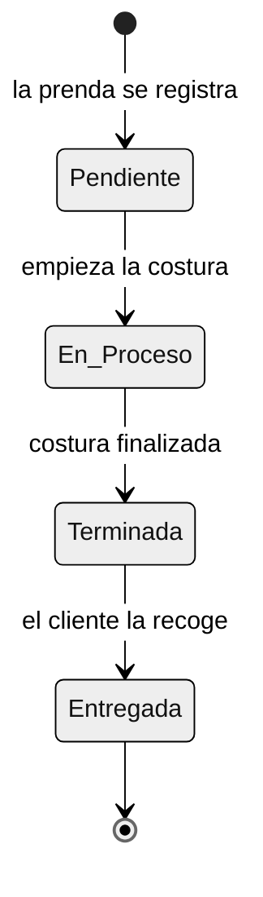
```mermaid
%%{init: {'theme': 'neutral'}}%%
stateDiagram-v2
    [*] --> Pendiente : la prenda se registra
    Pendiente --> En_Proceso : empieza la costura
    En_Proceso --> Terminada : costura finalizada
    Terminada --> Entregada : el cliente la recoge
    Entregada --> [*]
```

## DG-15 · docs/02-diseno/COMPORTAMIENTO.md · 3

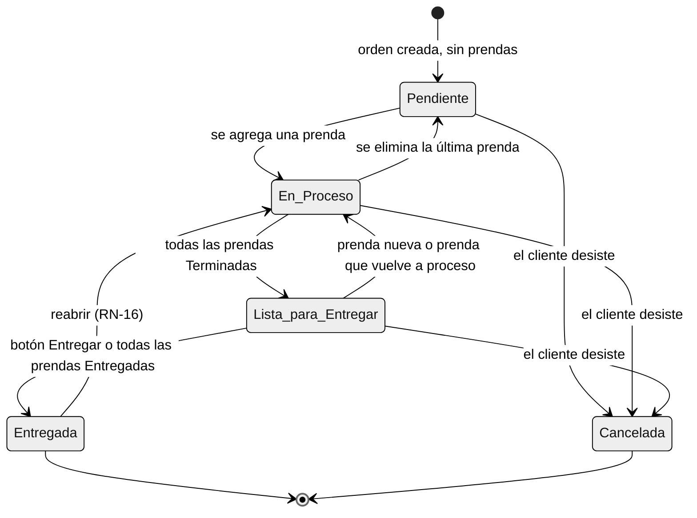
```mermaid
%%{init: {'theme': 'neutral'}}%%
stateDiagram-v2
    [*] --> Pendiente : orden creada, sin prendas
    Pendiente --> En_Proceso : se agrega una prenda
    En_Proceso --> Pendiente : se elimina la última prenda
    En_Proceso --> Lista_para_Entregar : todas las prendas Terminadas
    Lista_para_Entregar --> En_Proceso : prenda nueva o prenda que vuelve a proceso
    Lista_para_Entregar --> Entregada : botón Entregar o todas las prendas Entregadas
    Entregada --> En_Proceso : reabrir (RN-16)

    Pendiente --> Cancelada : el cliente desiste
    En_Proceso --> Cancelada : el cliente desiste
    Lista_para_Entregar --> Cancelada : el cliente desiste

    Entregada --> [*]
    Cancelada --> [*]
```

## DG-16 · docs/02-diseno/COMPORTAMIENTO.md · 4

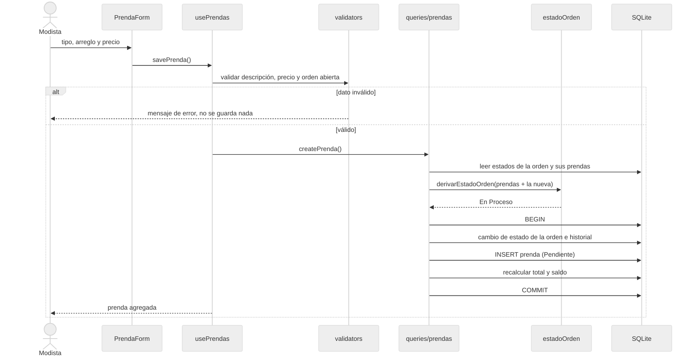
```mermaid
%%{init: {'theme': 'neutral'}}%%
sequenceDiagram
    actor M as Modista
    participant F as PrendaForm
    participant U as usePrendas
    participant V as validators
    participant Q as queries/prendas
    participant E as estadoOrden
    participant BD as SQLite

    M->>F: tipo, arreglo y precio
    F->>U: savePrenda()
    U->>V: validar descripción, precio y orden abierta
    alt dato inválido
        V-->>M: mensaje de error, no se guarda nada
    else válido
        U->>Q: createPrenda()
        Q->>BD: leer estados de la orden y sus prendas
        Q->>E: derivarEstadoOrden(prendas + la nueva)
        E-->>Q: En Proceso
        Q->>BD: BEGIN
        Q->>BD: cambio de estado de la orden e historial
        Q->>BD: INSERT prenda (Pendiente)
        Q->>BD: recalcular total y saldo
        Q->>BD: COMMIT
        U-->>M: prenda agregada
    end
```

## DG-17 · docs/02-diseno/COMPORTAMIENTO.md · 5

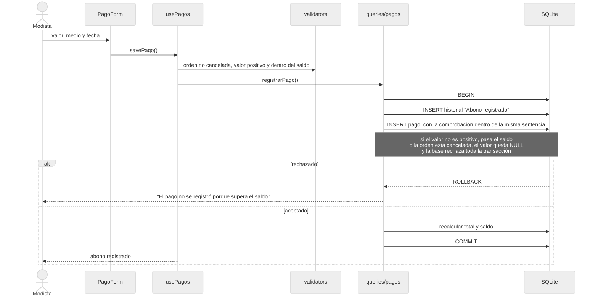
```mermaid
%%{init: {'theme': 'neutral'}}%%
sequenceDiagram
    actor M as Modista
    participant F as PagoForm
    participant U as usePagos
    participant V as validators
    participant Q as queries/pagos
    participant BD as SQLite

    M->>F: valor, medio y fecha
    F->>U: savePago()
    U->>V: orden no cancelada, valor positivo y dentro del saldo
    U->>Q: registrarPago()
    Q->>BD: BEGIN
    Q->>BD: INSERT historial "Abono registrado"
    Q->>BD: INSERT pago, con la comprobación dentro de la misma sentencia
    Note over Q,BD: si el valor no es positivo, pasa el saldo<br/>o la orden está cancelada, el valor queda NULL<br/>y la base rechaza toda la transacción
    alt rechazado
        BD-->>Q: ROLLBACK
        Q-->>M: "El pago no se registró porque supera el saldo"
    else aceptado
        Q->>BD: recalcular total y saldo
        Q->>BD: COMMIT
        U-->>M: abono registrado
    end
```

## DG-18 · docs/02-diseno/COMPORTAMIENTO.md · 6

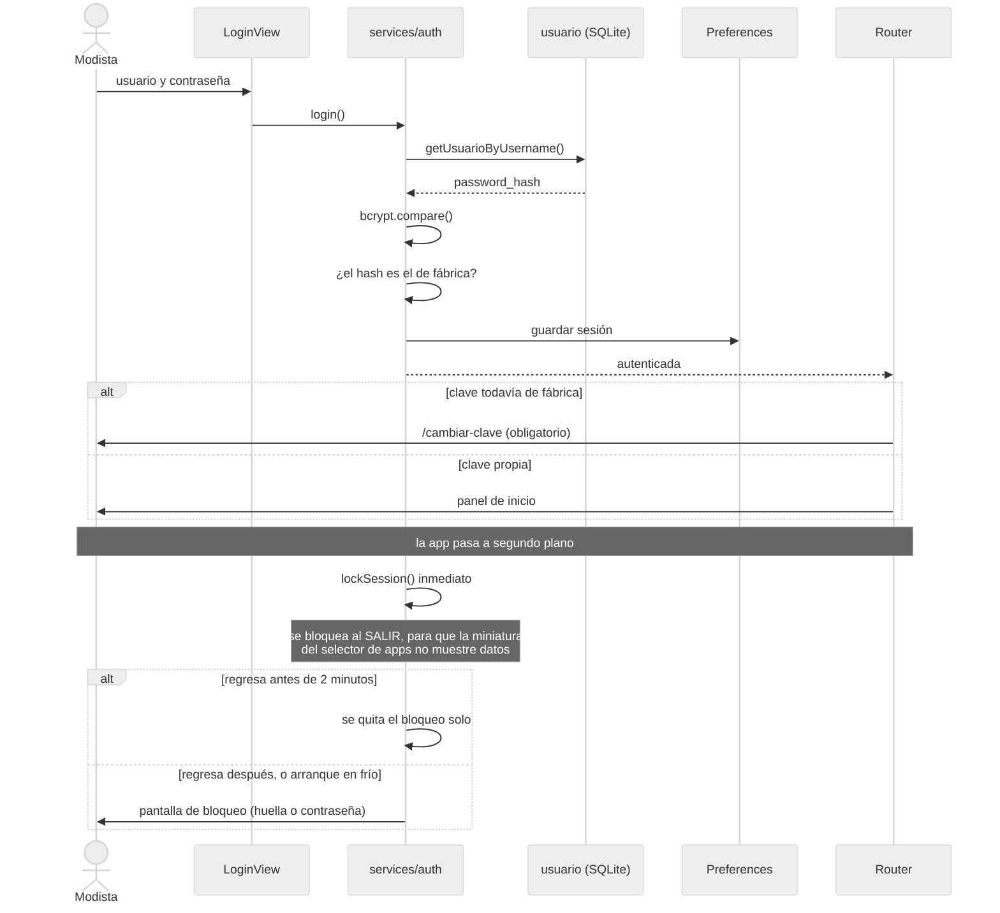
```mermaid
%%{init: {'theme': 'neutral'}}%%
sequenceDiagram
    actor M as Modista
    participant L as LoginView
    participant A as services/auth
    participant BD as usuario (SQLite)
    participant P as Preferences
    participant R as Router

    M->>L: usuario y contraseña
    L->>A: login()
    A->>BD: getUsuarioByUsername()
    BD-->>A: password_hash
    A->>A: bcrypt.compare()
    A->>A: ¿el hash es el de fábrica?
    A->>P: guardar sesión
    A-->>R: autenticada

    alt clave todavía de fábrica
        R->>M: /cambiar-clave (obligatorio)
    else clave propia
        R->>M: panel de inicio
    end

    Note over M,R: la app pasa a segundo plano
    A->>A: lockSession() inmediato
    Note over A: se bloquea al SALIR, para que la miniatura<br/>del selector de apps no muestre datos

    alt regresa antes de 2 minutos
        A->>A: se quita el bloqueo solo
    else regresa después, o arranque en frío
        A->>M: pantalla de bloqueo (huella o contraseña)
    end
```

## DG-19 · docs/02-diseno/COMPORTAMIENTO.md · 7

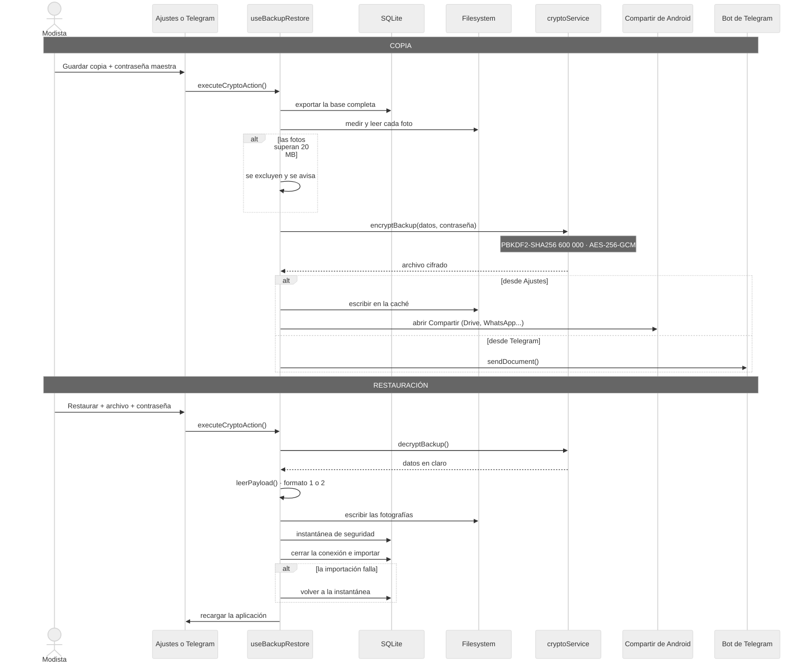
```mermaid
%%{init: {'theme': 'neutral'}}%%
sequenceDiagram
    actor M as Modista
    participant V as Ajustes o Telegram
    participant B as useBackupRestore
    participant BD as SQLite
    participant F as Filesystem
    participant C as cryptoService
    participant S as Compartir de Android
    participant T as Bot de Telegram

    Note over M,T: COPIA
    M->>V: Guardar copia + contraseña maestra
    V->>B: executeCryptoAction()
    B->>BD: exportar la base completa
    B->>F: medir y leer cada foto
    alt las fotos superan 20 MB
        B->>B: se excluyen y se avisa
    end
    B->>C: encryptBackup(datos, contraseña)
    Note over C: PBKDF2-SHA256 600 000 · AES-256-GCM
    C-->>B: archivo cifrado
    alt desde Ajustes
        B->>F: escribir en la caché
        B->>S: abrir Compartir (Drive, WhatsApp...)
    else desde Telegram
        B->>T: sendDocument()
    end

    Note over M,T: RESTAURACIÓN
    M->>V: Restaurar + archivo + contraseña
    V->>B: executeCryptoAction()
    B->>C: decryptBackup()
    C-->>B: datos en claro
    B->>B: leerPayload() · formato 1 o 2
    B->>F: escribir las fotografías
    B->>BD: instantánea de seguridad
    B->>BD: cerrar la conexión e importar
    alt la importación falla
        B->>BD: volver a la instantánea
    end
    B->>V: recargar la aplicación
```

## DG-20 · docs/02-diseno/MODELO_DE_DATOS.md · 1

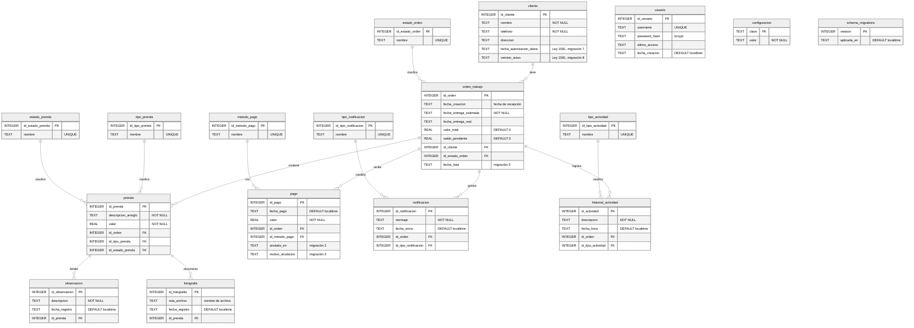
```mermaid
%%{init: {'theme': 'neutral'}}%%
erDiagram
    cliente ||--o{ orden_trabajo : "tiene"
    estado_orden ||--o{ orden_trabajo : "clasifica"
    orden_trabajo ||--o{ prenda : "contiene"
    tipo_prenda ||--o{ prenda : "clasifica"
    estado_prenda ||--o{ prenda : "clasifica"
    prenda ||--o{ observacion : "detalla"
    prenda ||--o{ fotografia : "documenta"
    orden_trabajo ||--o{ pago : "recibe"
    metodo_pago ||--o{ pago : "usa"
    orden_trabajo ||--o{ notificacion : "genera"
    tipo_notificacion ||--o{ notificacion : "clasifica"
    orden_trabajo ||--o{ historial_actividad : "registra"
    tipo_actividad ||--o{ historial_actividad : "clasifica"

    cliente {
        INTEGER id_cliente PK
        TEXT nombre "NOT NULL"
        TEXT telefono "NOT NULL"
        TEXT direccion
        TEXT fecha_autorizacion_datos "Ley 1581, migración 7"
        TEXT version_aviso "Ley 1581, migración 8"
    }
    orden_trabajo {
        INTEGER id_orden PK
        TEXT fecha_creacion "fecha de recepción"
        TEXT fecha_entrega_estimada "NOT NULL"
        TEXT fecha_entrega_real
        REAL valor_total "DEFAULT 0"
        REAL saldo_pendiente "DEFAULT 0"
        INTEGER id_cliente FK
        INTEGER id_estado_orden FK
        TEXT fecha_lista "migración 5"
    }
    prenda {
        INTEGER id_prenda PK
        TEXT descripcion_arreglo "NOT NULL"
        REAL valor "NOT NULL"
        INTEGER id_orden FK
        INTEGER id_tipo_prenda FK
        INTEGER id_estado_prenda FK
    }
    observacion {
        INTEGER id_observacion PK
        TEXT descripcion "NOT NULL"
        TEXT fecha_registro "DEFAULT localtime"
        INTEGER id_prenda FK
    }
    fotografia {
        INTEGER id_fotografia PK
        TEXT ruta_archivo "nombre de archivo"
        TEXT fecha_registro "DEFAULT localtime"
        INTEGER id_prenda FK
    }
    pago {
        INTEGER id_pago PK
        TEXT fecha_pago "DEFAULT localtime"
        REAL valor "NOT NULL"
        INTEGER id_orden FK
        INTEGER id_metodo_pago FK
        TEXT anulado_en "migración 3"
        TEXT motivo_anulacion "migración 3"
    }
    notificacion {
        INTEGER id_notificacion PK
        TEXT mensaje "NOT NULL"
        TEXT fecha_envio "DEFAULT localtime"
        INTEGER id_orden FK
        INTEGER id_tipo_notificacion FK
    }
    historial_actividad {
        INTEGER id_actividad PK
        TEXT descripcion "NOT NULL"
        TEXT fecha_hora "DEFAULT localtime"
        INTEGER id_orden FK
        INTEGER id_tipo_actividad FK
    }
    estado_orden {
        INTEGER id_estado_orden PK
        TEXT nombre "UNIQUE"
    }
    estado_prenda {
        INTEGER id_estado_prenda PK
        TEXT nombre "UNIQUE"
    }
    tipo_prenda {
        INTEGER id_tipo_prenda PK
        TEXT nombre "UNIQUE"
    }
    metodo_pago {
        INTEGER id_metodo_pago PK
        TEXT nombre "UNIQUE"
    }
    tipo_notificacion {
        INTEGER id_tipo_notificacion PK
        TEXT nombre "UNIQUE"
    }
    tipo_actividad {
        INTEGER id_tipo_actividad PK
        TEXT nombre "UNIQUE"
    }
    usuario {
        INTEGER id_usuario PK
        TEXT username "UNIQUE"
        TEXT password_hash "bcrypt"
        TEXT ultimo_acceso
        TEXT fecha_creacion "DEFAULT localtime"
    }
    configuracion {
        TEXT clave PK
        TEXT valor "NOT NULL"
    }
    schema_migrations {
        INTEGER version PK
        TEXT aplicada_en "DEFAULT localtime"
    }
```
