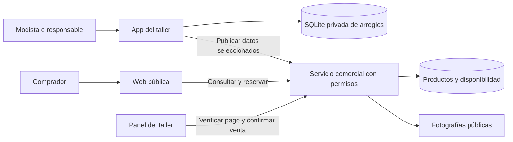
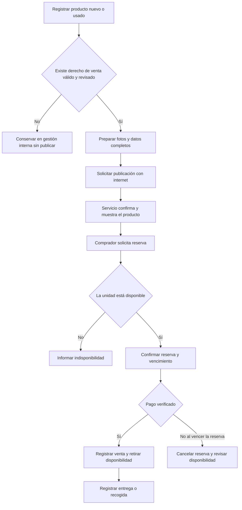
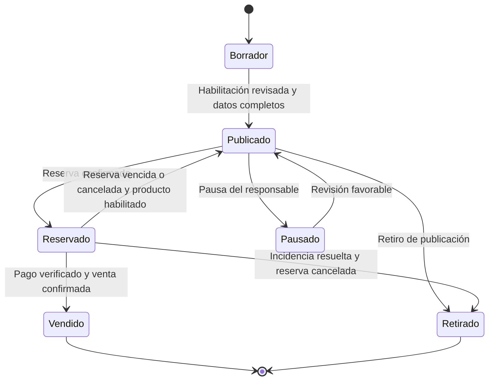

# Propuesta de una web de venta de prendas vinculada a la app del taller

**Lugar de operación:** Florencia, Caquetá, Colombia.  
**Fecha:** 6 de octubre de 2026.  
**Estado:** propuesta de análisis y desarrollo; las funciones descritas todavía no están implementadas.

## 1. Qué se propone

Ampliar la app del taller con una página web donde las personas puedan consultar y adquirir prendas nuevas o usadas que el taller tenga derecho a vender. La modista gestionaría los arreglos en la app y prepararía las publicaciones; el público vería un catálogo con fotografías, medidas, condición y precio.

La primera versión propuesta permite reservar una prenda y coordinar el pago y la entrega con el taller. El pago directamente en la web es una alternativa pendiente de definir. El desarrollo aprovecharía la app existente y corregiría primero sus problemas prioritarios.

**El plazo propuesto es de 20 jornadas con hasta 12 horas diarias: un máximo de 240 horas por persona.** Se distribuyen 200 horas entre análisis, correcciones, desarrollo, documentación y pruebas, y 40 horas como margen. Es una estimación para un piloto acotado; no asegura implementar todos los requisitos antiguos y futuros al mismo tiempo.

## 2. Quiénes usarían el sistema

| Persona | Uso principal |
| --- | --- |
| Modista o responsable del taller | Gestionar arreglos, revisar prendas y preparar publicaciones. |
| Cliente del arreglo | Dejar y reclamar sus prendas, realizar pagos y recibir información del servicio. |
| Comprador de la web | Ver prendas, revisar sus características y solicitar una reserva o compra. |
| Administrador | Revisar publicaciones, habilitación de venta, reservas, pagos e incidencias. |

El cliente dueño de una prenda entregada para un arreglo y la persona que posteriormente la compra son actores distintos. Sus datos y operaciones deben conservarse separados. En el piloto, la modista puede asumir también las tareas de administración.

## 3. Qué prendas podrían publicarse

Podrían prepararse publicaciones de inventario propio nuevo, prendas usadas de propiedad del taller o prendas cuya venta cuente con un fundamento válido y revisado, como un encargo de venta aplicable al caso.

Una prenda **no pagada**, una prenda **no reclamada** y una prenda **habilitada para venta** son situaciones distintas. Estar en buen estado no demuestra que el taller tenga derecho a venderla. Tampoco debe clasificarse una prenda como nueva solo porque se conserva bien.

### Regla que debe corregirse para Colombia

La documentación actual de fase 2 plantea llevar prendas de más de 30 días a bodega para incautarlas y venderlas. Esa regla no debe convertirse en una publicación automática. La SIC explica que el abandono de un bien recibido para prestar un servicio no convierte al prestador en propietario. [Concepto de la SIC sobre disposición de bienes abandonados](https://sedeelectronica.sic.gov.co/publicaciones/boletin-juridico/concepto/disposicion-de-los-bienes-abandonados-bajo-la-prestacion-de-un-servicio).

La propuesta es registrar el seguimiento de la prenda, la evidencia privada y la revisión del derecho de comercialización. El procedimiento aplicable debe verificarse para el caso real antes de habilitar la venta. El [Decreto 1413 de 2018](https://www1.funcionpublica.gov.co/eva/gestornormativo/norma.php?i=87866) regula bienes abandonados bajo la prestación de un servicio; un plazo interno de la app no sustituye ese procedimiento.

## 4. Funciones de la primera versión

### En la app o en el panel del taller

1. Mantener clientes, órdenes, prendas, observaciones, pagos y entregas del servicio.
2. Registrar productos nuevos o usados y su origen.
3. Preparar título, descripción, talla, medidas, condición, defectos, precio en COP y fotografías públicas.
4. Registrar y revisar el fundamento que habilita la venta.
5. Publicar, pausar o retirar una prenda y consultar su disponibilidad real.
6. Gestionar reservas, verificar el pago y registrar la venta y entrega.
7. Consultar ingresos por arreglos e ingresos por venta de prendas de forma separada.

### En la web pública

1. Consultar el catálogo desde teléfono o computador.
2. Buscar y filtrar prendas por condición y talla.
3. Abrir la ficha de una prenda y ver fotos, medidas, defectos y precio.
4. Conocer quién vende y las condiciones de pago, entrega, garantía y devolución aplicables.
5. Solicitar una reserva y recibir confirmación de disponibilidad y vencimiento.
6. Coordinar la adquisición con el taller según el modo de compra aprobado.

El catálogo mostrará únicamente la información destinada a la venta. El nombre, teléfono, dirección, deuda y observaciones privadas del cliente del arreglo no serán públicos. Las fotografías del arreglo se seleccionarán expresamente antes de publicarlas.

### Requisitos que deben quedar verificables

| ID | Requisito | Cómo se comprobará |
| --- | --- | --- |
| RF-VEN-01 | Mostrar la condición nueva o usada y sus defectos reales. | La ficha pública contiene estos datos obligatorios. |
| RF-VEN-02 | Publicar solo cuando exista habilitación de venta vigente y revisada. | Una prenda sin fundamento válido no puede publicarse. |
| RF-VEN-03 | Vincular internamente producto y prenda del arreglo cuando corresponda. | Se conserva la referencia sin exponer datos privados. |
| RF-VEN-04 | Publicar información y fotos completas. | Se rechazan publicaciones incompletas. |
| RF-VEN-05 | Permitir catálogo, detalle y filtros básicos. | Un visitante encuentra y consulta una prenda disponible. |
| RF-VEN-06 | Evitar reservas simultáneas sobre la misma unidad. | Solo una de dos solicitudes simultáneas obtiene la reserva. |
| RF-VEN-07 | Vencer o cancelar reservas. | La disponibilidad se actualiza según el estado del producto. |
| RF-VEN-08 | Registrar la venta después de verificar el pago. | Una solicitud o un mensaje no aumenta los ingresos por ventas. |
| RF-VEN-09 | Separar el dinero del arreglo y el de la venta. | La venta no borra ni modifica silenciosamente los abonos o deudas del arreglo. |
| RF-VEN-10 | Pausar o retirar una publicación ante una incidencia. | Se bloquean nuevas reservas y se gestionan las existentes. |
| RF-VEN-11 | Informar condiciones de adquisición y datos públicos del vendedor. | El comprador puede consultarlos antes de confirmar. |
| RF-VEN-12 | Conservar historial de las operaciones. | Se puede identificar fecha, responsable y resultado de cada cambio. |

## 5. Cómo se vincularía la web con la app

La app actual guarda los datos del taller en SQLite local. Una web pública necesita un servicio accesible por internet y almacenamiento compartido para publicaciones, fotos, reservas y ventas. Los compradores no pueden acceder directamente a la base privada del teléfono.

Se propone enviar al servicio web únicamente los productos y fotos seleccionados para venta. El servicio confirma la publicación y controla la disponibilidad. Las operaciones de publicar, reservar y confirmar una venta requieren conexión; las tareas locales del taller pueden conservar su funcionamiento sin internet.

Una operación sin conexión o rechazada debe mostrarse como pendiente o fallida. No debe anunciarse como publicada o vendida hasta recibir confirmación del servicio.

### Diagrama de integración propuesto

Este es un esquema conceptual, no una infraestructura ya desplegada. El proveedor de alojamiento, el mecanismo de autenticación y el tratamiento de datos de compradores se definirán antes de finalizar el diseño.

### Flujo de publicación y adquisición

### Estados comerciales separados del arreglo

La orden del arreglo conserva sus propios estados e historial. Una venta no transforma una orden en Entregada ni elimina automáticamente el saldo del servicio.

### Modelo conceptual de datos

| Entidad | Información principal |
| --- | --- |
| Taller | Identidad pública del negocio y referencia del responsable. |
| Producto | Origen, condición, talla, medidas, defectos y referencia interna a la prenda cuando exista. |
| Derecho de venta | Fundamento, evidencia privada, estado y fecha de revisión. |
| Publicación | Título, descripción, precio, fotos públicas y estado comercial. |
| Reserva | Producto solicitado, precio acordado, estado y vencimiento. |
| Venta | Reserva relacionada, importe, pago verificado y entrega. |

Las relaciones entre estas entidades y las restricciones de disponibilidad deben incorporarse al diagrama entidad-relación final. Los detalles de cuentas, compradores y conservación de datos siguen pendientes de definición.

## 6. Alcance del plazo de 20 días

Para estimar el plazo se utiliza un escenario de **un taller, un desarrollador con experiencia, aprovechamiento de la app actual y reservas con pago coordinado con el negocio**. El usuario todavía no ha confirmado el número de talleres ni el modo de pago. Estas condiciones deben resolverse al comienzo.

| Jornadas | Horas planificadas | Resultado |
| --- | ---: | --- |
| 1–2 | 20 | Análisis, alcance acordado y requisitos con diagramas coherentes. |
| 3–7 | 50 | Corrección de problemas prioritarios de la app y pruebas de sus reglas. |
| 8–10 | 30 | Modelo comercial, servicio y panel básico. |
| 11–13 | 30 | Catálogo web y ficha pública de producto. |
| 14–15 | 20 | Reservas, verificación de pago y registro de venta. |
| 16–17 | 20 | Integración de app y web, manuales y diagramas actualizados. |
| 18–20 | 30 | Pruebas completas y piloto con usuarios. |
| Distribuidas durante el proyecto | 40 | Margen para bloqueos, retrabajo e imprevistos. |
| **Total máximo por persona** | **240** | **200 horas de actividades y 40 de margen.** |

Al finalizar la jornada 2 se revisará la estimación contra el alcance acordado. Al finalizar la jornada 7 se comprobará si el núcleo del taller está estable. Si estas condiciones no se cumplen, se ajustarán las funciones comerciales o la fecha antes de continuar.

Un portal con varios talleres, comisiones, pagos en línea, transportadoras, carrito de varias prendas o sincronización completa entre dispositivos requiere una estimación distinta. La recogida en el taller de Florencia es una opción para el piloto, pendiente de confirmar. No se ha contratado alojamiento ni fijado un presupuesto de servicios.

## 7. Qué documentos y diagramas se deben actualizar

| Documento | Actualización propuesta |
| --- | --- |
| Costura.md y Costura.docx | Añadir comprador, productos, catálogo, reservas y ventas; resolver contradicciones de las reglas actuales. |
| COSTURA_FASE2_REQUISITOS.md | Cambiar la regla de incautación automática por seguimiento y habilitación revisada; completar el módulo comercial. |
| DIAGRAMAS.md | Añadir web y servicio compartido; separar estados de orden, prenda y publicación; ampliar actores y modelo de datos. |
| FICHA_TECNICA.md | Describir integración, alojamiento, almacenamiento de fotos, conectividad y seguridad acordados. |
| MANUAL_USUARIO.md | Explicar preparación, publicación, reserva, pago, entrega y retiro usando las pantallas reales. |
| Pruebas y matriz de requisitos | Asociar cada requisito con su pantalla, operación, criterio de aceptación y resultado de prueba. |

Los identificadores de requisitos deben ser únicos. Se propone conservar el prefijo RF-VEN para la venta, evitando las duplicaciones detectadas en los documentos actuales.

## 8. Cuándo considerar terminada la primera versión

La primera versión estará lista para el piloto cuando se pueda completar un arreglo y una venta de principio a fin; no haya mensajes de éxito de operaciones inexistentes; los importes e inventario sean consistentes; los datos privados permanezcan protegidos; y los manuales y diagramas representen el comportamiento verificado.

Se deben probar también una publicación sin habilitación, dos reservas simultáneas, una reserva vencida, una caída de conexión y la recuperación de un respaldo con fotografías. El resultado y las limitaciones se documentarán antes de usar datos reales en producción.

## 9. Decisiones pendientes

- Un taller en el piloto o varios talleres desde el inicio.
- Reserva y pago coordinado, o pago directo en la página.
- Recogida local, entregas en Florencia o envíos fuera del municipio.
- Personas que desarrollarán y operarán el sistema, y fecha de inicio.
- Presupuesto, alojamiento, dominio y cuentas necesarias.
- Permisos, autenticación, privacidad y conservación de datos.
- Política única de entrega con deuda y procedimiento de venta habilitada.

Este documento organiza la propuesta sin dar por aprobadas esas decisiones. El diagnóstico del estado actual se presenta por separado en `02_FALLOS_APP_DOCUMENTACION_DIAGRAMAS.md`.
