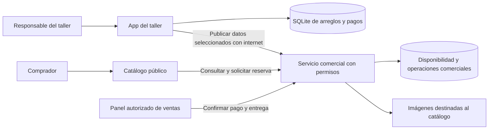
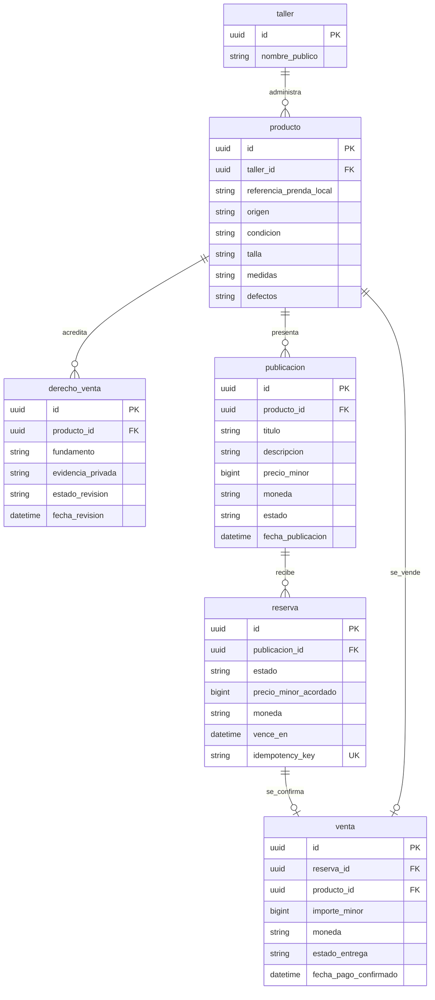
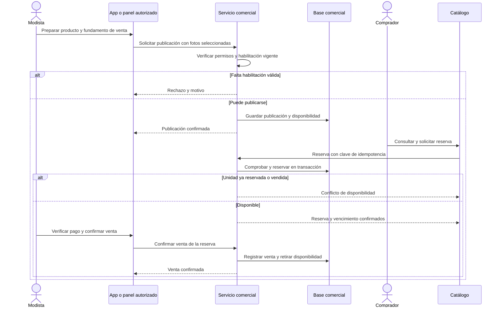
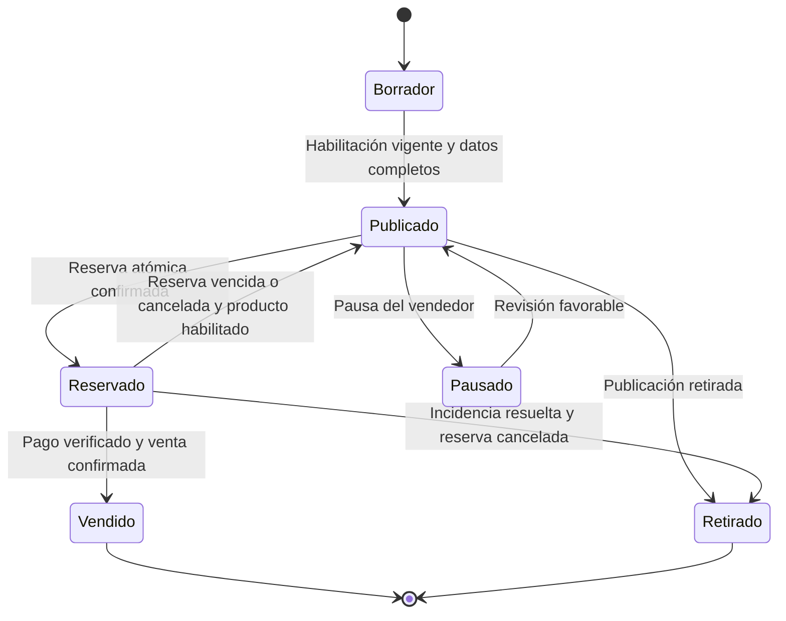

# Arquitectura conceptual propuesta para la venta de prendas

Estado: borrador, no arquitectura final. Aplican el alcance, reglas y decisiones pendientes de PRD.md. Este modelo amplía el análisis; no describe tablas que ya existan en la app.

Contexto del piloto confirmado: Florencia, Caquetá, Colombia. Usar America/Bogota para fechas de negocio y COP para precios. La disponibilidad declarada de 240 horas por persona orienta la estimación; no resuelve aún el número de talleres, pagos, permisos ni proveedor de infraestructura.

## 1. Visión General del Sistema

- **Patrón propuesto:** app del taller + servicio comercial compartido + catálogo público. La web no puede leer por internet la SQLite privada del teléfono.
- **Frontend:** aprovechar Vue para las interfaces; el canal de alojamiento queda pendiente.
- **Backend / API:** necesario para disponibilidad, reservas, permisos y venta. Lenguaje, autenticación y proveedor pendientes.
- **Base de datos:** persistencia compartida con transacciones para el dominio comercial; SQLite sigue siendo la fuente actual de los arreglos locales mientras no se acuerde migrarlos.
- **Infraestructura:** servicio web y almacenamiento de imágenes; proveedor, costos y política de conservación por decidir. No se han contratado recursos.

Una opción para limitar el trabajo es publicar solo productos y sus fotos seleccionadas, sin sincronizar todas las tablas del taller. Una publicación offline queda pendiente y no aparece en el catálogo hasta confirmación del servidor.

## 2. Diagrama Entidad Relación

Modelo lógico comercial. Una referencia a la prenda local es un dato de trazabilidad, no una clave foránea entre la base del teléfono y el servidor.

Este dibujo omite deliberadamente el esquema de cuentas, datos de compradores, fotos e historial hasta cerrar permisos y privacidad. El modelo físico debe añadirlos y las restricciones de una reserva activa, una venta por producto y una publicación activa por unidad. No es una migración ejecutable.

## 3. Diagrama de Secuencia del Flujo Comercial

## 4. Topología y Límites de Dominio

- **Arreglos:** conserva orden, cliente original, prendas, pagos del servicio e historial privado.
- **Comercio:** maneja productos, habilitación, publicaciones, reservas y ventas. El servidor es la autoridad de disponibilidad.
- **Catálogo:** expone únicamente información aprobada como pública; no recibe automáticamente fotos ni observaciones del arreglo.
- **Pagos:** el escenario propuesto usa confirmación manual de pago externo al catálogo. Si se elige pasarela, se necesita otra secuencia con webhook verificado, idempotencia, reembolsos y conciliación.

### Estados comerciales separados de los estados del arreglo

No existe una transición automática «No pagada/No reclamada → Publicado». Las devoluciones posteriores a una venta se especificarán según el país y el modo de compra aprobado.
