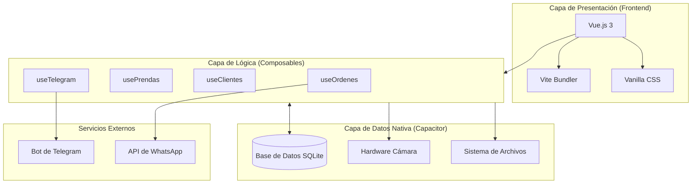
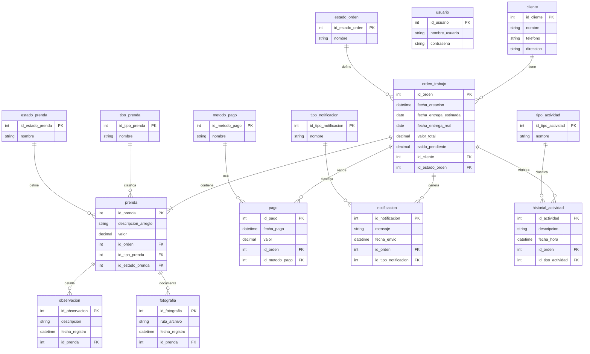
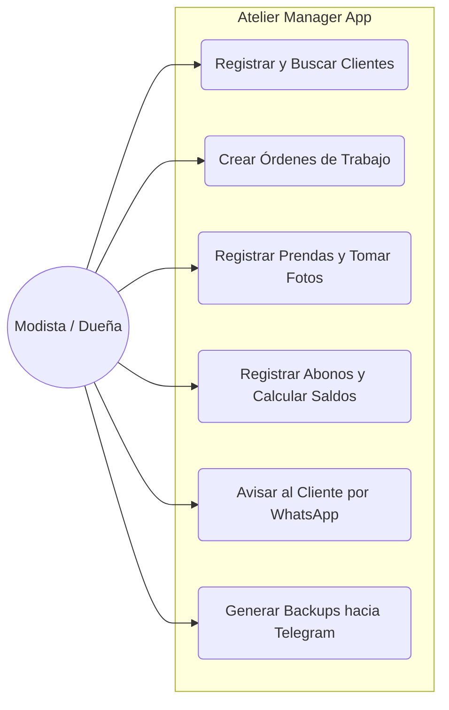
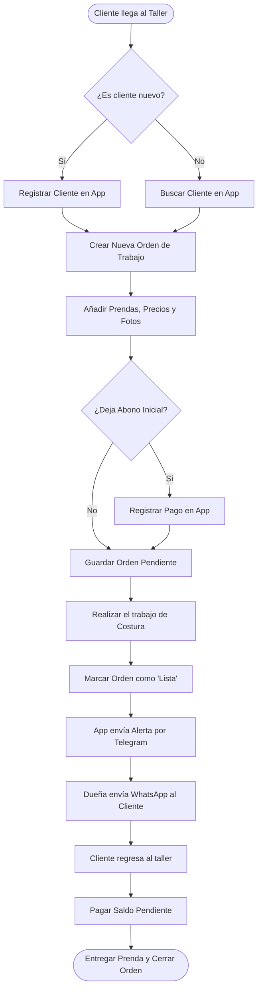
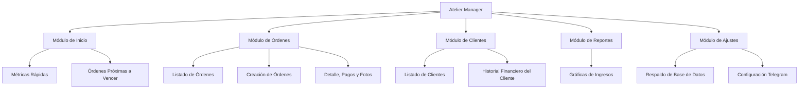
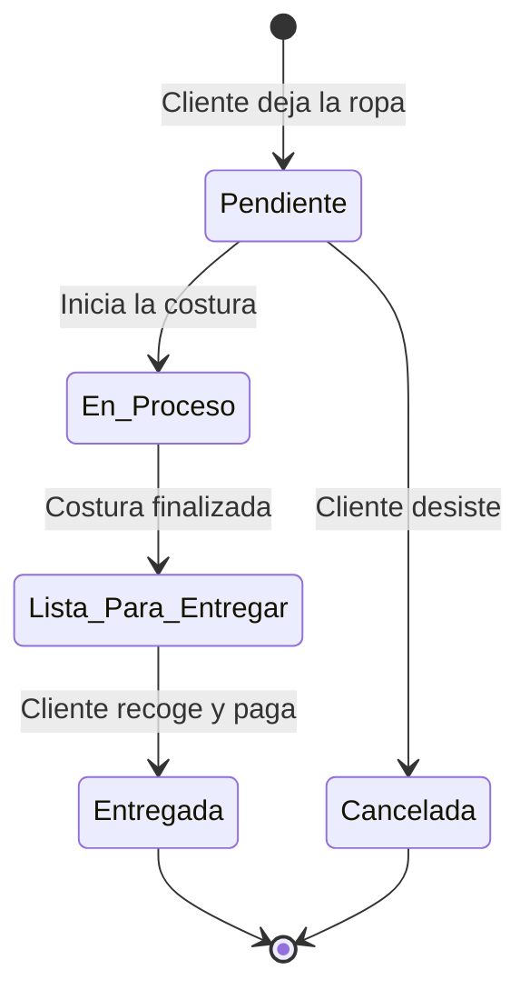

# Diagramas Oficiales del Sistema: Atelier Manager

A continuación presento la re-creación de todos los diagramas del sistema solicitados, construidos con la arquitectura y lógica exacta que programamos para la aplicación. 

*(Nota: Estos diagramas están escritos en código Mermaid. Si abres este archivo en tu editor web o en GitHub, se dibujarán automáticamente de forma visual).*

---

## 1. Diagrama de Arquitectura
Muestra la organización tecnológica de la aplicación y cómo interactúan las capas de desarrollo con la base de datos local y los servicios en la nube.

---

## 2. Diagrama Entidad-Relación (ER)
Representa la estructura exacta de la base de datos SQLite construida para el sistema.

---

## 3. Diagrama de Casos de Uso
Muestra las acciones principales que la dueña (Modista) puede ejecutar dentro del sistema.

---

## 4. Diagrama de Flujo del Negocio (Business Flow)
Muestra el paso a paso desde que un cliente entra por la puerta hasta que se lleva su ropa reparada.

---

## 5. Diagrama Funcional por Módulos
Estructura funcional de las pantallas de la aplicación.

---

## 6. Diagrama de Actividades (Gestión de una Prenda)
Describe el cambio de estado (el semáforo) de una prenda y su orden.

