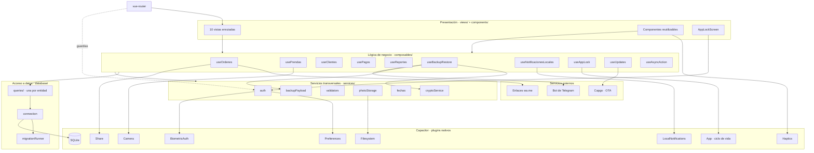
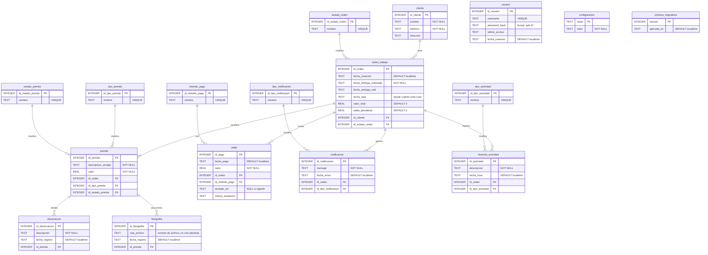
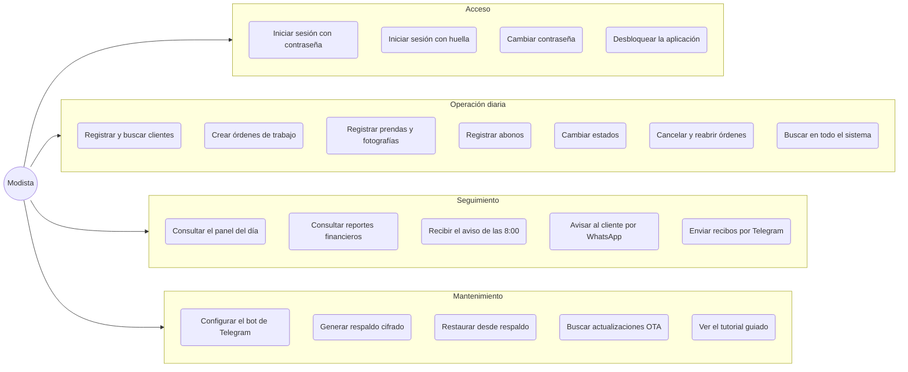
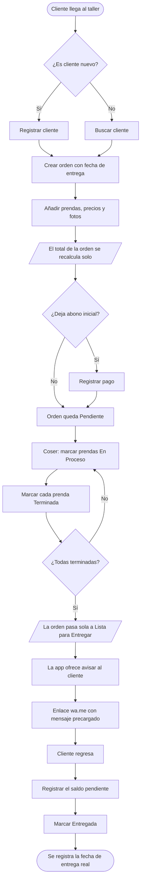
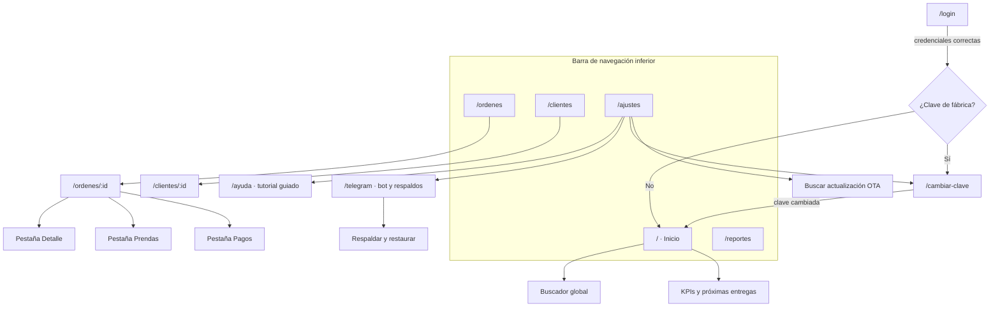
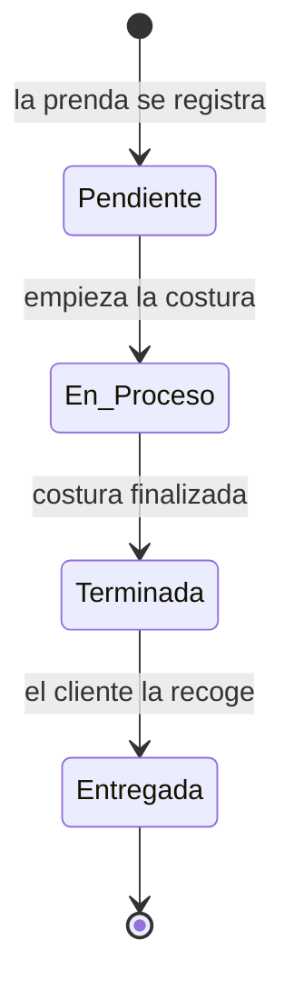
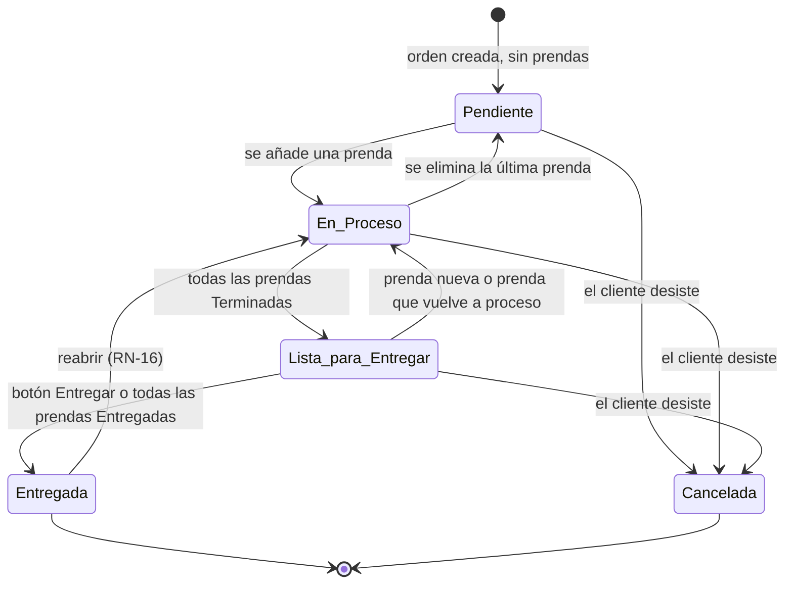
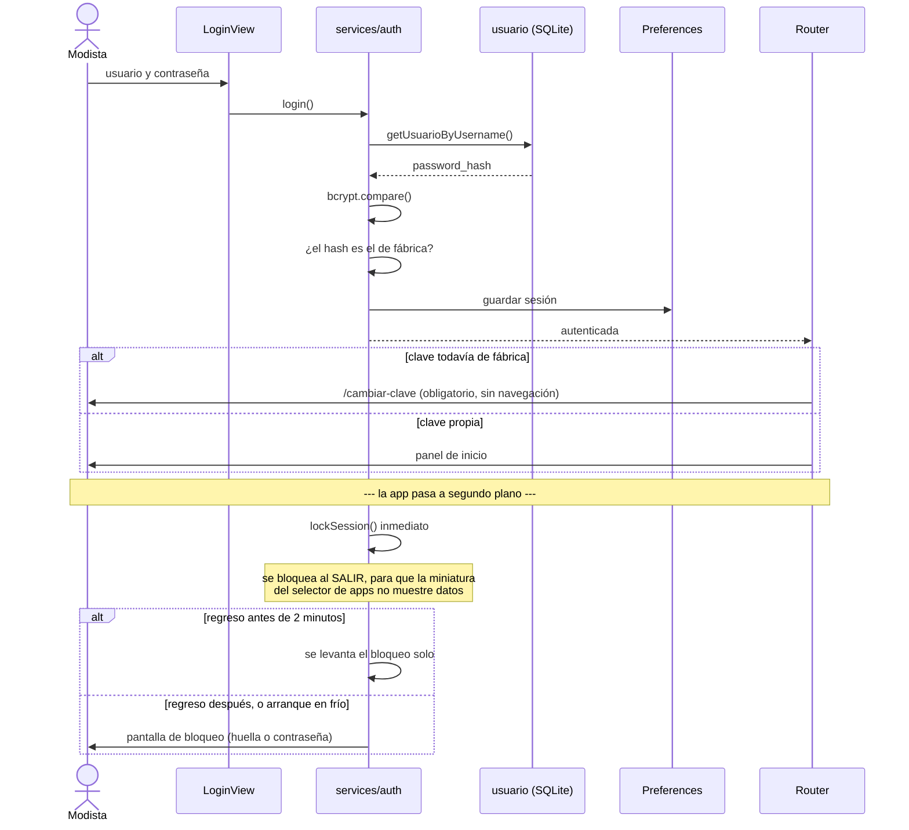
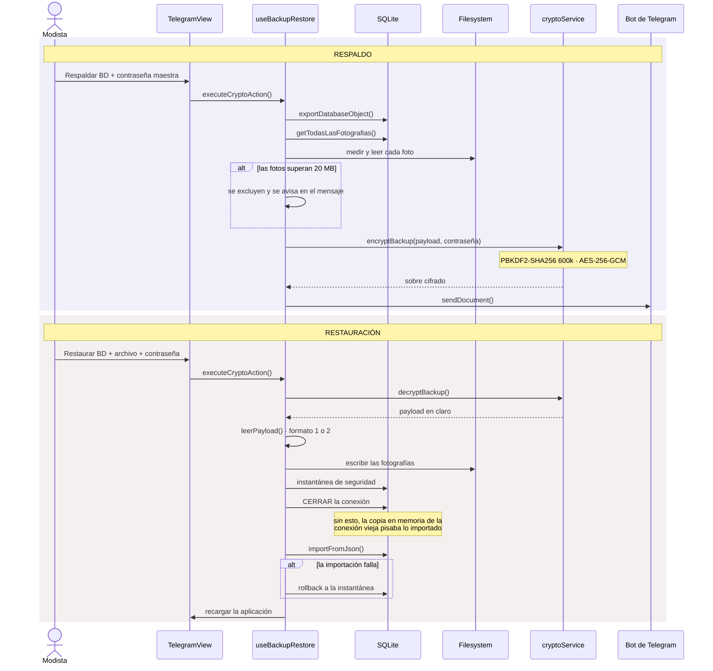
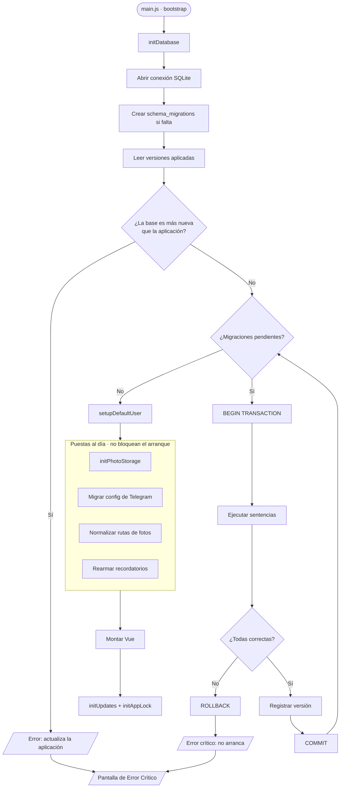

# Diagramas del Sistema · Atelier Manager

Planos del sistema **regenerados desde el código fuente**, no desde el diseño original. Todo lo que aparece aquí existe en `src/`; lo que no existe no está dibujado.

Están escritos en Mermaid: GitHub y la mayoría de editores los dibujan solos.

> **Versión del esquema documentada:** 5 (`schema_migrations`)
> **Última revisión contra el código:** 13 de septiembre de 2026

---

## 1. Arquitectura de software

Cuatro capas con dependencias en una sola dirección: una vista nunca habla con la base de datos, y una consulta nunca sabe de Vue.

```mermaid
flowchart TD
    subgraph Presentacion ["Presentación · views/ + components/"]
        Views[10 vistas enrutadas]
        Comps[Componentes reutilizables]
        Lock[AppLockScreen]
    end

    subgraph Logica ["Lógica de negocio · composables/"]
        UO[useOrdenes]
        UP[usePrendas]
        UC[useClientes]
        UPa[usePagos]
        UR[useReportes]
        UB[useBackupRestore]
        UN[useNotificacionesLocales]
        UAL[useAppLock]
        UUp[useUpdates]
        UAA[useAsyncAction]
    end

    subgraph Servicios ["Servicios transversales · services/"]
        Auth[auth]
        Crypto[cryptoService]
        Valid[validators]
        Photo[photoStorage]
        Fechas[fechas]
        Backup[backupPayload]
    end

    subgraph Datos ["Acceso a datos · database/"]
        Queries[queries/ · una por entidad]
        Conn[connection]
        Runner[migrationRunner]
    end

    subgraph Nativo ["Capacitor · plugins nativos"]
        SQLite[(SQLite)]
        Camara[Camera]
        FS[Filesystem]
        Bio[BiometricAuth]
        Notif[LocalNotifications]
        Prefs[Preferences]
        Haptics[Haptics]
        Share[Share]
        AppState[App · ciclo de vida]
    end

    subgraph Nube ["Servicios externos"]
        Telegram[Bot de Telegram]
        Capgo[Capgo · OTA]
        WA[Enlaces wa.me]
    end

    Router[vue-router] --> Views
    Views --> Logica
    Comps --> Logica
    Lock --> Auth
    Router -.guardias.-> Auth

    Logica --> Queries
    Logica --> Servicios
    Queries --> Conn
    Conn --> Runner
    Conn --> SQLite

    Auth --> Prefs
    Auth --> Bio
    Photo --> FS
    UP --> Camara
    UAL --> AppState
    UN --> Notif
    Comps --> Haptics

    UB --> Crypto
    UB --> Backup
    UB --> Telegram
    UUp --> Capgo
    UO --> WA
    UO --> Share
```

**Reglas de la arquitectura**

| Regla | Estado |
| --- | --- |
| Ninguna vista ejecuta SQL | ✅ cumplida |
| Las vistas pasan por composables | ⚠️ dos excepciones conocidas (ver [TRAZABILIDAD.md](TRAZABILIDAD.md)) |
| Las validaciones viven en `services/validators.js` | ✅ cumplida |
| Las escrituras multi-tabla van en transacción | ✅ cumplida |

---

## 2. Modelo entidad-relación

Esquema **real**, tal y como lo crea `src/database/migrations.js`. Diecisiete tablas: ocho de negocio, seis catálogos, y tres de soporte (`usuario`, `configuracion`, `schema_migrations`).

```mermaid
erDiagram
    cliente ||--o{ orden_trabajo : "tiene"
    estado_orden ||--o{ orden_trabajo : "clasifica"
    orden_trabajo ||--|{ prenda : "contiene"
    tipo_prenda ||--o{ prenda : "clasifica"
    estado_prenda ||--o{ prenda : "clasifica"
    prenda ||--o{ observacion : "detalla"
    prenda ||--o{ fotografia : "documenta"
    orden_trabajo ||--o{ pago : "recibe"
    metodo_pago ||--o{ pago : "usa"
    orden_trabajo ||--o{ notificacion : "genera"
    tipo_notificacion ||--o{ notificacion : "clasifica"
    orden_trabajo ||--o{ historial_actividad : "registra"
    tipo_actividad ||--o{ historial_actividad : "clasifica"

    cliente {
        INTEGER id_cliente PK
        TEXT nombre "NOT NULL"
        TEXT telefono "NOT NULL"
        TEXT direccion
    }
    orden_trabajo {
        INTEGER id_orden PK
        TEXT fecha_creacion "DEFAULT localtime"
        TEXT fecha_entrega_estimada "NOT NULL"
        TEXT fecha_entrega_real
        TEXT fecha_lista "desde cuándo está Lista"
        REAL valor_total "DEFAULT 0"
        REAL saldo_pendiente "DEFAULT 0"
        INTEGER id_cliente FK
        INTEGER id_estado_orden FK
    }
    prenda {
        INTEGER id_prenda PK
        TEXT descripcion_arreglo "NOT NULL"
        REAL valor "NOT NULL"
        INTEGER id_orden FK
        INTEGER id_tipo_prenda FK
        INTEGER id_estado_prenda FK
    }
    observacion {
        INTEGER id_observacion PK
        TEXT descripcion "NOT NULL"
        TEXT fecha_registro "DEFAULT localtime"
        INTEGER id_prenda FK
    }
    fotografia {
        INTEGER id_fotografia PK
        TEXT ruta_archivo "nombre de archivo, no ruta absoluta"
        TEXT fecha_registro "DEFAULT localtime"
        INTEGER id_prenda FK
    }
    pago {
        INTEGER id_pago PK
        TEXT fecha_pago "DEFAULT localtime"
        REAL valor "NOT NULL"
        INTEGER id_orden FK
        INTEGER id_metodo_pago FK
        TEXT anulado_en "NULL si vigente"
        TEXT motivo_anulacion
    }
    notificacion {
        INTEGER id_notificacion PK
        TEXT mensaje "NOT NULL"
        TEXT fecha_envio "DEFAULT localtime"
        INTEGER id_orden FK
        INTEGER id_tipo_notificacion FK
    }
    historial_actividad {
        INTEGER id_actividad PK
        TEXT descripcion "NOT NULL"
        TEXT fecha_hora "DEFAULT localtime"
        INTEGER id_orden FK
        INTEGER id_tipo_actividad FK
    }
    estado_orden {
        INTEGER id_estado_orden PK
        TEXT nombre "UNIQUE"
    }
    estado_prenda {
        INTEGER id_estado_prenda PK
        TEXT nombre "UNIQUE"
    }
    tipo_prenda {
        INTEGER id_tipo_prenda PK
        TEXT nombre "UNIQUE"
    }
    metodo_pago {
        INTEGER id_metodo_pago PK
        TEXT nombre "UNIQUE"
    }
    tipo_notificacion {
        INTEGER id_tipo_notificacion PK
        TEXT nombre "UNIQUE"
    }
    tipo_actividad {
        INTEGER id_tipo_actividad PK
        TEXT nombre "UNIQUE"
    }
    usuario {
        INTEGER id_usuario PK
        TEXT username "UNIQUE"
        TEXT password_hash "bcrypt, salt 10"
        TEXT ultimo_acceso
        TEXT fecha_creacion "DEFAULT localtime"
    }
    configuracion {
        TEXT clave PK
        TEXT valor "NOT NULL"
    }
    schema_migrations {
        INTEGER version PK
        TEXT aplicada_en "DEFAULT localtime"
    }
```

`usuario`, `configuracion` y `schema_migrations` no tienen relaciones: son tablas de soporte. `configuracion` guarda el token del bot de Telegram y el chat id, de modo que entran solos en el respaldo cifrado.

**Índices** creados sobre claves foráneas y campos de búsqueda: `idx_cliente_nombre`, `idx_orden_cliente`, `idx_orden_estado`, `idx_orden_fecha_entrega`, `idx_prenda_orden`, `idx_pago_orden`, `idx_notificacion_orden`, `idx_historial_orden`.

---

## 3. Casos de uso

Un solo actor: la modista, que es dueña y única usuaria del dispositivo.

```mermaid
flowchart LR
    Actor((Modista))

    subgraph Acceso ["Acceso"]
        A1(Iniciar sesión con contraseña)
        A2(Iniciar sesión con huella)
        A3(Cambiar contraseña)
        A4(Desbloquear la aplicación)
    end

    subgraph Taller ["Operación diaria"]
        T1(Registrar y buscar clientes)
        T2(Crear órdenes de trabajo)
        T3(Registrar prendas y fotografías)
        T4(Registrar abonos)
        T5(Cambiar estados)
        T6(Cancelar y reabrir órdenes)
        T7(Buscar en todo el sistema)
    end

    subgraph Seguimiento ["Seguimiento"]
        S1(Consultar el panel del día)
        S2(Consultar reportes financieros)
        S3(Recibir el aviso de las 8:00)
        S4(Avisar al cliente por WhatsApp)
        S5(Enviar recibos por Telegram)
    end

    subgraph Mantenimiento ["Mantenimiento"]
        M1(Configurar el bot de Telegram)
        M2(Generar respaldo cifrado)
        M3(Restaurar desde respaldo)
        M4(Buscar actualizaciones OTA)
        M5(Ver el tutorial guiado)
    end

    Actor --> Acceso
    Actor --> Taller
    Actor --> Seguimiento
    Actor --> Mantenimiento
```

---

## 4. Flujo del negocio

Desde que el cliente entra por la puerta hasta que se lleva la ropa.

```mermaid
flowchart TD
    Inicio([Cliente llega al taller]) --> P1{¿Es cliente nuevo?}
    P1 -- Sí --> P2[Registrar cliente]
    P1 -- No --> P3[Buscar cliente]

    P2 --> P4[Crear orden con fecha de entrega]
    P3 --> P4

    P4 --> P5[Añadir prendas, precios y fotos]
    P5 --> P6[/El total de la orden se recalcula solo/]
    P6 --> P7{¿Deja abono inicial?}
    P7 -- Sí --> P8[Registrar pago]
    P7 -- No --> P9[Orden queda Pendiente]
    P8 --> P9

    P9 --> P10[Coser: marcar prendas En Proceso]
    P10 --> P11[Marcar cada prenda Terminada]
    P11 --> P12{¿Todas terminadas?}
    P12 -- Sí --> P13[/La orden pasa sola a Lista para Entregar/]
    P12 -- No --> P10

    P13 --> P14[La app ofrece avisar al cliente]
    P14 --> P15[Enlace wa.me con mensaje precargado]

    P15 --> P16[Cliente regresa]
    P16 --> P17[Registrar el saldo pendiente]
    P17 --> P18[Marcar Entregada]
    P18 --> Fin([Se registra la fecha de entrega real])
```

> **Nota sobre el aviso al cliente:** no es automático. La aplicación construye el mensaje y abre WhatsApp; enviarlo es una acción de la modista. No existe integración con la API de WhatsApp Business.

---

## 5. Navegación y módulos

Las diez rutas reales de `src/router/index.js`.

```mermaid
flowchart TB
    Login["/login"]
    Clave["/cambiar-clave"]

    Login -->|"credenciales correctas"| Guardia{¿Clave de fábrica?}
    Guardia -- Sí --> Clave
    Guardia -- No --> Dash

    Clave -->|"clave cambiada"| Dash

    subgraph Nav ["Barra de navegación inferior"]
        Dash["/ · Inicio"]
        Ord["/ordenes"]
        Cli["/clientes"]
        Rep["/reportes"]
        Aju["/ajustes"]
    end

    Dash --> Buscador[Buscador global]
    Dash --> KPIs[KPIs y próximas entregas]

    Ord --> OrdDet["/ordenes/:id"]
    OrdDet --> TabD[Pestaña Detalle]
    OrdDet --> TabP[Pestaña Prendas]
    OrdDet --> TabPa[Pestaña Pagos]

    Cli --> CliDet["/clientes/:id"]

    Aju --> Ayuda["/ayuda · tutorial guiado"]
    Aju --> Tele["/telegram · bot y respaldos"]
    Aju --> Clave
    Aju --> Actualiza[Buscar actualización OTA]

    Tele --> Resp[Respaldar y restaurar]
```

> El respaldo vive en **`/telegram`**, no en Ajustes: Ajustes sólo enlaza hacia allí.

---

## 6. Estados

Son **dos** máquinas de estados distintas, y confundirlas fue un error del diagrama anterior.

### 6.1 Estado de una prenda (`estado_prenda`)

```mermaid
stateDiagram-v2
    [*] --> Pendiente : la prenda se registra
    Pendiente --> En_Proceso : empieza la costura
    En_Proceso --> Terminada : costura finalizada
    Terminada --> Entregada : el cliente la recoge
    Entregada --> [*]
```

Cuatro estados. Una prenda **no** se cancela: se cancela la orden completa.

### 6.2 Estado de una orden (`estado_orden`)

```mermaid
stateDiagram-v2
    [*] --> Pendiente : orden creada, sin prendas
    Pendiente --> En_Proceso : se añade una prenda
    En_Proceso --> Pendiente : se elimina la última prenda
    En_Proceso --> Lista_para_Entregar : todas las prendas Terminadas
    Lista_para_Entregar --> En_Proceso : prenda nueva o prenda que vuelve a proceso
    Lista_para_Entregar --> Entregada : botón Entregar o todas las prendas Entregadas
    Entregada --> En_Proceso : reabrir (RN-16)

    Pendiente --> Cancelada : el cliente desiste
    En_Proceso --> Cancelada : el cliente desiste
    Lista_para_Entregar --> Cancelada : el cliente desiste

    Entregada --> [*]
    Cancelada --> [*]
```

**Transiciones automáticas.** Pendiente, En Proceso y Lista para Entregar no se fijan a mano: los decide `derivarEstadoOrden` (`services/estadoOrden.js`) cada vez que se crea, cambia de estado o elimina una prenda, en la misma transacción:

| Prendas de la orden | Estado de la orden | Regla |
| --- | --- | --- |
| Ninguna | Pendiente | RN-04 |
| Alguna *Pendiente* o *En Proceso* | En Proceso | RN-17 |
| Todas *Terminada* o *Entregada*, alguna sin entregar | Lista para Entregar · se registra la notificación | RN-06, RN-10 |
| Todas *Entregada* | Entregada · se sella `fecha_entrega_real` | RN-09 |

Una orden *Entregada* o *Cancelada* no cambia por sus prendas.

**Orden activa** (RN-04, `ESTADOS_ORDEN_ACTIVA`): sólo *En Proceso* y *Lista para Entregar*. Una orden *Pendiente* no tiene prendas, así que no cuenta en activas, atrasadas, próximas entregas, la campana, los recordatorios ni el resumen de Telegram. La misma lista genera la condición SQL (`condicionOrdenActiva`), para que pantalla y consultas no puedan discrepar.

**Estado de pago** (RN-28, `estadoDePago`): *Pagada* si el saldo es cero o menor, *Pendiente* si queda saldo, ninguno si la orden todavía no vale nada. No es una columna: se deriva del saldo, que ya se recalcula en cada escritura.

**Próxima a vencer** (RN-38, `clasificarVencimiento`): la fecha estimada cae entre hoy y hoy + N días, ambos incluidos, con N guardado en `configuracion.dias_anticipacion_vencer`.

**Sin reclamar** (RN-37): la orden lleva más de N días *Lista para Entregar*, contados desde `orden_trabajo.fecha_lista`, con N en `configuracion.dias_sin_reclamar` (30 por defecto). La fecha se sella al entrar en *Lista*, se borra al salir hacia *En Proceso*, *Pendiente*, *Cancelada* o al reabrir, y se conserva al entregar.

**Acciones manuales** (en `validators.validateCambioManualEstado`):

- *Entregar* sólo desde *Lista para Entregar*.
- *Cancelar* cualquier orden que no esté *Entregada*.
- *Reabrir* sólo lo que está *Entregada*; vuelve a *En Proceso*.
- Una orden *Cancelada* no admite prendas ni pagos.
- Una prenda sólo pasa a *Entregada* desde *Terminada* (CP-18).

**Entregar con saldo pendiente** está permitido (RN-30), pero el botón *Entregar* pide confirmación mostrando lo que se debe. La entrega automática por prendas no la pide.

**Saldo** (en `queries/saldo.js`): nunca se suma ni se resta una diferencia. Cada escritura sobre `prenda` o `pago` recalcula en la misma transacción `valor_total = SUM(prenda.valor)` y `saldo_pendiente = valor_total − SUM(pago.valor)` contando sólo los pagos no anulados. Bajar el precio de una prenda, o eliminarla, si el total queda por debajo de lo ya pagado se rechaza (RN-29).

**Correcciones** (P1-9): un pago nunca se borra; se anula con fecha y motivo, deja de sumar en el saldo y en los ingresos, y queda en el historial. Una prenda sí se elimina con sus fotos y observaciones, salvo en órdenes entregadas o canceladas o si la prenda ya se entregó.

---

## 7. Sesión: acceso y bloqueo

```mermaid
sequenceDiagram
    actor M as Modista
    participant L as LoginView
    participant A as services/auth
    participant BD as usuario (SQLite)
    participant P as Preferences
    participant R as Router

    M->>L: usuario y contraseña
    L->>A: login()
    A->>BD: getUsuarioByUsername()
    BD-->>A: password_hash
    A->>A: bcrypt.compare()
    A->>A: ¿el hash es el de fábrica?
    A->>P: guardar sesión
    A-->>R: autenticada

    alt clave todavía de fábrica
        R->>M: /cambiar-clave (obligatorio, sin navegación)
    else clave propia
        R->>M: panel de inicio
    end

    Note over M,R: --- la app pasa a segundo plano ---
    A->>A: lockSession() inmediato
    Note over A: se bloquea al SALIR, para que la miniatura<br/>del selector de apps no muestre datos

    alt regreso antes de 2 minutos
        A->>A: se levanta el bloqueo solo
    else regreso después, o arranque en frío
        A->>M: pantalla de bloqueo (huella o contraseña)
    end
```

Por encima de todo esto sigue corriendo el cierre de sesión por 15 minutos de inactividad.

---

## 8. Respaldo y restauración

El flujo más intrincado del sistema, y el que más veces se había roto en silencio.

```mermaid
sequenceDiagram
    actor M as Modista
    participant V as TelegramView
    participant B as useBackupRestore
    participant BD as SQLite
    participant F as Filesystem
    participant C as cryptoService
    participant T as Bot de Telegram

    rect rgb(240, 240, 250)
    Note over M,T: RESPALDO
    M->>V: Respaldar BD + contraseña maestra
    V->>B: executeCryptoAction()
    B->>BD: exportDatabaseObject()
    B->>BD: getTodasLasFotografias()
    B->>F: medir y leer cada foto
    alt las fotos superan 20 MB
        B->>B: se excluyen y se avisa en el mensaje
    end
    B->>C: encryptBackup(payload, contraseña)
    Note over C: PBKDF2-SHA256 600k · AES-256-GCM
    C-->>B: sobre cifrado
    B->>T: sendDocument()
    end

    rect rgb(245, 240, 240)
    Note over M,T: RESTAURACIÓN
    M->>V: Restaurar BD + archivo + contraseña
    V->>B: executeCryptoAction()
    B->>C: decryptBackup()
    C-->>B: payload en claro
    B->>B: leerPayload() · formato 1 o 2
    B->>F: escribir las fotografías
    B->>BD: instantánea de seguridad
    B->>BD: CERRAR la conexión
    Note over BD: sin esto, la copia en memoria de la<br/>conexión vieja pisaba lo importado
    B->>BD: importFromJson()
    alt la importación falla
        B->>BD: rollback a la instantánea
    end
    B->>V: recargar la aplicación
    end
```

**Contenido del respaldo (formato 2):** base de datos completa, configuración del bot, contraseña como hash y fotografías en base64 mientras no superen 20 MB. Los respaldos del formato 1 (sin fotografías) se siguen pudiendo restaurar.

---

## 9. Arranque y migraciones

```mermaid
flowchart TD
    Start([main.js · bootstrap]) --> Init[initDatabase]
    Init --> Conn[Abrir conexión SQLite]
    Conn --> Tabla[Crear schema_migrations si falta]
    Tabla --> Leer[Leer versiones aplicadas]

    Leer --> Guardia{¿La base es más nueva<br/>que la aplicación?}
    Guardia -- Sí --> Bloqueo[/Error: actualiza la aplicación/]
    Guardia -- No --> Pend{¿Migraciones pendientes?}

    Pend -- No --> Usuario
    Pend -- Sí --> Trans[BEGIN TRANSACTION]
    Trans --> Ejec[Ejecutar sentencias]
    Ejec --> Ok{¿Todas correctas?}
    Ok -- No --> Roll[ROLLBACK] --> Falla[/Error crítico: no arranca/]
    Ok -- Sí --> Reg[Registrar versión] --> Commit[COMMIT] --> Pend

    Usuario[setupDefaultUser] --> Mant

    subgraph Mant ["Puestas al día · no bloquean el arranque"]
        M1[initPhotoStorage]
        M2[Migrar config de Telegram]
        M3[Normalizar rutas de fotos]
        M4[Rearmar recordatorios]
    end

    Mant --> Mount[Montar Vue] --> OTA[initUpdates + initAppLock]

    Bloqueo --> Pantalla[/Pantalla de Error Crítico/]
    Falla --> Pantalla
```

La distinción importa: **sin base de datos no hay taller**, así que un fallo ahí detiene el arranque. Un fallo normalizando una ruta de fotografía, en cambio, no puede impedir que la modista abra su aplicación.

---

## Qué NO está dibujado aquí

Porque no existe en el código:

- Módulo de bodega o papelería (RF-61 a RF-63, Fase 2).
- Exportación a Excel o PDF (RF-64, RF-65).
- Impresión térmica ESC/POS (RF-66, RF-67).
- Modo oscuro (RF-71).
- Integración con la API de WhatsApp Business: sólo se generan enlaces `wa.me`.
- Sincronización entre dispositivos: la arquitectura es de un solo dispositivo por diseño.
